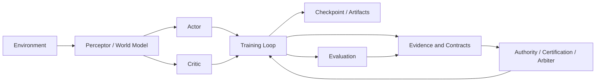

# Aletheia

Aletheia is a governance-first reinforcement learning system.

License: Apache-2.0

Most RL projects are organized around algorithms. Aletheia is organized around **trust**.

It is built on a simple premise:

> Optimization is only meaningful when the source of value is trusted.

That changes the codebase shape. Instead of treating value estimates, bootstrap targets, and external feedback as interchangeable tensors, Aletheia wraps them in semantic contracts, evidence bundles, certification states, and authority decisions.

In short:

- mainstream RL asks: "How do we train a better policy?"
- Aletheia asks: "How do we know the thing we are training on is credible?"

## Why It Exists

Classic RL frameworks usually optimize a scalar objective and spend most of their complexity budget on sampling efficiency, network architecture, or loss shaping.

Aletheia is aimed at a different problem:

- training signals can come from multiple sources
- those sources may disagree
- some sources should dominate others
- some signals should be rejected outright
- the system should keep working when signal quality degrades

So the project focuses on:

- source provenance
- authority arbitration
- certification and admissibility
- semantic debt tracking
- compensation and fallback logic

The result is a reinforcement learning stack that is explicitly designed around governance, not just optimization.

## System Overview



The training loop does not just optimize on raw trajectories. It repeatedly converts observations into evidence, evaluates contract status, and decides which signal source should be trusted for the next step.

## What Makes It Different

### 1. It is organized by governance units, not algorithm units

Traditional RL code is often organized as:

```text
ppo/
replay_buffer/
policies/
envs/
```

Aletheia is organized more like:

```text
contracts/
training/
runtime/
checkpoint/
```

That difference matters because it reflects the project’s core belief: the first thing worth modeling is not the algorithm, but the trust boundary around the signal.

### 2. It treats value as something that must be justified

In Aletheia, a value estimate is not just a number. It can carry:

- source
- coverage
- confidence
- authority
- trust
- task agreement
- registry support
- semantic debt
- certification tags

This makes it possible to answer questions like:

- Is this value external or internal?
- Was it certified by a task corridor or geometry corridor?
- Is the bootstrap source eligible to dominate?
- Is the current training signal too stale or too polluted?

### 3. It separates evidence from decision

The code does not conflate raw signal, evidence, and final authority.

- `EvidenceBundle` collects raw support data
- `SemanticContract` packages the signal with provenance and governance metadata
- `SemanticArbiter` decides which contract should dominate
- `AuthorityDecision` records the resulting authority state

That separation is one of the main reasons the repository looks different from a standard RL project.

## Architecture

### Configuration and profiles

[`aletheia/aletheia_config.py`](/Users/zhangsan/Desktop/缸中之脑v6.0/aletheia/aletheia_config.py) defines:

- environment profiles
- model and RL config
- router config
- training params
- checkpoint restore policy

The environment image is explicit. The system does not assume that one set of settings fits all tasks.

### Representation and policy stack

[`aletheia/aletheia_world_model.py`](/Users/zhangsan/Desktop/缸中之脑v6.0/aletheia/aletheia_world_model.py) and [`aletheia/aletheia_actor_critic.py`](/Users/zhangsan/Desktop/缸中之脑v6.0/aletheia/aletheia_actor_critic.py) provide:

- the perceptor
- the world model
- feature routing
- actor and critic modules
- intrinsic motivation / will modules

The system is assembled as a component stack, not a single monolithic policy network.

### Contract and evidence system

[`aletheia/contracts/`](/Users/zhangsan/Desktop/缸中之脑v6.0/aletheia/contracts) is the heart of the repository.

Important modules:

- [`core.py`](/Users/zhangsan/Desktop/缸中之脑v6.0/aletheia/contracts/core.py) for `SemanticContract`, `SemanticArbiter`, and contract helpers
- [`authority.py`](/Users/zhangsan/Desktop/缸中之脑v6.0/aletheia/contracts/authority.py) for bootstrap and takeover authority logic
- [`evidence.py`](/Users/zhangsan/Desktop/缸中之脑v6.0/aletheia/contracts/evidence.py) for evidence bundles and real-feedback snapshots
- [`certification.py`](/Users/zhangsan/Desktop/缸中之脑v6.0/aletheia/contracts/certification.py) for task certification and registry support
- [`consumers.py`](/Users/zhangsan/Desktop/缸中之脑v6.0/aletheia/contracts/consumers.py) for consumer-facing contract views
- [`hold_state.py`](/Users/zhangsan/Desktop/缸中之脑v6.0/aletheia/contracts/hold_state.py) for canonical hold-state management

This layer is the clearest expression of the project philosophy.

### Training and compensation

[`aletheia/aletheia_train.py`](/Users/zhangsan/Desktop/缸中之脑v6.0/aletheia/aletheia_train.py) and [`aletheia/training/`](/Users/zhangsan/Desktop/缸中之脑v6.0/aletheia/training) implement:

- replay collection
- rollout collection
- imagination updates
- loss computation
- optimizer orchestration
- compensation and fallback logic
- training loop scheduling

The training subsystem is not just a learner. It is also a runtime control system that reacts to degraded or ambiguous conditions.

### Runtime and persistence

The repository also includes:

- checkpoint schemas
- artifact schemas
- runtime helpers
- safe restore policies
- training and evaluation summaries

That makes experiments inspectable, resumable, and auditable.

## Main Flow

The canonical execution path is:

1. resolve environment and config
2. build the model stack
3. collect rollout data
4. compute contract-aware evidence and authority
5. train on real and imagined batches
6. apply compensation or guard logic when needed
7. evaluate
8. checkpoint
9. repeat

The scheduler can blend real and imagined data, and the contract system can reroute or reject signals when quality changes.

## Key Modules

### `aletheia/contracts`

This is the control plane.

It defines the project’s key governance objects:

- `SemanticContract`
- `EvidenceBundle`
- `CertificationState`
- `AuthorityDecision`
- `SemanticArbiter`

These objects encode where a signal came from, how much of it is covered, whether it is certified, and whether it should be trusted.

### `aletheia/training`

This is the runtime correction layer.

It handles:

- external evaluation feedback
- compensation phase transitions
- persistence guards
- runtime RL context

### `aletheia/aletheia_train.py`

This is the canonical training implementation.

It contains:

- `ReplayBuffer`
- `RolloutCollector`
- `ImaginationEngine`
- `TrainingStep`
- `TrainingLoop`
- `build_training_model()`

It is the place where model components, contracts, and optimizer orchestration come together.

### `aletheia/aletheia_api.py`

This is the unified entrypoint.

`run_train()`:

- resolves environment input
- applies overrides
- initializes logging
- builds or loads the agent
- runs training
- handles checkpoint and artifact wiring

The CLI wrapper in `scripts/cartpole_train.py` is intentionally thin.

## Repository Layout

```text
aletheia/
├── contracts/        # semantic contracts, evidence, authority, certification
├── training/         # compensation and runtime helpers
├── aletheia_api.py   # unified train entrypoint
├── aletheia_train.py # canonical training loop and model wiring
├── aletheia_world_model.py
├── aletheia_actor_critic.py
├── aletheia_config.py
└── tests/

scripts/
└── cartpole_train.py # thin CLI entrypoint
```

## Validation

The current repository state has been validated with the test suite:

- `603 passed`
- `29 subtests passed`

## Quick Start

Run the CartPole training entrypoint:

```bash
python3 scripts/cartpole_train.py \
  --steps 32 \
  --train-steps-per-cycle 2 \
  --collect-steps-per-cycle 8 \
  --enable-eval \
  --eval-episodes 1 \
  --eval-max-steps 100
```

## Short Version

Aletheia is a reinforcement learning system that treats trust as a first-class training primitive.

It is for cases where the right question is not only "what should the policy do?" but also "why should we trust the signal that tells it to do that?"

## License

This repository is licensed under the [Apache License 2.0](LICENSE).
