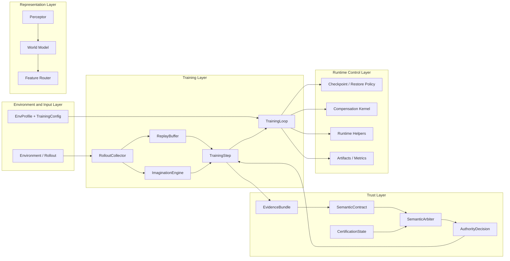

# Aletheia


A governance-first, trust-driven reinforcement learning system that treats credibility as a first-class training primitive.

Aletheia is not organized around algorithms first. It is organized around **what should be trusted**.

Instead of treating value estimates, bootstrap targets, and external feedback as interchangeable tensors, the codebase wraps them in contracts, evidence bundles, certification states, and authority decisions. The result is a research RL stack that is explicit about provenance, fail-safe behavior, and source arbitration.

## Why It Exists

Classic RL systems usually optimize a scalar objective and then patch around the edges with heuristics.

Aletheia is built for a harder setting:

- signals can come from multiple sources
- those sources may disagree
- some sources should dominate others
- some signals should be rejected outright
- the system should keep working when signal quality degrades

That leads to a different design target:

- not just "train faster"
- but "verify what is being trained on"

## What Makes It Different

### Governance-first organization

Mainstream RL code is typically organized around algorithmic parts:

```text
ppo/
replay_buffer/
policies/
envs/
```

Aletheia is organized around governance units:

```text
contracts/
training/
runtime/
checkpoint/
```

That difference is the point. The repository is structured around the belief that trust boundaries are a first-class architectural primitive.

### Signal credibility as a core object

In Aletheia, a value signal is not just a tensor. It can carry:

- source
- coverage
- confidence
- authority
- trust
- task agreement
- registry support
- semantic debt
- freshness
- certification tags

This makes it possible to ask concrete questions like:

- Is the source primary or reference?
- Is it task-certified or geometry-certified?
- Is it stale?
- Should it dominate the current training target?
- Is it too degraded to be trusted?

## Key Technical Subsystems

### Multi-channel certification corridors

The certification system distinguishes between geometry-style support and task-style support through certification labels such as `geometry_corridor` and `task_corridor`.

[`compute_task_certification()`](./aletheia/contracts/certification.py) combines:

- imagined task gate
- task confidence
- real evaluation gate
- real reward agreement
- previous real task state
- geometry support
- registry support

It also applies a recursive smoothing update so real certification does not jump erratically when evidence changes. The output is a structured [`CertificationState`](./aletheia/contracts/certification.py) rather than a single scalar.

### Semantic contracts

[`SemanticContract`](./aletheia/contracts/core.py) is the main trust object in the repo.

It packages:

- `value`: the actual tensor being trusted
- `coverage`: how complete the signal is
- `confidence`: local predictive reliability
- `authority`: how much weight it should carry
- `trust`: historical credibility
- `task_agreement`: alignment with task evidence
- `registry_support`: support from the registry/corridor side
- `semantic_debt`: degradation or mismatch pressure
- `freshness`: age / staleness indicator
- `certified_by`: explicit certification labels

The important part is not that these values exist. The important part is that the training system reasons over them directly.

### Dynamic arbitration and takeover control

[`SemanticArbiter`](./aletheia/contracts/core.py) performs explicit arbitration between internal and external contracts.

It computes:

- a takeover floor
- a modulation bonus
- a cap on external authority
- internal vs. external authority weights

That lets the system do safe takeover, bounded replacement, and controlled authority blending instead of blindly trusting whichever signal arrived last.

### Production-grade fail-safe mechanics

Aletheia includes defensive behavior that is easy to miss if you only look at the high-level architecture:

- [`TrainingCheckpointRestorePolicy`](./aletheia/_training_checkpoint_schema.py) blocks unsafe checkpoint restoration when model or optimizer restore modes do not match expectations.
- `validation_mode` in [`TrainingConfig`](./aletheia/aletheia_config.py) controls strictness for activation and config validation.
- `optimizer_restore_mode` supports `strict`, `auto`, and `skip` restore behavior.
- telemetry and evidence paths coerce inputs into bounded tensors and finite numeric ranges instead of silently accepting polluted values.
- runtime compensation logic handles degraded phases, late triggers, and fallback guards.

These are not side features. They are part of the design contract.

## System Overview



The lifecycle is not "collect and backprop once". It is:

1. collect experience
2. derive evidence
3. certify the signal
4. arbitrate authority
5. train only on signals that survive the governance checks
6. apply compensation when the runtime state becomes unstable

## Developer Quick Start

The contract layer is intentionally usable from normal Python code.

```python
import torch

from aletheia.contracts.core import make_semantic_contract, SemanticArbiter

# 1. Initialize a reference value tensor.
value_ref = torch.randn(1, 4)

# 2. Build a primary contract, e.g. a model prediction.
internal_contract = make_semantic_contract(
    value=value_ref,
    source="primary_model_prediction",
    confidence=torch.full_like(value_ref, 0.8),
    trust=torch.full_like(value_ref, 0.9),
)

# 3. Build a reference contract, e.g. an evaluator or anchor signal.
external_contract = make_semantic_contract(
    value=value_ref + 0.1,
    source="reference_evaluator",
    coverage=torch.full_like(value_ref, 1.0),
    confidence=torch.full_like(value_ref, 0.95),
    certified_by=("task_corridor",),
)

# 4. Perform dynamic arbitration.
arbiter = SemanticArbiter()
decision = arbiter.arbitrate_bootstrap(
    internal_contract=internal_contract,
    external_contract=external_contract,
    takeover_floor=torch.zeros_like(value_ref),
    modulation_bonus=torch.full_like(value_ref, 0.1),
)

print("Reference authority weight:", decision.external_authority.mean().item())
```

The returned decision is a bounded, inspectable arbitration result. It is not just a scalar blend factor.

## Main Modules

### `aletheia/contracts`

This is the control plane.

Important objects:

- [`SemanticContract`](./aletheia/contracts/core.py)
- [`EvidenceBundle`](./aletheia/contracts/evidence.py)
- [`CertificationState`](./aletheia/contracts/certification.py)
- [`SemanticArbiter`](./aletheia/contracts/core.py)
- [`AuthorityDecision`](./aletheia/contracts/authority.py)

These objects encode where a signal came from, how complete it is, how credible it is, and whether it is eligible to dominate the training target.

### `aletheia/training`

This is the runtime correction layer.

It handles:

- external evaluation feedback
- compensation phase transitions
- persistence and restore guards
- runtime RL context

### `aletheia/aletheia_train.py`

This is the canonical training implementation.

It contains:

- `ReplayBuffer`
- `RolloutCollector`
- `ImaginationEngine`
- `TrainingStep`
- `TrainingLoop`
- `build_training_model()`

It is where the actor, critic, world model, router, and contract-aware training logic come together.

### `aletheia/aletheia_api.py`

This is the unified entrypoint.

`run_train()`:

- resolves environment input
- applies overrides
- initializes logging
- builds or loads the agent
- runs training
- handles checkpoint and artifact wiring

The CLI wrapper in `scripts/cartpole_train.py` is intentionally thin.

## Fail-Safe Engineering

Aletheia is designed to fail closed when inputs or restore state look wrong.

Examples:

- checkpoint restore uses explicit restore modes and can reject config drift
- contract tensors are bounded and shape-checked
- telemetry and evidence are normalized before use
- activation validation can run in strict mode
- training can distinguish live, imagined, and fallback phases

This matters because the repository is not trying to hide uncertainty. It is trying to make uncertainty explicit enough to control.

## Verification Suite

The current repository state has been validated with the test suite:

- `603 passed`
- `29 subtests passed`

The tests cover:

- rollout collection and imagination paths
- adaptive compensation kernels
- telemetry and contract validation boundaries
- checkpoint restore integrity
- semantic contract and arbitration behavior

## Repository Layout

```text
aletheia/
├── contracts/        # semantic contracts, evidence, authority, certification
├── training/         # compensation and runtime helpers
├── aletheia_api.py   # unified train entrypoint
├── aletheia_train.py # canonical training loop and model wiring
├── aletheia_world_model.py
├── aletheia_actor_critic.py
├── aletheia_config.py
└── tests/

scripts/
└── cartpole_train.py # thin CLI entrypoint
```

## Quick Start

Run the CartPole training entrypoint:

```bash
python3 scripts/cartpole_train.py \
  --steps 32 \
  --train-steps-per-cycle 2 \
  --collect-steps-per-cycle 8 \
  --enable-eval \
  --eval-episodes 1 \
  --eval-max-steps 100
```

## Short Version

Aletheia is a reinforcement learning system that treats trust as a first-class training primitive.

It is for cases where the right question is not only "what should the policy do?" but also "why should we trust the signal that tells it to do that?"

## License

This repository is licensed under the [Apache License 2.0](LICENSE).
