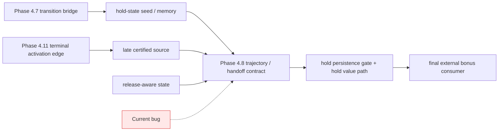

# Phase 4 当前根因复核与唯一允许下一刀

> 日期：2026-03-19
>
> 本次复核对象：
> - `v229_phase412_terminal_truth_activation_edge_bridge`
> - `v231_phase414_late_window_hold_persistence_effectiveness_strengthening`
> - `v232_phase415_late_window_hold_persistence_selective_retention_release`
> - `v233_phase416_hold_state_release_window_gating`
> - `v234_phase417_fully_active_release_retention_balance_sharpening`

## 1. 复核结论

前一版结论整体方向是对的，但还需要收紧一层。

正确的部分是：

- 当前主问题确实已经不在 actor / controller / floor / authority / entry 主链。
- `v232` 之后继续围着 fully-active late-window 的 edge 做 helper sharpening，不是正确的主方向。
- 下一刀仍然应该留在 `Phase 4.8 hold persistence`，而不是重新横跳回 trigger、floor、candidate family 或 actor/controller。

需要收紧的部分是：

> 当前问题不能只表述成“Phase 4.8 的 fully-active late-window retention/release balance 没调好”。
>
> 更准确的表述是：
> `Phase 4.8` 当前真正缺的是 **late-window trajectory / handoff contract**，
> 尤其是 `transition bridge -> hold state -> late certified source` 这一段在 state-side 和 value-side 没有完全对齐。

也就是说，问题不是单纯“hold 太强”或“release 太弱”，而是：

- state-side 已经把一部分 transition / late source 记忆接进来了
- value-side hold helper 却没有把同一段 handoff 语义真正消费进去
- 结果系统在 `0.75 -> 1.0` 的 late-window 路径上，继续依赖一个不完整的交棒合同

这才是 `v232` 之后持续漂移的更精确根因。

---

## 2. 关键事实复核

### 2.1 行为对账

| step | `v229` | `v231` | `v232` | `v233` | `v234` |
| --- | ---: | ---: | ---: | ---: | ---: |
| `1250` | `194.2` | `194.2` | `194.2` | `194.2` | `194.2` |
| `1500` | `158.8` | `47.2` | `106.4` | `163.2` | `133.0` |
| `1750` | `490.4` | `137.2` | `93.4` | `317.8` | `101.2` |
| `2000` | `184.2` | `427.2` | `135.2` | `420.6` | `500.0` |
| `2250` | `160.8` | `138.8` | `500.0` | `203.0` | `459.8` |
| `2500` | `257.4` | `143.8` | `500.0` | `406.6` | `131.2` |

复核后最重要的三条事实：

1. `v232` 的晚窗最好，但中后段 `1500/1750/2000` 并不稳。
2. `v233` 明确修好了中段 continuity，但没有保住 `v232` 的 `2250/2500`。
3. `v234` 证明“继续 sharpen fully-active release edge”不是正确主线：
   - 它同时出现了 `2000/2250` 很强与 `1500/1750/2500` 不稳
   - 这是一条典型的 trajectory redistribution，不是根因修复

### 2.2 `v232` 反证了“fully-active edge 是主因”这条解释

`v232` 的关键结构点：

| step | eval | late_gate | release_window | hold_gate | hold_delta |
| --- | ---: | ---: | ---: | ---: | ---: |
| `2250` | `500.0` | `0.8203` | `0.0` | `0.00389` | `0.00437` |
| `2500` | `500.0` | `1.0` | `1.0` | `0.02612` | `0.34079` |

这意味着：

- `v232@2250` 的满分表现，发生在 `release_window_activation = 0.0`
- 因而 `v232` 的关键成功，不能被解释成“fully-active release edge 已经调对”
- `2500` 的 fully-active 只是终点上的一种表现，不是 `2250` 高分的唯一主因

因此，后续如果继续把主注意力放在：

- `release_window_activation`
- helper 末端 attenuation
- fully-active edge 的局部 sharpen

就会再次犯错。

### 2.3 `v233` 证明的是 “pre-fully-active continuity bug”，不是 “fully-active edge bug”

`v233` 相比 `v232`：

| step | `v232` | `v233` | 差值 |
| --- | ---: | ---: | ---: |
| `1500` | `106.4` | `163.2` | `+56.8` |
| `1750` | `93.4` | `317.8` | `+224.4` |
| `2000` | `135.2` | `420.6` | `+285.4` |

同时：

- `1500/1750` 时 `release_window_activation` 仍然是 `0.0`

所以 `v233` 真实证明的是：

> `Phase 4.15` 之前存在 state-side release 早于 value-side release 的 continuity 泄漏。

这条证据说明：

- 问题本质是路径中的 handoff / continuity
- 不是只在 fully-active edge 上做局部 sharpen 就能解决

### 2.4 `v234` 证明 “继续修 edge” 会把问题重新打散成轨迹 tradeoff

`v234` 的关键结构点：

| step | eval | late_gate | release_window | hold_gate | hold_delta | mc_gap |
| --- | ---: | ---: | ---: | ---: | ---: | ---: |
| `1500` | `133.0` | `0.7611` | `0.0` | `0.00566` | `0.0` | `7.8678` |
| `1750` | `101.2` | `0.8165` | `0.0` | `0.00202` | `0.00228` | `9.9924` |
| `2000` | `500.0` | `0.8231` | `0.0` | `0.00221` | `0.00316` | `10.8997` |
| `2250` | `459.8` | `1.0` | `1.0` | `0.00704` | `0.08566` | `12.1107` |
| `2500` | `131.2` | `1.0` | `1.0` | `0.01531` | `0.29792` | `12.4150` |

`v234` 的正式含义不是“方向接近，只差一点点”，而是：

> 它把 `v232/v233` 之间尚未统一的 trajectory tradeoff，再次用一个 helper edge 调整重新分配了一遍。

因此，`v234` 是对下面这条假设的正式证伪：

> “只要继续 sharpen fully-active release/retention edge，就能同时保住 `v233` 的中段和 `v232` 的末段。”

---

## 3. 更深一层的 code-level 证据

这次复核发现了一个比“现象判断”更硬的证据：

在 [`_compute_bootstrap_bonus_source_hold_persistence_contract(...)`](/Users/zhangsan/Desktop/缸中之脑v5.6/aletheia/aletheia_train.py#L1396) 里：

- helper 输入里已经包含 `critic_contract_bootstrap_source_transition_bridge_gate`
- 但在 helper 内，这个输入被读进来以后，基本没有真正参与后续 hold handoff 计算

相反，在 bootstrap call-site 的 hold state 更新里，`source_hold_seed` 已经在消费：

- `source_transition_bridge_gate`
- `source_value_late_window_activation`

也就是说，当前系统已经出现了一个新的 **state-side / value-side handoff mismatch**：

- state-side 认为 transition bridge 已经是 hold trajectory 的一部分
- value-side hold helper 却没有把这段 bridge 真正纳入 `late certified floor / strict_hold_value / persistence path`

这和 `v233` 证明过的 “state-side release 先于 value-side release” 属于同一类型的问题，只是层次已经上移到了：

> `Phase 4.8 trajectory / handoff`

这也是为什么当前最合理的下一刀，不应该再写成“更强 hold”或“更强 release”，而应该写成：

> 让 `Phase 4.8` 的 state-side trajectory 和记 value-side hold path，真正共享同一份 handoff contract。

---

## 4. 当前真正根因裁决

正式裁决固定为：

> `Phase 4` 当前不再卡在底座执行链，
> 也不再卡在 entry、terminal candidate family 或 fully-active edge timing。
>
> 当前真正的问题是：
> `Phase 4.8 hold persistence` 的 **trajectory / handoff contract 仍不完整**。
>
> 更具体地说，是：
> `transition bridge -> hold state -> late certified source`
> 这一段在 state-side 和记忆更新、以及 value-side 的实际 hold path 之间还没有完全复联。

因此，`v232` 之后持续漂移的本质不是：

- “能力不够所以老修不好”
- “底座又坏了”
- “SAI 路线失败”

而是：

- 我们已经进入了一个更窄、更难、也更容易被局部指标误导的阶段
- 后面几刀之所以反复漂，是因为把 trajectory-level 问题误修成了 edge-level 问题

---

## 5. 当前底座是否稳定

当前可以继续视为稳定底座的层：

- `Phase 4.2` floor overlay
- `Phase 4.3` recert
- `Phase 4.5` first-drop safe activation
- `Phase 4.9 / 4.10` entry recoupling
- `Phase 4.11 / 4.12` terminal candidate 与 activation edge
- floor / contact / authority / entry 主执行链

本轮复核没有找到任何足以把问题重新打回这些层的证据。

因此正式判断是：

> 底座稳定，trajectory / handoff 未完。

---

## 6. 唯一允许的下一刀

从现在开始，继续留在 `Phase 4` 时，唯一允许动的层固定为：

> `Phase 4.8 hold persistence` 的 trajectory / handoff contract

只允许动下面三类对象：

- hold helper 内对 `transition bridge / late certified source / release-aware hold state` 的交棒语义
- hold path 的 state-side 与 value-side 对齐
- `strict_hold_value / late_certified_floor / persistence_gate` 的 trajectory 级联关系

默认冻结，不再作为下一刀候选的层：

- actor unified contract
- controller stage
- `_compute_task_cert_gate`
- `Phase 4.2`
- `Phase 4.3`
- `Phase 4.5`
- `Phase 4.7`
- `Phase 4.9`
- `Phase 4.10`
- `Phase 4.11`
- `Phase 4.12`
- `Phase 4.13`
- public CLI
- training entry params

---

## 7. 下一刀的正确写法

下一刀不应再写成：

- stronger hold
- stronger release
- sharper fully-active edge
- more terminal source

下一刀应该固定写成：

> `Phase 4.8` 只修 trajectory / handoff：
> 让 hold state 已经记住的 transition / late-source continuity，
> 在 value-side hold path 里被同一份合同真正消费，
> 从而避免系统继续在 `0.75 -> 1.0` 的 late-window 上做错误的局部主导权切换。

一个最小正确实现必须满足：

1. 不侵入 `1250` first-drop safe window。
2. 不回退 `v233` 已经验证过的 state-side continuity 修复。
3. 不重新打开 `Phase 4.11` 或 trigger/floor/authority 搜索面。
4. 能直接观测到：
   - hold path 确实开始消费 trajectory handoff，而不是继续只盯 `source_value_late_window_activation`

---

## 8. 因果图

图上要钉死的点是：

- 当前 bug 不在 `A/C` 的公式本体
- 当前 bug 也不在 `H` 的更下游 floor/authority 混合器
- 当前 bug 在 `E`：
  - hold trajectory 的 handoff 语义没有把上游已经存在的 continuity 真正接成一条连续的 value path

---

## 9. 最终 verdict

本轮复核后的正式 verdict 固定为：

> 之前“继续 sharpen fully-active late-window edge”这条线判断错了。
>
> 正确的下一刀仍然留在 `Phase 4.8`，
> 但它不再是 generic hold/release strengthening，
> 而是一次 **trajectory / handoff recoupling**：
> 让 transition bridge、hold state 和记 late certified source，
> 在 state-side 与 value-side 上重新用同一份合同说话。
