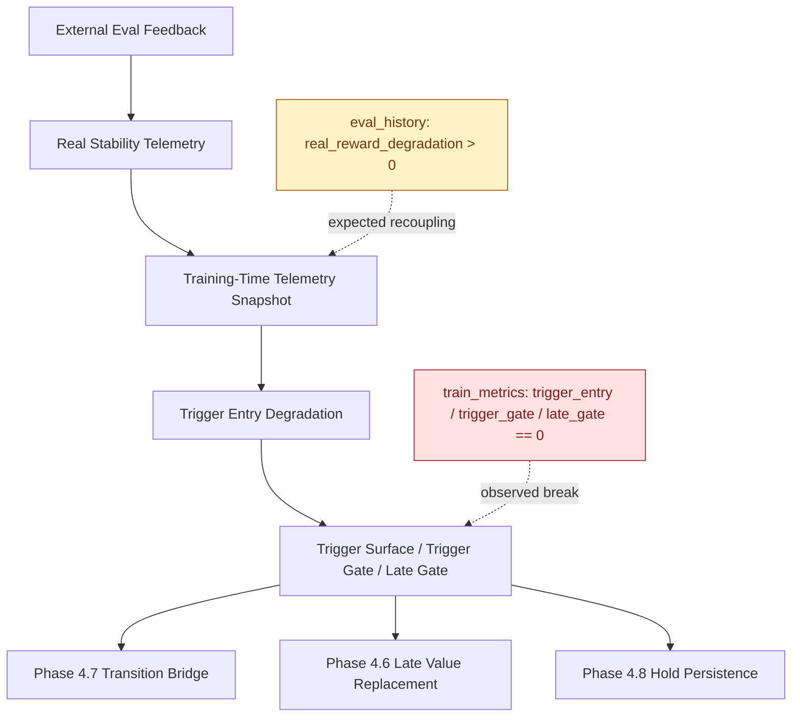

# Phase 4 总对账图与根因复盘

> 2026-03-19 晚间补充裁决
>
> 在 `v225_phase410_external_eval_feedback_training_time_entry_recoupling` 两次真实 run 结束后，新增确认了一条比原报告更上游的事实：
> `v223 / v224 / v225` 的真实 `config_resolved.json` 都显示 `adaptive_imag_critic_bootstrap_contract_enabled = false`，而 `v220 / v221 / v222` 为 `true`。
>
> 这意味着：
> - `v223-v225` 上看到的 `trigger_entry_degradation / trigger_gate / late_gate = 0.0`，不能再直接解释为“Phase 4.8-4.10 公式本体已经失败”。
> - 更准确的判读应是：`Phase 4.8-4.10` 这一段真实 run 混入了一个 launch/configuration regression，bootstrap contract 根本没有进入执行态。
> - 因此，`v223-v225` 仍然可以作为“为什么需要修 launch / entry 装配链”的证据，但不能单独作为 `Phase 4.8-4.10` 公式优劣的终局裁决。
>
> 也就是说，Phase 4 当前的真实阻塞，除了原报告里的 `training-time entry recoupling` 之外，还多了一层必须先修正的运行口径问题：
> `Phase 4 run assembly / override activation` 不能再静默把 bootstrap contract 关掉。

## 结论摘要

Phase 4 到 `v224` 为止，已经把问题从“bootstrap 中后段会掉坑”逐步上游化成一个更明确的结构故障。

- 已经确认修好的层：
  - `Phase 4.0 / v214` 修掉的是 final `effective_contact surface` 的执行漏洞，证明 `requested_floor` 可以真正落到 final surface。
  - `Phase 4.2 / v216` 证明 authority 侧必须有硬下界，不能只守 contact。
  - `Phase 4.5 / v220` 证明 source replacement 需要 `first-drop safe activation`，否则会过早侵入 `1050-1250`。
  - `Phase 4.6 / v221` 证明 late-window 的 `bonus source value replacement` 是有效修复层。
  - `Phase 4.7 / v222` 证明 `transition-window continuity bridge` 也是有效修复层。

- 还没有修好的层：
  - `Phase 4.8 / v223` 和 `Phase 4.9 / v224` 的原始观测仍然成立：这些 run 上 late-window contract 没有 entry。
  - 但 `v225` 之后的新证据说明，`v223-v225` 这组 run 还混入了一个更上游的 launch/configuration regression：bootstrap contract 在真实 run 中被关掉了。
  - 因此，这一段 run 目前更适合作为“运行口径失真”的证据，而不是 `hold / trigger-entry` 公式本体的最终反证。

- 当前真正根因：
  - 问题不再是 actor、controller、final effective-contact surface、authority floor、transition bridge 或 late bonus replacement 本体。
  - 当前真正断点分成两层：
    - `real-side degradation` 没有稳定进入训练态 bootstrap entry 主链。
    - `Phase 4` 真实 run 的 override / bootstrap-contract activation 也发生了配置回归。
  - 更准确地说，是 `external eval feedback / real stability telemetry` 到 `training-time trigger entry` 的消费与持久化链条，以及 `Phase 4 run assembly` 本身，都存在脱钩。

## 行为总对账表

| Run | 1000 | 1250 | 1500 | 1750 | 2000 | 2250 | 2500 | best during train | 结论 |
| --- | ---: | ---: | ---: | ---: | ---: | ---: | ---: | ---: | --- |
| `v214b` | 212.0 | 59.0 | 68.6 | 88.0 | 19.0 | 14.2 | 101.6 | 212.0 @1000 | strict A/B 基线，典型 fake corridor 首跌 |
| `v215` | 196.2 | 44.0 | 242.0 | 435.6 | 500.0 | 125.2 | 70.4 | 500.0 @2000 | 后段救回增强，但首跌保护失败 |
| `v216` | 141.2 | 73.6 | 34.2 | 89.8 | 88.6 | 18.8 | 103.0 | 144.8 @750 | authority floor 修正了 `1250`，但中后段仍不稳 |
| `v217` | 141.2 | 78.6 | 135.0 | 137.6 | 187.8 | 52.8 | 88.2 | 187.8 @2000 | source recert 有帮助，但 late-window 仍掉 |
| `v218` | 131.4 | 20.0 | 500.0 | 145.8 | 100.2 | 136.6 | 89.4 | 500.0 @1500 | provenance/source qualification 过早侵入首跌窗 |
| `v219` | 141.2 | 18.4 | 96.8 | 157.4 | 41.8 | 500.0 | 122.2 | 500.0 @2250 | source replacement 方向对，但首跌保护被打坏 |
| `v220` | 141.2 | 78.6 | 334.2 | 86.6 | 252.2 | 47.0 | 100.0 | 334.2 @1500 | first-drop safe activation 修好首跌窗，late-window 仍不稳 |
| `v221` | 146.2 | 148.4 | 137.8 | 20.6 | 331.4 | 264.0 | 464.2 | 464.2 @2500 | late bonus source value replacement 有效，但 `1500-1750` continuity 缺口暴露 |
| `v222` | 146.2 | 194.2 | 158.4 | 141.2 | 99.8 | 125.6 | 500.0 | 500.0 @2500 | transition bridge 修好中段 continuity，但 post-transition hold 仍掉 |
| `v223` | 96.4 | 20.4 | 28.0 | 32.6 | 247.4 | 18.2 | 13.4 | 247.4 @2000 | 事后复盘确认该 run 混入 `bootstrap_contract_enabled=false` 的 launch regression，不能直接裁 Phase 4.8 公式本体 |
| `v224` | 315.0 | 228.2 | 481.2 | 140.8 | 45.0 | 185.0 | 156.8 | 481.2 @1500 | 事后复盘确认该 run 同样混入 `bootstrap_contract_enabled=false`，原“trigger 入口全零”证据仍成立，但口径已失真 |

### 行为总表读法

- 首跌保护最显著的改善来自 `v216 -> v220 -> v221 -> v222 -> v224`，说明 authority floor、safe activation、value replacement、transition bridge 都各自修到了一个真实窗口。
- 但这些 run 都没有稳定把“真实退化发生时，训练主链及时进入 late-window contract”这件事修通。
- `v223` 和 `v224` 的共同结论仍然关键，但现在要加一句更准确的限定：
  - 不是所有后续合同都坏了。
  - 而是这些合同没有获得稳定 entry，而且这件事还叠加了真实 run 装配层把 bootstrap contract 关掉的口径错误。

## 结构分层对账表

### A. 执行链 / authority / mc-gap 终态指纹

| Run | requested_floor_on_valid | anchor_valid_effective_contact | external_authority_mean | external_authority_on_valid | authority_on_valid_debt_high | real_mc_value_gap_abs |
| --- | ---: | ---: | ---: | ---: | ---: | ---: |
| `v214b` | 0.5778 | 0.8853 | 0.4358 | — | — | 12.2726 |
| `v215` | 0.7823 | 1.0000 | 0.4755 | — | — | 23.4829 |
| `v216` | 0.5821 | 1.0000 | 0.6816 | 0.7674 | 0.7950 | 40.6830 |
| `v217` | 0.6537 | 0.9101 | 0.2845 | 0.6781 | 0.0000 | 17.8553 |
| `v218` | 0.7629 | 0.9552 | 0.3679 | 0.7660 | 0.8000 | 17.5306 |
| `v219` | 0.7532 | 1.0000 | 0.0965 | 0.7534 | 0.0000 | 13.8161 |
| `v220` | 0.7330 | 1.0000 | 0.1651 | 0.7331 | 0.8000 | 16.9167 |
| `v221` | 0.7522 | 0.9531 | 0.4091 | 0.7524 | 0.8000 | 23.9160 |
| `v222` | 0.6320 | 0.9166 | 0.3284 | 0.6672 | 0.7392 | 16.3798 |
| `v223` | 0.0000 | 0.0000 | 0.0000 | 0.0000 | 0.0000 | 214.8614 |
| `v224` | 0.0000 | 0.0000 | 0.0000 | 0.0000 | 0.0000 | 84.2866 |

### B. 窗口激活 / trigger 终态指纹

| Run | transition_activation | late_value_activation | hold_activation | trigger_entry_degradation | trigger_gate | late_gate |
| --- | ---: | ---: | ---: | ---: | ---: | ---: |
| `v214b` | — | — | — | — | 0.9364 | 0.9364 |
| `v215` | — | — | — | — | 1.0000 | 1.0000 |
| `v216` | — | — | — | — | 0.8920 | 0.8920 |
| `v217` | — | — | — | — | 0.9635 | 0.9635 |
| `v218` | — | — | — | — | 1.0000 | 1.0000 |
| `v219` | — | — | — | — | 1.0000 | 1.0000 |
| `v220` | — | — | — | — | 1.0000 | 1.0000 |
| `v221` | — | 1.0000 | — | — | 1.0000 | 1.0000 |
| `v222` | 0.0000 | 0.2541 | — | — | 0.8508 | 0.8508 |
| `v223` | 0.0000 | 0.0000 | 0.0000 | — | 0.0000 | 0.0000 |
| `v224` | 0.0000 | 0.0000 | 0.0000 | 0.0000 | 0.0000 | 0.0000 |

### C. `v224` 的关键脱钩证据

| step | eval mean | eval-side real_reward_degradation | eval-side real_task_cert_gate | train-side trigger_entry_degradation | train-side trigger_gate | train-side late_gate | train-side mc_gap |
| --- | ---: | ---: | ---: | ---: | ---: | ---: | ---: |
| 1250 | 228.2 | 0.2756 | 0.7244 | 0.0000 | 0.0000 | 0.0000 | 27.4725 |
| 1500 | 481.2 | 0.0000 | 1.0000 | 0.0000 | 0.0000 | 0.0000 | 33.3045 |
| 1750 | 140.8 | 0.7074 | 0.2926 | 0.0000 | 0.0000 | 0.0000 | 48.1869 |
| 2000 | 45.0 | 0.9065 | 0.0935 | 0.0000 | 0.0000 | 0.0000 | 76.0679 |
| 2250 | 185.0 | 0.6155 | 0.3845 | 0.0000 | 0.0000 | 0.0000 | 59.8814 |
| 2500 | 156.8 | 0.6741 | 0.3259 | 0.0000 | 0.0000 | 0.0000 | 84.2866 |

### 结构分层结论

- `Phase 4.2` 修的是 authority floor 执行，而不是 source truth。
- `Phase 4.5` 修的是 first-drop safe activation，而不是 late-window source 本体。
- `Phase 4.6` 修的是 late-window bonus source value。
- `Phase 4.7` 修的是 transition continuity。
- `Phase 4.8/4.9` 暴露的不是下游 floor/authority 执行链坏掉，而是：
  - late-window consumers 没有稳定 entry
  - entry source 与真实 reward/task degradation 仍脱钩
  - 并且真实 run 还混入了 `bootstrap contract` 未启用的 launch regression，导致这一段结构证据需要重新按正确口径复验

## Phase 4 分刀 verdict

### `v214b` strict A/B
- 目标：作为 `v213` 之后的严格同口径控制组。
- 实际结果：给出了稳定基线，确认中后段 fake corridor 首跌与掉坑仍存在。
- verdict：不是修复刀，但为后续每一刀提供了固定裁决基线。

### `v215 / Phase 4.1`
- 目标：把 bootstrap upstream request 改成显式 task-cert request 主合同。
- 实际结果：后段接管更强，`1500-2000` 可显著冲高。
- verdict：修到的是“后段救回增强”，没有修到“首跌预防”。

### `v216 / Phase 4.2`
- 目标：把 requested floor 升级为 external authority 的硬下界。
- 实际结果：`1250` 首跌窗口改善，authority floor 执行链被坐实。
- verdict：修到的是 authority floor 执行，不是 authority source 语义持续认证。

### `v217 / Phase 4.3`
- 目标：只允许通过 task-semantic persistence recert 的 source 保留 floor 上 bonus。
- 实际结果：late-window source recert 对 `2000` 一带有帮助。
- verdict：修到的是“谁有资格继续拿 authority bonus”，但没修到 source 真值本体。

### `v218 / v219 / Phase 4.4`
- 目标：把 authority bonus 的 source qualification 上移到 reward-semantic source replacement。
- 实际结果：确实触到了 provenance/source qualification 层。
- verdict：source replacement 侵入首跌窗过早，导致 `1250` 回归，说明时机错了，不是方向完全错。

### `v220 / Phase 4.5`
- 目标：让 reward-semantic source activation 在 first-drop window 保持中性，late-window 才生效。
- 实际结果：首跌保护被救回。
- verdict：修到的是激活时机，不是 late-window source truth 本体。

### `v221 / Phase 4.6`
- 目标：把 floor-above bonus 的 value source 替换为 reward-semantic 认证过的 source value。
- 实际结果：`1250 / 2250 / 2500` 都显著改善，说明 late-window value replacement 是真实有效层。
- verdict：暴露出新的 `1500-1750` continuity gap，问题上移到 transition-window continuity。

### `v222 / Phase 4.7`
- 目标：补上 early-safe 与 late replacement 之间的 transition-window continuity bridge。
- 实际结果：`1750` 得到修复，`2500` 也很强。
- verdict：transition continuity 被修好，但 post-transition hold 仍不稳定。

### `v223 / Phase 4.8`
- 目标：给 post-transition late-window bonus source 一个 hold persistence。
- 实际结果：大部分 bootstrap 合同指标整体归零，只有少数行为窗口侥幸反弹。
- verdict：原始现象仍是“late-window consumers 没有得到 entry”，但 `v225` 后续复盘确认该 run 还叠加了 `bootstrap_contract_enabled=false` 的 launch regression，因此不能再把锅只记在 hold 公式本体上。

### `v224 / Phase 4.9`
- 目标：把 late-window entry trigger source 重新耦合到真实 reward/task degradation。
- 实际结果：行为面一度很强，但结构面 `trigger_entry_degradation / trigger_gate / late_gate` 从 `1250 -> 2500` 全部保持 `0.0`。
- verdict：Phase 4.9 没有恢复 training-time entry。它证明的是：
  - helper 公式本身不是主问题
  - 真正问题在 `external eval feedback / real stability telemetry` 没有被训练态 bootstrap entry 稳定消费
  - 同时也暴露出 run assembly 本身没有保证 `bootstrap contract` 处于启用态，导致这条证据链必须在修正口径后重跑

### `v209-v213` 背景附录
- 这一段主要完成了：从“registry / task-cert / immediate reward agreement”一路收敛到“final surface 执行链”和“bootstrap authority contract”的早期诊断。
- 它们提供了上游化方向，但不进入本轮 `Phase 4` 主裁决表。

## 根因图 + 下一刀落点

### 根因结论

- `eval_history` 已经证明：
  - `real_reward_degradation` 会在真实退化窗口显著升高
  - `real_task_cert_gate` 会同步下降

- 但 `train_metrics` 同步点又证明：
  - `critic_contract_bootstrap_real_reward_degradation`
  - `critic_contract_bootstrap_real_task_degradation`
  - `critic_contract_bootstrap_trigger_entry_degradation`
  - `critic_contract_bootstrap_trigger_gate`
  - `critic_contract_bootstrap_late_gate`
  会同时保持为 `0.0`

- 因此当前问题不在 downstream consumers，而在：
  - `training-time consumption`
  - `feedback persistence`
  - `entry-source recoupling`

### 下一刀落点

下一刀继续留在 Phase 4，落点固定为：

`Phase 4.10：External Eval Feedback Persistence / Training-Time Entry Recoupling`

固定目标：

- 不再调 floor / authority floor / recert / source replacement / bridge / hold 的公式本体
- 只修 `external eval feedback -> training-time bootstrap entry` 的持久化与消费路径
- 同时修正 `Phase 4 run assembly / override activation`，避免 bootstrap contract 再次被静默关闭
- 明确拆开：
  - dedicated external feedback state
  - batch-local runtime task-cert state
- 让 `v224/v225` 这种“eval-side 真实退化很高，但 train-side trigger 全零，且 bootstrap contract 实际未启用”的双重脱钩形态不能再次出现
