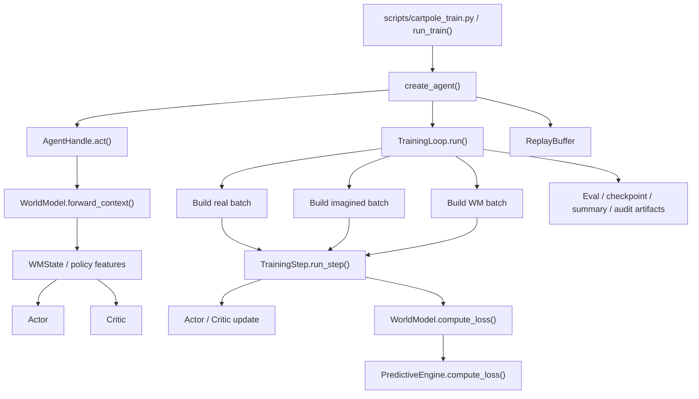
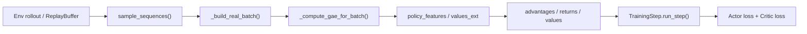
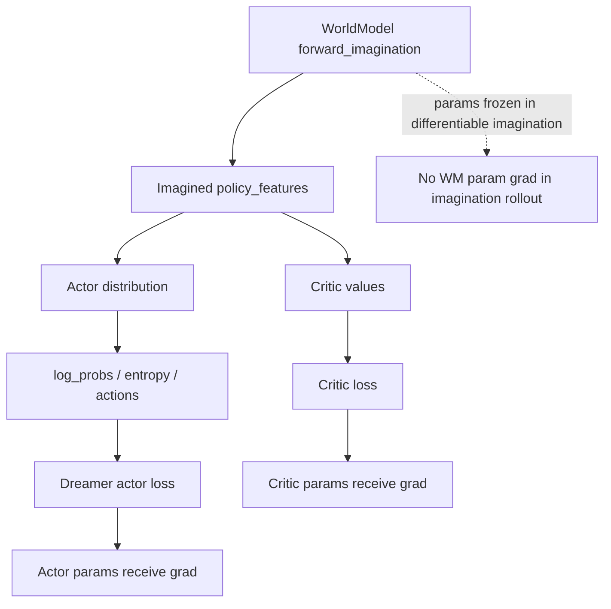

# 项目全盘正式审计报告（正式归档版）

- 审计日期：2026-03-12
- 审计对象：`/Users/zhangsan/Desktop/缸中之脑v5.6`
- 审计范围：架构、功能结构、数据流、训练链路、传导链路、函数空间、状态/特征转换、世界模型构建、梯度传播、反向梯度传播、损失计算、梯度隔离、实验产物与可复现性
- 审计方法：静态源码审计 + 关键路径抽样 + 全量单测 + 代表性实验产物交叉核对

## 审计摘要

本项目的基础 MBRL 主干是成立的。`ReplayBuffer -> TrainingLoop -> WorldModel -> Actor/Critic -> outputs` 这条主链路具备完整实现，真实数据链路与想象数据链路也都可运行，梯度隔离语义整体明确，实验产物落盘也较完整。

当前主要风险不在“世界模型无法训练”或“梯度整体串错”，而在 imagined controller 这一层的阶段状态机已经覆盖了主训练语义，且它与仓库自带测试契约已经出现明确偏移。换句话说，系统当前的主矛盾是控制语义自洽性，而不是基础学习管线缺失。

本轮基线结果如下：

- 当前目录不是 git worktree，无法建立基于 commit 的代码变更时间线。
- `python3 -m py_compile aletheia/*.py` 通过。
- `./.venv/bin/python -m unittest discover -s aletheia/tests -v` 共执行 `218` 个测试，失败 `4` 个。
- 核心代码高度集中在四个超大文件中：
  - `aletheia/aletheia_train.py`：9761 行
  - `aletheia/aletheia_world_model.py`：7893 行
  - `aletheia/aletheia_api.py`：3957 行
  - `aletheia/aletheia_actor_critic.py`：3552 行
- 扫描总代码量约 `43571` 行。
- 实验产物规模：
  - `outputs/` 一级目录 `285` 个
  - `checkpoints/` 一级目录 `28` 个
  - `outputs/**/*.jsonl` 文件 `538` 个

---

## 1. 架构图

### 1.1 总体架构



### 1.2 模块职责分层

| 层级 | 主要模块 | 核心职责 | 关键证据 |
| --- | --- | --- | --- |
| 入口层 | `scripts/cartpole_train.py`, `aletheia_api.py` | 环境构造、参数解析、agent 装配、训练入口、评估与保存 | [aletheia_api.py#L2959](/Users/zhangsan/Desktop/缸中之脑v5.6/aletheia/aletheia_api.py#L2959) |
| 运行时推理层 | `AgentHandle.act()` | 维护 stateful world-model 状态并输出动作 | [aletheia_api.py#L2072](/Users/zhangsan/Desktop/缸中之脑v5.6/aletheia/aletheia_api.py#L2072) |
| 训练编排层 | `TrainingLoop` | collect、sample、build batch、阶段控制、训练调度 | [aletheia_train.py#L8808](/Users/zhangsan/Desktop/缸中之脑v5.6/aletheia/aletheia_train.py#L8808) |
| 数据层 | `ReplayBuffer` | 以 episode 为单位维护时序契约和采样 | [aletheia_train.py#L805](/Users/zhangsan/Desktop/缸中之脑v5.6/aletheia/aletheia_train.py#L805) |
| 学习层 | `TrainingStep` | actor/critic/world model 损失拼装与优化器更新 | [aletheia_train.py#L3178](/Users/zhangsan/Desktop/缸中之脑v5.6/aletheia/aletheia_train.py#L3178) |
| 世界模型层 | `WorldModel`, `PredictiveEngine` | RSSM、预测头、序列建模、世界模型损失 | [aletheia_world_model.py#L7349](/Users/zhangsan/Desktop/缸中之脑v5.6/aletheia/aletheia_world_model.py#L7349), [aletheia_world_model.py#L5992](/Users/zhangsan/Desktop/缸中之脑v5.6/aletheia/aletheia_world_model.py#L5992) |
| 策略价值层 | `aletheia_actor_critic.py` | actor、critic、分布、twohot 等 | [aletheia_actor_critic.py](/Users/zhangsan/Desktop/缸中之脑v5.6/aletheia/aletheia_actor_critic.py) |
| 审计产物层 | `outputs/*` | resolved config、summary、jsonl 指标、post-entry 审计 | [summary.json](/Users/zhangsan/Desktop/缸中之脑v5.6/outputs/exp_seed42_v113_commit_highwater150_protect320_1500_20260312_200308/summary.json), [post_entry_audit.json](/Users/zhangsan/Desktop/缸中之脑v5.6/outputs/exp_seed42_v113_commit_highwater150_protect320_1500_20260312_200308/post_entry_audit.json) |

### 1.3 世界模型构建结构

`create_agent()` 会先根据环境空间推导 RSSM 容量，然后按顺序创建 perceptor、world model、router、actor-critic，并组装为 `AgentContainer`。这说明世界模型不是孤立组件，而是整个 agent 装配图的核心中枢。

关键位置：

- `create_agent()`： [aletheia_api.py#L1027](/Users/zhangsan/Desktop/缸中之脑v5.6/aletheia/aletheia_api.py#L1027)
- runtime 装配后的 `TrainingLoop`： [aletheia_api.py#L3643](/Users/zhangsan/Desktop/缸中之脑v5.6/aletheia/aletheia_api.py#L3643)
- `WorldModel.compute_loss()`： [aletheia_world_model.py#L7810](/Users/zhangsan/Desktop/缸中之脑v5.6/aletheia/aletheia_world_model.py#L7810)
- `PredictiveEngine.compute_loss()`： [aletheia_world_model.py#L6106](/Users/zhangsan/Desktop/缸中之脑v5.6/aletheia/aletheia_world_model.py#L6106)

### 1.4 函数空间热区

按 AST 统计，函数空间的复杂度高度集中：

| 排名 | 函数 | 行数 | 位置 |
| --- | --- | ---: | --- |
| 1 | `TrainingStep.run_step` | 1191 | [aletheia_train.py#L3178](/Users/zhangsan/Desktop/缸中之脑v5.6/aletheia/aletheia_train.py#L3178) |
| 2 | `run_train` | 895 | [aletheia_api.py#L2959](/Users/zhangsan/Desktop/缸中之脑v5.6/aletheia/aletheia_api.py#L2959) |
| 3 | `TrainingLoop._build_imagined_batch` | 689 | [aletheia_train.py#L7984](/Users/zhangsan/Desktop/缸中之脑v5.6/aletheia/aletheia_train.py#L7984) |
| 4 | `TrainingLoop._resolve_imag_controller_stage` | 391 | [aletheia_train.py#L6778](/Users/zhangsan/Desktop/缸中之脑v5.6/aletheia/aletheia_train.py#L6778) |
| 5 | `TrainingLoop._resolve_imag_continue_cap` | 263 | [aletheia_train.py#L7720](/Users/zhangsan/Desktop/缸中之脑v5.6/aletheia/aletheia_train.py#L7720) |

结论：当前架构不是“模块很多”，而是“职责集中到几个超大函数”。这会显著放大回归风险。

---

## 2. 数据流图

### 2.1 真实数据训练链路



真实链路的关键契约：

- `ReplayBuffer` 以 `T+1` 个 `vitals` 对齐 `T` 个动作、奖励、done。定义见 [aletheia_train.py#L808](/Users/zhangsan/Desktop/缸中之脑v5.6/aletheia/aletheia_train.py#L808)。
- `_compute_gae_for_batch()` 优先尝试构造 stateful `policy_features`，再补齐 `values_ext` 计算 GAE。位置见 [aletheia_train.py#L7594](/Users/zhangsan/Desktop/缸中之脑v5.6/aletheia/aletheia_train.py#L7594)。
- `_build_real_batch()` 最终将 `returns` 投入 `target_actor`，并把 `base_actor` 固定为 detached value baseline。位置见 [aletheia_train.py#L8674](/Users/zhangsan/Desktop/缸中之脑v5.6/aletheia/aletheia_train.py#L8674)。

### 2.2 想象训练链路


想象链路的几个决定性转换点：

- seed 状态恢复： [aletheia_train.py#L8053](/Users/zhangsan/Desktop/缸中之脑v5.6/aletheia/aletheia_train.py#L8053)
- differentiable imagination： [aletheia_train.py#L4634](/Users/zhangsan/Desktop/缸中之脑v5.6/aletheia/aletheia_train.py#L4634)
- continue cap 和 controller 接入： [aletheia_train.py#L8116](/Users/zhangsan/Desktop/缸中之脑v5.6/aletheia/aletheia_train.py#L8116)
- actor target/base/weights 构造： [aletheia_train.py#L8136](/Users/zhangsan/Desktop/缸中之脑v5.6/aletheia/aletheia_train.py#L8136), [aletheia_train.py#L8253](/Users/zhangsan/Desktop/缸中之脑v5.6/aletheia/aletheia_train.py#L8253)

### 2.3 数据计算空间关系

| 空间 | 表示 | 来源 | 主要变换 | 下游用途 |
| --- | --- | --- | --- | --- |
| 观测空间 | `obs`, `vitals` | 环境 / replay | `encode_obs()` | 进入世界模型 |
| 动作空间 | `action`, `action_prev` | actor / replay | `encode_action()` | RSSM 条件输入 |
| 动力学隐空间 | `h_shared`, `z` | RSSM posterior/prior | `observe_step()` / `imagine_step()` | world model 主状态 |
| 控制空间 | `s_ctrl` | `ControlHead` | 由 `x_rl + action_prev + s_ctrl_prev` 更新 | policy/critic 路由 |
| 投影空间 | `x_proj` | `ProjectionLayer` | `s_pred -> x-space` | imagination 控制推进、router 输入 |
| 任务抽象空间 | `z_task` | `Abstractor` | `s_pred -> task space` | 辅助路由 / 抽象任务表征 |
| 策略特征空间 | `policy_features`, `f_policy` | `policy_from_wm_state()` / router | 将 WMState 转成 actor/critic 输入 | 行为与价值估计 |
| 价值目标空间 | `values`, `returns`, `target_actor`, `base_actor` | critic + imagined lambda return | clip、blend、cap、stage-based repair | actor/critic 损失 |
| 折扣/视野空间 | `continue_probs`, `weights_actor`, `effective_horizon` | continue head | `cumprod(gamma * continue)` | 控制 imagined horizon |
| 阶段语义空间 | `idle/pretrigger/post_entry/...` | controller state machine | 多阈值、多 hold、多 override | 控制整个 imagined 几何 |

### 2.4 世界模型前向与传导链路

真实前向：

- `forward_context()` 对真实观测做 posterior 更新，同时生成 `x_proj`、`z_task`、`s_ctrl`。见 [aletheia_world_model.py#L7634](/Users/zhangsan/Desktop/缸中之脑v5.6/aletheia/aletheia_world_model.py#L7634)。

想象前向：

- `forward_imagination()` 基于 prior 更新 `(h_shared, z)`，然后由 `s_pred` 派生 `x_proj` 和 `z_task`，再用 `imag_x_t = x_proj if x_proj is not None else prev_state.x_t` 推进控制分支。见 [aletheia_world_model.py#L7705](/Users/zhangsan/Desktop/缸中之脑v5.6/aletheia/aletheia_world_model.py#L7705)。

这条设计意味着控制链路在 imagination 阶段不应继续复用最后一帧真实观测嵌入，而应跟随 imagined embedding 前进。仓库测试也对这一点做了回归约束，见 [test_pure_imagination_path.py#L215](/Users/zhangsan/Desktop/缸中之脑v5.6/aletheia/tests/test_pure_imagination_path.py#L215)。

### 2.5 梯度传播、反向传播与梯度隔离



当前项目在梯度层面的设计是清晰的：

- `WMState.isolate_gradients()` 提供 `rl/policy/all` 三种隔离模式。见 [aletheia_world_model.py#L4743](/Users/zhangsan/Desktop/缸中之脑v5.6/aletheia/aletheia_world_model.py#L4743)。
- `forward_context()` 和 `forward_imagination()` 中的 `x_proj/z_task` 都会 detach 后再进入 router/control 语义。见 [aletheia_world_model.py#L7681](/Users/zhangsan/Desktop/缸中之脑v5.6/aletheia/aletheia_world_model.py#L7681)、[aletheia_world_model.py#L7727](/Users/zhangsan/Desktop/缸中之脑v5.6/aletheia/aletheia_world_model.py#L7727)。
- `ImaginationEngine.imagine_rollout_differentiable()` 会冻结 world model 和 critic 参数，只让 actor 保留梯度通路。见 [aletheia_train.py#L4681](/Users/zhangsan/Desktop/缸中之脑v5.6/aletheia/aletheia_train.py#L4681)。
- sampled action 上的 `log_prob` 反向被切断。见 [aletheia_train.py#L4707](/Users/zhangsan/Desktop/缸中之脑v5.6/aletheia/aletheia_train.py#L4707)。
- imagined precomputed feature 可选对 critic 输入 detach，防止 critic 反灌 policy feature。见 [aletheia_train.py#L3294](/Users/zhangsan/Desktop/缸中之脑v5.6/aletheia/aletheia_train.py#L3294)。

测试证据：

- actor 有 imagination gradient，而 world model/critic 无： [test_pure_imagination_path.py#L114](/Users/zhangsan/Desktop/缸中之脑v5.6/aletheia/tests/test_pure_imagination_path.py#L114)
- sampled action 不承受 log_prob 反向： [test_pure_imagination_path.py#L152](/Users/zhangsan/Desktop/缸中之脑v5.6/aletheia/tests/test_pure_imagination_path.py#L152)
- critic-feature detach 契约： [test_training_entrypoints.py#L367](/Users/zhangsan/Desktop/缸中之脑v5.6/aletheia/tests/test_training_entrypoints.py#L367)

### 2.6 损失计算结构

世界模型损失：

- `PredictiveEngine.compute_loss()` 统一组装 `reward / continue / recon / kl / quant / consistency`。见 [aletheia_world_model.py#L6106](/Users/zhangsan/Desktop/缸中之脑v5.6/aletheia/aletheia_world_model.py#L6106)。
- `PredictiveLossPacket.total` 按权重汇总 core loss 与 consistency total。见 [aletheia_world_model.py#L5097](/Users/zhangsan/Desktop/缸中之脑v5.6/aletheia/aletheia_world_model.py#L5097)。

策略价值损失：

- actor 目标为 Dreamer 风格混合目标：`analytic_term + reinforce_term + entropy`。见 [aletheia_train.py#L2045](/Users/zhangsan/Desktop/缸中之脑v5.6/aletheia/aletheia_train.py#L2045)。
- critic 目标支持 Huber 或 twohot，并叠加 slow regularization、real-value anchor、post-solved anchor。见 [aletheia_train.py#L3443](/Users/zhangsan/Desktop/缸中之脑v5.6/aletheia/aletheia_train.py#L3443)、[aletheia_train.py#L3505](/Users/zhangsan/Desktop/缸中之脑v5.6/aletheia/aletheia_train.py#L3505)。
- `run_step()` 最终将 actor objective 与加权 critic terms 汇总，再分别 step actor/critic/extra optimizer。见 [aletheia_train.py#L4018](/Users/zhangsan/Desktop/缸中之脑v5.6/aletheia/aletheia_train.py#L4018)、[aletheia_train.py#L4035](/Users/zhangsan/Desktop/缸中之脑v5.6/aletheia/aletheia_train.py#L4035)。
- world model 更新独立发生，loss 通过 `wm_optimizer` 单独反向。见 [aletheia_train.py#L4306](/Users/zhangsan/Desktop/缸中之脑v5.6/aletheia/aletheia_train.py#L4306)。

补充观察：

- `PredictiveLossPacket` 保留了 `projection` 与 `abstractor` 槽位，但 `PredictiveEngine.compute_loss()` 当前直接将二者置零。见 [aletheia_world_model.py#L6140](/Users/zhangsan/Desktop/缸中之脑v5.6/aletheia/aletheia_world_model.py#L6140)。这不是已确认 bug，但确实降低了投影头/抽象头训练语义的可解释性。

---

## 3. 风险分级

### 3.1 风险总表

| 等级 | 领域 | 风险描述 | 影响 | 直接证据 |
| --- | --- | --- | --- | --- |
| 高 | Controller 契约 | external eval 回撤无法可靠 arm persistence，导致 release 语义断裂 | imagined 控制链条在关键回撤场景失效 | [aletheia_train.py#L6544](/Users/zhangsan/Desktop/缸中之脑v5.6/aletheia/aletheia_train.py#L6544), [aletheia_train.py#L6555](/Users/zhangsan/Desktop/缸中之脑v5.6/aletheia/aletheia_train.py#L6555), [aletheia_train.py#L6581](/Users/zhangsan/Desktop/缸中之脑v5.6/aletheia/aletheia_train.py#L6581) |
| 高 | Controller 契约 | effective override 直接绕过标准 commit confirmation window | post-entry handoff 语义与测试契约偏离 | [aletheia_train.py#L7021](/Users/zhangsan/Desktop/缸中之脑v5.6/aletheia/aletheia_train.py#L7021), [aletheia_train.py#L7170](/Users/zhangsan/Desktop/缸中之脑v5.6/aletheia/aletheia_train.py#L7170), [aletheia_train.py#L7254](/Users/zhangsan/Desktop/缸中之脑v5.6/aletheia/aletheia_train.py#L7254) |
| 中 | 结构复杂度 | `run_step`、`_build_imagined_batch`、controller resolver 过大 | 修复成本高，回归面大，行为不透明 | [aletheia_train.py#L3178](/Users/zhangsan/Desktop/缸中之脑v5.6/aletheia/aletheia_train.py#L3178), [aletheia_train.py#L7984](/Users/zhangsan/Desktop/缸中之脑v5.6/aletheia/aletheia_train.py#L7984) |
| 中 | 维护性 | `TrainingStep` 存在重复方法定义，后定义覆盖前定义 | 将来修复极易改到死代码 | [aletheia_train.py#L2698](/Users/zhangsan/Desktop/缸中之脑v5.6/aletheia/aletheia_train.py#L2698), [aletheia_train.py#L2792](/Users/zhangsan/Desktop/缸中之脑v5.6/aletheia/aletheia_train.py#L2792) |
| 中 | 配置面复杂度 | `adaptive_imag_*` 参数/状态表面过大，白名单极长 | 配置爆炸，语义漂移难以及时发现 | [aletheia_api.py#L3200](/Users/zhangsan/Desktop/缸中之脑v5.6/aletheia/aletheia_api.py#L3200) |
| 低到中 | 可复现性 | 有 resolved config，但当前不记录 git commit | 参数可回放，源码快照不可精确回放 | [config_resolved.json](/Users/zhangsan/Desktop/缸中之脑v5.6/outputs/exp_seed42_v113_commit_highwater150_protect320_1500_20260312_200308/config_resolved.json) |

### 3.2 已验证失败信号

当前失败的 `4` 个测试都指向 controller 契约偏差，而不是基础张量逻辑：

- [test_training_loop_integration.py#L2367](/Users/zhangsan/Desktop/缸中之脑v5.6/aletheia/tests/test_training_loop_integration.py#L2367)
- [test_training_loop_integration.py#L2751](/Users/zhangsan/Desktop/缸中之脑v5.6/aletheia/tests/test_training_loop_integration.py#L2751)
- [test_training_loop_integration.py#L3320](/Users/zhangsan/Desktop/缸中之脑v5.6/aletheia/tests/test_training_loop_integration.py#L3320)
- [test_training_loop_integration.py#L6943](/Users/zhangsan/Desktop/缸中之脑v5.6/aletheia/tests/test_training_loop_integration.py#L6943)

### 3.3 风险判断

当前项目的高风险区不是世界模型本体，而是 imagined controller 的“策略几何治理层”。这层一旦语义失配，会直接重写 `target_actor/base_actor/weights_actor` 的构造方式，从而改变训练目标本身。

---

## 4. 修复建议

### 4.1 第一阶段：契约修复优先

目标：先把 controller 语义修回与测试契约一致，再讨论新的调参与新策略。

建议：

1. 修复 persistence arming 契约。
   - 明确“external eval 已确认 drawdown，但尚未 post-entry commit”时 persistence 是否允许直接 armed。
   - 若测试契约是权威口径，应优先使 [aletheia_train.py#L6544](/Users/zhangsan/Desktop/缸中之脑v5.6/aletheia/aletheia_train.py#L6544) 这一门控与测试一致。

2. 修复 effective override 对 confirmation window 的旁路。
   - `_maybe_apply_effective_post_entry_commit_override()` 不应直接把 `post_entry_commit_confirmation_ready` 改为 `True`，除非 highwater fast-path 被明确设计为独立契约。
   - 推荐将 override 改成“只写候选证据，不直接写完成态”，由 `_resolve_imag_controller_stage()` 统一落 final state。

3. 先让失败的 4 个集成测试全部转绿，再继续 controller 语义扩展。

### 4.2 第二阶段：结构拆分

目标：降低超大函数的认知与回归成本。

建议拆分：

1. 将 `_build_imagined_batch()` 拆为四个纯函数或近纯函数：
   - seed state 恢复
   - imagination rollout 封装
   - actor target/base/weight 几何构造
   - controller metrics 与 stage 注入

2. 将 `_resolve_imag_controller_stage()` 拆为：
   - external eval state update
   - post-entry / persistence / release / post-solved 决策
   - metrics materialization

3. 将 `run_step()` 拆为：
   - precomputed policy outputs 准备
   - actor loss 计算
   - critic loss 计算
   - world model loss 计算
   - optimizer orchestration

4. 删除 `TrainingStep` 内重复定义的方法块，避免后续维护踩空。

### 4.3 第三阶段：配置面收缩

目标：从“参数驱动状态机”回退到“少量稳定控制律”。

建议：

1. 将 `adaptive_imag_*` 参数按阶段聚类为结构化配置，而不是继续扩平铺字段。
2. 将“实验性修正”与“主线契约参数”分层管理。
3. 对 API override 白名单做分组注释，并给 controller 相关参数建立 schema 文档。

### 4.4 第四阶段：世界模型辅助分支语义澄清

目标：明确 `projection` / `abstractor` 辅助分支是否属于当前主训练闭环。

建议：

1. 若这两个头是主设计的一部分，应恢复其显式 loss 入口与日志。
2. 若它们只作为前向中间表征，应在文档中明确“当前不通过独立损失训练”。

### 4.5 第五阶段：可复现性闭环

目标：让实验产物真正可回放到源码快照。

建议：

1. 将项目纳入 git 管理，确保 `config_resolved.json` 记录真实 commit hash。
2. 在 `summary.json` 中显式写入当前测试基线状态。
3. 对关键实验产物增加“源码摘要 + 配置摘要 + 失败测试摘要”。

---

## 5. 验证计划

### 5.1 验证目标

验证不是只看训练分数，而是同时验证以下四层：

- 语法与导入层：代码可编译、可导入
- 契约层：controller 测试与梯度隔离测试全绿
- 行为层：阶段切换与 imagined target 几何符合预期
- 可复现层：产物能回溯到配置与源码快照

### 5.2 验证步骤

#### Step 1：基础静态验证

执行：

```bash
python3 -m py_compile aletheia/*.py
```

通过标准：

- 无语法错误
- 无导入级崩溃

#### Step 2：聚焦 controller 回归测试

优先执行：

```bash
./.venv/bin/python -m unittest \
  aletheia.tests.test_training_loop_integration.TestTrainingLoopIntegration.test_external_eval_confirmation_arms_controller_after_streak \
  aletheia.tests.test_training_loop_integration.TestTrainingLoopIntegration.test_persistence_release_stage_softens_guard_near_solved_band \
  aletheia.tests.test_training_loop_integration.TestTrainingLoopIntegration.test_persistence_release_stage_hands_off_to_post_solved \
  aletheia.tests.test_training_loop_integration.TestTrainingLoopIntegration.test_post_entry_standard_commit_requires_confirmation_window_before_clearing_pending \
  -v
```

通过标准：

- 当前失败的 4 个测试全部转绿
- 不引入新的 controller 失败

#### Step 3：聚焦梯度隔离与 imagined path 契约

执行：

```bash
./.venv/bin/python -m unittest \
  aletheia.tests.test_pure_imagination_path \
  aletheia.tests.test_training_entrypoints \
  -v
```

通过标准：

- actor 有 imagined gradient
- world model / critic 不通过 imagination rollout 获得不应有的梯度
- critic-feature detach 契约保持成立

#### Step 4：全量回归

执行：

```bash
./.venv/bin/python -m unittest discover -s aletheia/tests -v
```

通过标准：

- 全量测试无失败
- controller 相关失败归零

#### Step 5：阶段行为审计

在固定 seed 下跑一个中长度 imagination-only 训练，并审计这些指标：

- `imag/controller_stage`
- `imag/controller_post_entry_commit_ready`
- `imag/controller_persistence_active`
- `imag/controller_persistence_release_active`
- `imag/controller_post_solved_active`
- `imag/value_target_gap_abs_mean`
- `actor/target_mean`
- `actor/base_mean`
- `actor/weights_mean`
- `imag/effective_horizon`

通过标准：

- `post_entry -> persistence -> persistence_release -> post_solved` 的转换与配置语义一致
- 不再出现“测试要求等待确认窗，但运行时直接 committed”的偏差
- imagined 目标几何没有因修复而出现明显断崖

#### Step 6：可复现性审计

检查产物：

- `config_resolved.json`
- `summary.json`
- `resume_latest.pt`
- `trainer_state_final.pt`
- `post_entry_audit.json`

通过标准：

- `config_resolved.json` 有真实 `git_commit`
- `summary.json` 中能追溯关键实验配置和最佳评估点
- post-entry 审计能准确反映阶段切换

### 5.3 推荐验收门槛

建议将本轮修复定义为“通过”时，必须同时满足：

1. 当前 `4` 个失败测试归零。
2. 全量 `218` 个测试全部通过。
3. imagined controller 阶段切换不再依赖隐式 override 旁路。
4. 实验产物记录真实源码快照标识。

---

## 附录 A：关键证据清单

### 代码主路径

- 训练入口： [aletheia_api.py#L2959](/Users/zhangsan/Desktop/缸中之脑v5.6/aletheia/aletheia_api.py#L2959)
- stateful 动作路径： [aletheia_api.py#L2072](/Users/zhangsan/Desktop/缸中之脑v5.6/aletheia/aletheia_api.py#L2072)
- ReplayBuffer 契约： [aletheia_train.py#L805](/Users/zhangsan/Desktop/缸中之脑v5.6/aletheia/aletheia_train.py#L805)
- 主训练循环： [aletheia_train.py#L8808](/Users/zhangsan/Desktop/缸中之脑v5.6/aletheia/aletheia_train.py#L8808)
- imagined batch 构造： [aletheia_train.py#L7984](/Users/zhangsan/Desktop/缸中之脑v5.6/aletheia/aletheia_train.py#L7984)
- differentiable imagination： [aletheia_train.py#L4634](/Users/zhangsan/Desktop/缸中之脑v5.6/aletheia/aletheia_train.py#L4634)
- actor loss： [aletheia_train.py#L2045](/Users/zhangsan/Desktop/缸中之脑v5.6/aletheia/aletheia_train.py#L2045)
- training step： [aletheia_train.py#L3178](/Users/zhangsan/Desktop/缸中之脑v5.6/aletheia/aletheia_train.py#L3178)
- world model imagination： [aletheia_world_model.py#L7705](/Users/zhangsan/Desktop/缸中之脑v5.6/aletheia/aletheia_world_model.py#L7705)
- world model loss 入口： [aletheia_world_model.py#L7810](/Users/zhangsan/Desktop/缸中之脑v5.6/aletheia/aletheia_world_model.py#L7810)

### 高风险缺陷证据

- persistence gate： [aletheia_train.py#L6544](/Users/zhangsan/Desktop/缸中之脑v5.6/aletheia/aletheia_train.py#L6544)
- persistence release gate： [aletheia_train.py#L6581](/Users/zhangsan/Desktop/缸中之脑v5.6/aletheia/aletheia_train.py#L6581)
- confirmation window： [aletheia_train.py#L7021](/Users/zhangsan/Desktop/缸中之脑v5.6/aletheia/aletheia_train.py#L7021)
- effective override： [aletheia_train.py#L7170](/Users/zhangsan/Desktop/缸中之脑v5.6/aletheia/aletheia_train.py#L7170)
- 重复定义： [aletheia_train.py#L2698](/Users/zhangsan/Desktop/缸中之脑v5.6/aletheia/aletheia_train.py#L2698), [aletheia_train.py#L2792](/Users/zhangsan/Desktop/缸中之脑v5.6/aletheia/aletheia_train.py#L2792)

### 测试证据

- [test_pure_imagination_path.py](/Users/zhangsan/Desktop/缸中之脑v5.6/aletheia/tests/test_pure_imagination_path.py)
- [test_training_entrypoints.py](/Users/zhangsan/Desktop/缸中之脑v5.6/aletheia/tests/test_training_entrypoints.py)
- [test_training_loop_integration.py](/Users/zhangsan/Desktop/缸中之脑v5.6/aletheia/tests/test_training_loop_integration.py)

### 实验与审计产物

- [config_resolved.json](/Users/zhangsan/Desktop/缸中之脑v5.6/outputs/exp_seed42_v113_commit_highwater150_protect320_1500_20260312_200308/config_resolved.json)
- [summary.json](/Users/zhangsan/Desktop/缸中之脑v5.6/outputs/exp_seed42_v113_commit_highwater150_protect320_1500_20260312_200308/summary.json)
- [post_entry_audit.json](/Users/zhangsan/Desktop/缸中之脑v5.6/outputs/exp_seed42_v113_commit_highwater150_protect320_1500_20260312_200308/post_entry_audit.json)

