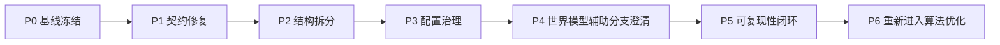

# 项目系统性修复实施方案

- 方案日期：2026-03-12
- 适用范围：`/Users/zhangsan/Desktop/缸中之脑v5.6`
- 方案依据：
  - [项目全盘正式审计报告-2026-03-12.md](/Users/zhangsan/Desktop/缸中之脑v5.6/docs/archive/root-reports/2026-03/项目全盘正式审计报告-2026-03-12.md)
  - 当前源码与测试基线
  - 当前实验产物与 post-entry 审计产物

## 0. 方案总述

这份修复方案的核心判断是：

1. 项目的基础 MBRL 主干没有坏。
2. 当前最主要的修复目标不是继续做参数扫描，而是先把 imagined controller 的契约修正回“可解释、可验证、可维护”的状态。
3. 修复必须分成三层推进：
   - 契约修复：先恢复行为正确性
   - 结构修复：再降低复杂度与回归面
   - 算法修复：最后才继续做阶段策略和稳定性优化

如果不按这个顺序推进，项目会继续陷入“靠新增开关掩盖旧语义偏差”的循环，导致测试契约、实验结果和代码表意持续背离。

本方案不是“建议清单”，而是一套可以直接执行的修复计划，包含：

- 修复目标和优先级
- 逐阶段工作包
- 文件级落点
- 每阶段的输出物
- 测试门槛与验收条件
- 风险控制与停止条件

---

## 1. 修复目标与定义

### 1.1 总目标

将项目恢复到以下状态：

- controller 语义与仓库测试契约一致
- imagined training chain 的关键状态转换不再依赖隐式 override
- 训练目标构造 `target_actor / base_actor / weights_actor` 的来源和阶段修正可被清晰解释
- 关键超大函数被拆分到可单测的程度
- 实验产物可以回溯到明确的源码快照和测试基线

### 1.2 成功标准

本轮修复完成必须同时满足：

1. 当前失败的 4 个测试全部修复。
2. 全量测试 `218` 个全部通过。
3. controller 的 stage handoff 可以用状态机规则解释，不再依赖旁路式直接改写完成态。
4. `TrainingStep` 中重复定义的方法被消除。
5. `run_step`、`_build_imagined_batch`、`_resolve_imag_controller_stage` 的职责边界明显收缩。
6. 训练产物记录真实源码标识与测试基线。

### 1.3 非目标

本轮不把以下内容作为第一优先级：

- 继续大规模扫描 `adaptive_imag_*` 参数
- 在 controller 契约未修正前继续做新阶段策略设计
- 在结构尚未拆分前继续堆叠新的局部 guard
- 把“训练分数偶尔变好”当作修复成功

---

## 2. 根因综合判断

### 2.1 已确认的一级问题

#### 问题 A：persistence arming 契约偏差

`set_external_eval_feedback()` 当前把 persistence arming 建立在额外的 post-entry commit gate 之上，导致“外部评估确认回撤，但尚未 commit”的场景不能稳定进入 persistence。

关键位置：

- [aletheia_train.py#L6544](/Users/zhangsan/Desktop/缸中之脑v5.6/aletheia/aletheia_train.py#L6544)
- [aletheia_train.py#L6555](/Users/zhangsan/Desktop/缸中之脑v5.6/aletheia/aletheia_train.py#L6555)
- [aletheia_train.py#L6581](/Users/zhangsan/Desktop/缸中之脑v5.6/aletheia/aletheia_train.py#L6581)

表现：

- persistence 无法按测试契约 armed
- persistence_release 连带失效
- 阶段链路被迫回退到更早或错误的 stage

#### 问题 B：effective override 旁路确认窗口

`_maybe_apply_effective_post_entry_commit_override()` 会直接把 controller 状态改写为 committed，覆盖 `_resolve_imag_controller_stage()` 原本维护的确认窗语义。

关键位置：

- [aletheia_train.py#L7021](/Users/zhangsan/Desktop/缸中之脑v5.6/aletheia/aletheia_train.py#L7021)
- [aletheia_train.py#L7170](/Users/zhangsan/Desktop/缸中之脑v5.6/aletheia/aletheia_train.py#L7170)
- [aletheia_train.py#L7254](/Users/zhangsan/Desktop/缸中之脑v5.6/aletheia/aletheia_train.py#L7254)

表现：

- 测试要求“先成为候选，再走确认窗，最后 committed”
- 当前实现却会直接跳到 `post_entry`
- 造成运行时状态机与测试契约不一致

#### 问题 C：结构复杂度掩盖真实语义

当前主训练语义散布在超大函数里：

- `TrainingStep.run_step()`：1191 行
- `TrainingLoop._build_imagined_batch()`：689 行
- `TrainingLoop._resolve_imag_controller_stage()`：391 行

这导致：

- 很难定位某个阶段修正究竟影响了哪一层目标构造
- 很难新增测试覆盖全部变换路径
- 修复一个局部问题时容易连带影响多个阶段

#### 问题 D：死代码式风险已出现

`TrainingStep` 内重复定义的方法说明当前文件已超出稳定维护边界，后续任何修复都可能改错块。

关键位置：

- [aletheia_train.py#L2698](/Users/zhangsan/Desktop/缸中之脑v5.6/aletheia/aletheia_train.py#L2698)
- [aletheia_train.py#L2792](/Users/zhangsan/Desktop/缸中之脑v5.6/aletheia/aletheia_train.py#L2792)

### 2.2 二级问题

#### 问题 E：配置面爆炸

`adaptive_imag_*` 配置与状态键数量已经非常大，且 API override 白名单很长。参数面的持续增长已经成为理解成本和回归成本的放大器。

#### 问题 F：辅助分支训练语义不透明

`PredictiveLossPacket` 保留了 `projection` 与 `abstractor` 槽位，但 `PredictiveEngine.compute_loss()` 当前将其置零。无论这是有意设计还是历史残留，都意味着这两个分支的训练语义需要被明确。

#### 问题 G：可复现性未闭环

实验已记录 resolved config、summary、audit 产物，但没有可靠的 git commit 绑定，所以参数回放是可行的，源码回放还不充分。

---

## 3. 修复总策略

### 3.1 总体策略图



### 3.2 执行原则

1. 先修行为契约，再修结构，再做算法优化。
2. 任何一项 controller 修复必须先补测试，再改代码。
3. 任何超大函数拆分都必须保持行为不变，优先提纯函数，不先改策略。
4. 任何新增配置都必须有对应 schema 归属与测试。
5. 所有训练效果判断都必须附带测试状态和源码快照。

---

## 4. 逐阶段修复方案

## 4.1 Phase P0：冻结基线与建立修复护栏

### 目标

在改代码前锁定一组权威基线，避免“边修边漂移”。

### 工作内容

1. 固化当前失败测试清单。
2. 固化当前全量测试结果。
3. 记录当前代表性实验基线及其关键指标。
4. 为 controller 修复建立单独的最小回归命令。

### 具体动作

- 记录以下命令为权威基线：

```bash
python3 -m py_compile aletheia/*.py
./.venv/bin/python -m unittest discover -s aletheia/tests -v
```

- 固化当前失败测试：
  - [test_training_loop_integration.py#L2367](/Users/zhangsan/Desktop/缸中之脑v5.6/aletheia/tests/test_training_loop_integration.py#L2367)
  - [test_training_loop_integration.py#L2751](/Users/zhangsan/Desktop/缸中之脑v5.6/aletheia/tests/test_training_loop_integration.py#L2751)
  - [test_training_loop_integration.py#L3320](/Users/zhangsan/Desktop/缸中之脑v5.6/aletheia/tests/test_training_loop_integration.py#L3320)
  - [test_training_loop_integration.py#L6943](/Users/zhangsan/Desktop/缸中之脑v5.6/aletheia/tests/test_training_loop_integration.py#L6943)

- 为代表性训练基线指定一个固定实验目录作为比较对象：
  - [summary.json](/Users/zhangsan/Desktop/缸中之脑v5.6/outputs/exp_seed42_v113_commit_highwater150_protect320_1500_20260312_200308/summary.json)
  - [post_entry_audit.json](/Users/zhangsan/Desktop/缸中之脑v5.6/outputs/exp_seed42_v113_commit_highwater150_protect320_1500_20260312_200308/post_entry_audit.json)

### 输出物

- 基线记录写入项目计划文件
- 一组固定回归命令

### 验收标准

- 所有后续修复都以这组命令和实验产物为比较基准

---

## 4.2 Phase P1：controller 契约修复

### 目标

让 controller 的 stage transition 回到单一真相源，不再出现“测试契约一套、运行时语义一套”的情况。

### 关键策略

将 controller 修复拆成三条独立工作流：

1. `arming eligibility` 修复
2. `candidate -> confirmation -> committed` 修复
3. `final stage materialization` 收口

### 工作包 P1-A：修复 persistence arming 语义

#### 涉及文件

- [aletheia_train.py](/Users/zhangsan/Desktop/缸中之脑v5.6/aletheia/aletheia_train.py)
- [test_training_loop_integration.py](/Users/zhangsan/Desktop/缸中之脑v5.6/aletheia/tests/test_training_loop_integration.py)

#### 改法

1. 将 `persistence_would_arm` 与 “是否已 post-entry commit” 解耦。
2. 明确区分以下概念：
   - 允许 armed
   - 允许 active
   - 允许 release
3. 若必须保留 commit gate，则应把它迁移到“active 条件”而不是“arming 条件”，避免信号被直接吞掉。

#### 建议实现形态

新增中间结构或命名清晰的布尔量：

- `persistence_signal_eligible`
- `persistence_arm_allowed`
- `persistence_active_allowed`
- `persistence_release_allowed`

避免把多层语义压成一个 `persistence_commit_gate_ready`。

#### 验收

- 修复以下测试：
  - [test_training_loop_integration.py#L2367](/Users/zhangsan/Desktop/缸中之脑v5.6/aletheia/tests/test_training_loop_integration.py#L2367)
  - [test_training_loop_integration.py#L2751](/Users/zhangsan/Desktop/缸中之脑v5.6/aletheia/tests/test_training_loop_integration.py#L2751)
  - [test_training_loop_integration.py#L3320](/Users/zhangsan/Desktop/缸中之脑v5.6/aletheia/tests/test_training_loop_integration.py#L3320)

### 工作包 P1-B：修复 standard confirmation window

#### 涉及文件

- [aletheia_train.py](/Users/zhangsan/Desktop/缸中之脑v5.6/aletheia/aletheia_train.py)
- [test_training_loop_integration.py](/Users/zhangsan/Desktop/缸中之脑v5.6/aletheia/tests/test_training_loop_integration.py)

#### 改法

1. `_resolve_imag_controller_stage()` 负责维护“候选期、确认窗、确认完成”的真相。
2. `_maybe_apply_effective_post_entry_commit_override()` 不再直接写 committed 完成态。
3. override 若保留，应只生成“额外证据”：
   - 更新候选质量指标
   - 更新 highwater 证据
   - 更新加速确认条件
4. 最终 `stage` 与 `post_entry_commit_confirmation_ready` 只能由一个函数统一决定。

#### 推荐重构接口

将当前 override 改成返回类似结构：

```python
{
    "effective_commit_evidence": ...,
    "effective_gap_abs": ...,
    "effective_continue_ok": ...,
    "effective_return_ok": ...,
}
```

而不是直接回写：

- `stage = "post_entry"`
- `post_entry_commit_active = True`
- `post_entry_commit_confirmation_ready = True`

#### 验收

- 修复测试 [test_training_loop_integration.py#L6943](/Users/zhangsan/Desktop/缸中之脑v5.6/aletheia/tests/test_training_loop_integration.py#L6943)
- 新增两类测试：
  - standard candidate 需要完整 confirmation window
  - highwater fast-path 若允许跳过窗口，必须有显式单独测试和单独字段

### 工作包 P1-C：显式状态机化

#### 目标

把 controller 从“布尔量拼装”收敛为可读状态机。

#### 改法

1. 定义一个显式的 controller decision 数据结构，例如：

```python
ControllerDecision(
    stage=...,
    post_entry_candidate_active=...,
    confirmation_ready=...,
    persistence_armed=...,
    persistence_active=...,
    release_active=...,
    reasons=[...],
)
```

2. 将 `_resolve_imag_controller_stage()` 拆成：
   - signal gathering
   - rule evaluation
   - decision assembly
   - metrics materialization

3. 给每个阶段保留 `reasons` 或 `evidence` 字段，方便训练产物审计。

#### 验收

- `imag/controller_*` 指标可以一一追溯回 decision 结构
- 后续 `post_entry_audit.json` 可直接复用这些字段

---

## 4.3 Phase P2：训练链路结构拆分

### 目标

让“训练目标的几何构造”和“阶段修正”从巨型函数中解耦出来。

### 工作包 P2-A：拆分 `_build_imagined_batch()`

#### 当前问题

这个函数同时做了：

- horizon 动态调整
- seed 采样与 seed state 恢复
- imagination rollout
- continue cap
- controller decision 与 override
- target/base/weights 构造
- stage-based return/base/weight 修正
- metrics materialization

这意味着任意一个阶段参数变化，都有可能影响整条链路而难以定位。

#### 建议拆分

拆成以下函数：

1. `_resolve_imagination_horizon()`
2. `_sample_imagination_seed_batch()`
3. `_run_imagination_rollout()`
4. `_apply_imagination_continue_transform()`
5. `_build_actor_target_geometry()`
6. `_apply_controller_stage_transforms()`
7. `_emit_imagination_metrics()`

#### 核心原则

- 前四步尽量纯函数化
- geometry 构造和 stage 修正必须分层
- metrics 收口到最后一步，避免“边算边写 metrics”污染逻辑

### 工作包 P2-B：拆分 `run_step()`

#### 当前问题

`run_step()` 同时负责：

- RL batch 准备
- precomputed outputs 读取
- actor loss
- critic loss
- slow regularization
- value real anchor
- post-solved anchor
- optimizer orchestration
- world model update

#### 建议拆分

至少拆为：

1. `_prepare_rl_step_inputs()`
2. `_compute_actor_objective()`
3. `_compute_critic_objective()`
4. `_compute_rl_total_objective()`
5. `_step_rl_optimizers()`
6. `_compute_wm_objective()`
7. `_step_wm_optimizer()`

#### 特别说明

拆分时先保持行为等价，不要在这一阶段顺手修改策略。

### 工作包 P2-C：删除重复定义

#### 涉及位置

- [aletheia_train.py#L2698](/Users/zhangsan/Desktop/缸中之脑v5.6/aletheia/aletheia_train.py#L2698)
- [aletheia_train.py#L2792](/Users/zhangsan/Desktop/缸中之脑v5.6/aletheia/aletheia_train.py#L2792)

#### 改法

1. 保留一份实现。
2. 删除重复块。
3. 为保留下来的方法补单测，确保后续重构时能及时发现覆盖问题。

### 验收

- `TrainingStep` 不再存在重复定义方法
- `_build_imagined_batch()` 行数明显下降
- `run_step()` 行数明显下降
- 结构拆分后全量测试仍然全绿

---

## 4.4 Phase P3：配置与语义治理

### 目标

把 `adaptive_imag_*` 的平铺参数面从“实验堆栈”收敛为“分层配置”。

### 工作内容

1. 将 controller 配置按阶段聚类：
   - pretrigger
   - trigger
   - post_entry
   - persistence
   - post_solved

2. 将以下类别分开：
   - 契约参数
   - 保护参数
   - 实验参数
   - 调试/观测参数

3. 为 API override 引入结构化 schema 或 dataclass 适配层。

### 建议实现

例如：

```python
AdaptiveImagConfig(
    trigger=TriggerConfig(...),
    post_entry=PostEntryConfig(...),
    persistence=PersistenceConfig(...),
    post_solved=PostSolvedConfig(...),
)
```

然后保留一个兼容层，把旧平铺字段映射到新结构，避免一次性破坏旧实验脚本。

### 验收

- 新配置对象能完整表达当前平铺字段
- API 层不再维护超长、难审计的白名单
- 每个字段的所属阶段与语义边界清晰

---

## 4.5 Phase P4：世界模型辅助分支语义澄清

### 目标

明确 `ProjectionLayer`、`Abstractor`、Consistency 相关分支是“主训练闭环的一部分”，还是“中间表征设施”。

### 工作内容

1. 审核 `projection` / `abstractor` 是否应进入当前训练 loss。
2. 若应进入，恢复明确的损失项和日志。
3. 若不应进入，在代码和文档中明确“当前仅作中间前向表征”。

### 涉及文件

- [aletheia_world_model.py](/Users/zhangsan/Desktop/缸中之脑v5.6/aletheia/aletheia_world_model.py)

### 验收

- `PredictiveLossPacket` 中的字段不再处于语义悬空状态
- 训练日志能解释这些头到底如何被训练或为何不训练

---

## 4.6 Phase P5：可复现性闭环

### 目标

让“实验结果”与“源码状态”真正绑定。

### 工作内容

1. 将项目纳入 git 管理。
2. 在 `config_resolved.json` 中记录真实 commit hash。
3. 在 `summary.json` 中记录：
   - 测试总数
   - 测试失败数
   - 生成该实验时的核心测试状态
4. 为重要实验添加“源码摘要 + 参数摘要 + controller 摘要”。

### 验收

- 每个重要实验都可追溯到源码快照
- 能明确知道某个实验是在“测试全绿”还是“带缺陷基线”下产生的

---

## 4.7 Phase P6：回到算法优化

### 前提

只有在 P1-P5 完成并满足验收标准后，才恢复算法层优化。

### 可重启的优化方向

1. post-entry / persistence / post-solved 的阶段策略统一
2. target/base/weights 的几何质量优化
3. continue cap 与 effective horizon 稳定性调优
4. real replay 与 imagined replay 的值函数偏差校准

### 明确禁止

在 P1-P5 未完成前，禁止：

- 继续盲扫 midwater / highwater 单变量
- 继续扩大量 `adaptive_imag_*` 配置
- 用“单次训练跑得更好”代替契约修复完成

---

## 5. 测试与验证矩阵

## 5.1 验证层级

| 层级 | 目标 | 验证方式 |
| --- | --- | --- |
| L0 | 语法与导入正确 | `py_compile` |
| L1 | controller 契约正确 | 聚焦集成测试 |
| L2 | 梯度隔离正确 | imagination / entrypoint 测试 |
| L3 | 结构拆分不改行为 | 全量单测 |
| L4 | 阶段语义可解释 | post-entry audit + 指标对账 |
| L5 | 实验可回放 | resolved config + summary + git commit |

## 5.2 必跑测试分组

### A. 契约修复测试

```bash
./.venv/bin/python -m unittest \
  aletheia.tests.test_training_loop_integration.TestTrainingLoopIntegration.test_external_eval_confirmation_arms_controller_after_streak \
  aletheia.tests.test_training_loop_integration.TestTrainingLoopIntegration.test_persistence_release_stage_softens_guard_near_solved_band \
  aletheia.tests.test_training_loop_integration.TestTrainingLoopIntegration.test_persistence_release_stage_hands_off_to_post_solved \
  aletheia.tests.test_training_loop_integration.TestTrainingLoopIntegration.test_post_entry_standard_commit_requires_confirmation_window_before_clearing_pending \
  -v
```

### B. 梯度与 imagined path 测试

```bash
./.venv/bin/python -m unittest \
  aletheia.tests.test_pure_imagination_path \
  aletheia.tests.test_training_entrypoints \
  -v
```

### C. 全量回归

```bash
./.venv/bin/python -m unittest discover -s aletheia/tests -v
```

## 5.3 行为级验证指标

对修复后的代表性训练，至少持续跟踪：

- `imag/controller_stage`
- `imag/controller_post_entry_commit_candidate_active`
- `imag/controller_post_entry_commit_confirmation_ready`
- `imag/controller_post_entry_commit_active`
- `imag/controller_persistence_active`
- `imag/controller_persistence_release_active`
- `imag/controller_post_solved_active`
- `imag/value_target_gap_abs_mean`
- `actor/target_mean`
- `actor/base_mean`
- `actor/weights_mean`
- `imag/effective_horizon`

## 5.4 验收门槛

### P1 完成门槛

- 当前 `4` 个失败测试全部转绿
- controller 阶段切换可以用规则解释

### P2 完成门槛

- 重复定义清除
- 核心函数明显缩短
- 行为不退化

### P3 完成门槛

- controller 配置有结构化归属
- 旧平铺字段进入兼容层

### P4 完成门槛

- projection / abstractor 训练语义明确

### P5 完成门槛

- 实验产物携带真实源码标识

### 整体完成门槛

1. 全量测试全绿
2. 实验产物可回溯
3. controller 语义可解释
4. 后续优化不再建立在语义歧义之上

---

## 6. 建议执行节奏

## 6.1 第一周

### Day 1

- 完成 P0
- 固化基线与失败测试

### Day 2-3

- 完成 P1-A 与 P1-B
- 让 4 个失败测试转绿

### Day 4-5

- 完成 P1-C
- 初步拆出 controller decision 数据结构

## 6.2 第二周

### Day 6-8

- 完成 P2-A 与 P2-C
- 先拆 `_build_imagined_batch()` 并清除重复定义

### Day 9-10

- 完成 P2-B
- 拆 `run_step()`

### Day 11-12

- 完成 P3
- 启动配置收敛

### Day 13-14

- 完成 P4 与 P5 的第一版落地
- 重新建立实验闭环

---

## 7. 风险控制与停止条件

### 7.1 风险控制

1. 每完成一个工作包就跑对应最小测试集。
2. 每个阶段都保留行为前后对比指标。
3. 结构拆分与策略修改不能在同一提交中混做。
4. 不以训练分数掩盖测试失败。

### 7.2 停止条件

出现以下任一情况，应暂停继续扩展修复面：

1. P1 未完成但又开始新增 controller 开关。
2. 结构拆分后测试回归数量增加。
3. 训练分数上升但契约测试仍失败。
4. 不同修复同时改动 controller 语义和 loss 几何，导致无法归因。

### 7.3 回滚原则

若某一阶段修复导致行为严重退化：

- 回滚到上一个测试全绿且行为可解释的点
- 只保留辅助日志与新增测试
- 重新拆小工作包后再推进

---

## 8. 最终建议

这次修复最重要的不是“尽快把分数拉高”，而是“把系统重新变回一个可以被工程化维护的系统”。

最有效的路线不是继续在 imagined controller 上叠更多局部 guard，而是按以下顺序坚决推进：

1. 先修 controller 契约。
2. 再拆训练链路结构。
3. 再治理配置面。
4. 再补可复现性闭环。
5. 最后才回到阶段策略与算法优化。

如果这条顺序执行到位，后续做 `post_entry / persistence / post_solved` 优化时，项目会从“靠经验调参”切换成“靠规则、证据和测试驱动修复”，这才是这套系统真正稳定下来的前提。

