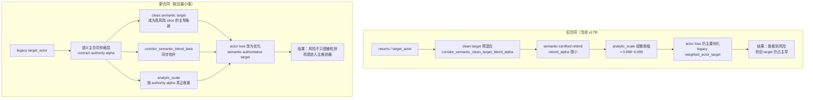

# actor 主合同支配权重写设计与最小实现方案

- 时间：2026-03-16 16:30
- 目的：把“旧合同 vs 新合同”的差异、代码落点和最小实现方案一次压清楚

## 一、旧合同 vs 新合同



## 二、旧合同为什么失败

### 当前真实合同链

1. `target_actor` 先来自 imagined `returns`
2. 再做一次 `clean target` 预混合
3. 再做一次 `semantic-certified rebind`
4. 最后进入 `compute_dreamer_actor_loss()`

当前问题不是没有 clean target，而是：

- clean target 已存在
- rebind 也已存在
- 但两者都只是“在旧合同上的小修正”

所以当前结构更像：

> `legacy contract + 小幅 clean correction`

而不是：

> `semantic contract 主导 + legacy fallback`

这就是为什么在 `v179` 里：

- `semantic mismatch` 与 `inflation pressure` 已经持续非零
- `rebind_alpha` 也持续非零
- 但 `weighted_actor_target_mean` 仍偏正
- `analytic_scale` 仍接近 `1.0`

## 三、新合同的核心思想

新合同不再把 clean semantic contract 当作“修正项”，而要把它提升成：

> 在 certified corridor 的高语义风险切片里，拥有主导权的合同仲裁结果

### 设计原则

1. 不回 controller-first
2. 不回 critic-only
3. 不破坏 Iron Wall
4. 不重写 world model truth
5. 不同时动 `base_actor`
6. 只改 actor 主合同的 target / analytic geometry 支配权

## 四、新合同的最小公式

### 旧公式

```text
target_actor_old
  = returns
  -> lerp(clean_target, clean_target_blend_alpha)
  -> lerp(clean_target, rebind_alpha)

analytic_term_old
  = lerp(normed_target, normed_target - normed_base, corridor_semantic_blend_beta)

actor_target_old
  = analytic_coef * analytic_term_old * analytic_scale_mask
    + reinforce_coef * reinforce_term
```

### 新公式

先定义：

```text
legacy_target = 当前 target_actor（经过旧层处理后的结果）
semantic_pressure = max(semantic_certified_mismatch, inflation_pressure)
legacy_clean_gap = relu(legacy_target - clean_target)
dominance_need = legacy_clean_gap / (abs(legacy_target) + abs(clean_target) + 1)
```

再定义新的主合同支配系数：

```text
authority_floor
  = floor_max
    * corridor_mask
    * inflation_gate
    * clean_target_confidence

authority_bonus
  = (authority_max - floor_max)
    * semantic_pressure
    * dominance_need
    * clean_target_confidence

contract_authority_alpha
  = clamp(
      max(existing_clean_target_blend_alpha,
          authority_floor + authority_bonus),
      0, authority_max
    )
```

然后用它统一重写三件事：

```text
target_actor
  = lerp(legacy_target, clean_target, contract_authority_alpha)

corridor_semantic_blend_beta
  = max(old_corridor_semantic_blend_beta, contract_authority_alpha)

actor_contract_analytic_scale
  = 1 - contract_authority_alpha * (1 - analytic_floor)
```

### 这一步的本质

旧系统是：

- 先有旧 target
- clean target 只能小声提建议

新系统是：

- 先让旧 target 和 clean target 进入仲裁层
- 在 high-risk corridor slice 上，由仲裁结果决定谁说了算

## 五、为什么这是最小、最干净的一刀

因为它只改 actor 主合同层，不改：

- world model
- critic loss
- controller stage
- registry 检测器

它复用当前已经存在的东西：

1. `corridor_semantic_clean_target`
2. `corridor_semantic_clean_target_blend_alpha`
3. `actor_contract_semantic_certified_mismatch`
4. `actor_contract_inflation_pressure`
5. `corridor_semantic_blend_beta`
6. `actor_contract_analytic_scale`

所以它不是新增第六层脚手架，而是：

> 把现有的 clean semantic contract 从“旁路修正”提升成“主合同仲裁层”

## 六、代码落点

### 落点 1：`_build_imagined_batch()` 中的 target_actor 组装

文件：

- `aletheia/aletheia_train.py`

位置：

- `12663-12703`

当前这里负责：

- 构造 `weights_actor`
- 初始化 `target_actor = returns`
- 先做一层 `corridor_semantic_clean_target_blend_alpha`

最小改动方案：

- 保留这层不删
- 把它视为“旧合同预混合层”
- 在后面新增一个更高优先级的 `contract_authority_alpha` 仲裁层

### 落点 2：`semantic-certified rebind` 主块

位置：

- `13159-13280`

当前这里负责：

- 计算 `semantic_certified_mismatch`
- 计算 `inflation_pressure`
- 生成 `rebind_alpha`
- 轻度重绑 `target_actor`
- 生成 `actor_contract_analytic_scale`

最小改动方案：

- 不再让 `rebind_alpha` 仅扮演轻量修正
- 在这里新增：
  - `legacy_target_actor_before_authority`
  - `actor_contract_legacy_clean_gap`
  - `actor_contract_dominance_need`
  - `actor_contract_authority_floor`
  - `actor_contract_authority_bonus`
  - `actor_contract_authority_alpha`
- 用 `actor_contract_authority_alpha` 代替当前轻量 `rebind_alpha` 作为最终主合同重绑系数

### 落点 3：把 authority alpha 接进 analytic geometry

位置：

- 当前 batch 输出在 `14396-14590`
- actor loss 调用在 `4528-4808`
- 真正损失定义在 `2119-2295`

最小改动方案：

- 在 `_build_imagined_batch()` 里直接把
  - `corridor_semantic_blend_beta = max(old_beta, authority_alpha)`
  - `actor_contract_analytic_scale = 1 - authority_alpha * (1 - floor)`
  写回 batch
- 这样 `compute_dreamer_actor_loss()` 不需要大改结构

### 落点 4：配置项

最小新增建议只加 3 个：

1. `adaptive_imag_actor_contract_authority_max`
2. `adaptive_imag_actor_contract_authority_floor_max`
3. `adaptive_imag_actor_contract_authority_analytic_floor`

如果需要更细，再加第 4 个：

4. `adaptive_imag_actor_contract_authority_gap_tau`

第一版建议不要超过 4 个新超参。

## 七、第一版最小实现范围

### 要做

1. 在 `_build_imagined_batch()` 新增 authority 仲裁层
2. 用 authority alpha 重写最终 `target_actor`
3. 用 authority alpha 抬升 `corridor_semantic_blend_beta`
4. 用 authority alpha 生成更真实的 `actor_contract_analytic_scale`
5. 增加对应监控指标

### 不做

1. 不改 `base_actor`
2. 不改 critic loss
3. 不改 controller
4. 不改 world model / bridge
5. 不改 registry 生成逻辑

## 八、建议新增监控

第一版最值得新增的指标：

1. `actor/actor_contract_authority_alpha_mean`
2. `actor/actor_contract_authority_active_fraction`
3. `actor/actor_contract_authority_floor_mean`
4. `actor/actor_contract_authority_bonus_mean`
5. `actor/actor_contract_legacy_clean_gap_mean`
6. `actor/actor_contract_dominance_need_mean`
7. `actor/weighted_actor_target_mean_when_authority_active`
8. `actor/corridor_semantic_blend_mean_when_authority_active`

## 九、成功判据

这刀的成功判据，不是“峰值更高”，而是：

1. 当 `semantic mismatch / inflation pressure` 升高时：
   - `authority_alpha` 必须显著高于当前 `rebind_alpha`
2. 当 authority active 时：
   - `weighted_actor_target_mean` 必须明显下降
   - `analytic_scale` 不能再接近 `1.0`
3. 真实 run 中：
   - `2000 / 2250 / 2500 current eval` 不能再像 `v179` 一样停在 `50~60`
4. 同时仍应保持：
   - `real_corridor_occupancy_fraction` 高
   - 不要破坏前中段起势

## 十、当前最重要的一句话

下一刀不是“再加一个 guard”，而是：

> 在 actor 主合同层增加一个语义仲裁器，让 clean semantic contract 在高风险 certified corridor slice 上真正拥有主导权。
