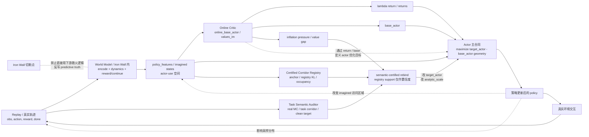
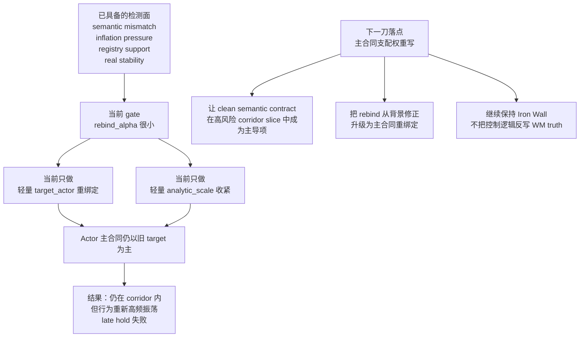

# actor 主合同现状总图与下一刀控制落点图

- 时间：2026-03-16 16:19
- 目的：把当前系统的模块职责、病理位置、控制面与下一刀落点压缩成一张系统图，并明确 `actor 主合同` 的代码位置与角色

## 一张总图

## 现状总判断

### 模块职责边界

1. `World Model / Iron Wall 内`
   - 职责：维护预测真相，负责 latent dynamics、reward、continue 等生成语义。
   - 不能承担的职责：不能为了救 actor late-stage hold，直接被下游控制逻辑重写。

2. `Critic`
   - 职责：在 actor-use 空间上给 imagined states 打 value 尺子，形成 `online_base_actor`，并通过 `lambda return` 参与 `target_actor` 的构造。
   - 风险：如果 value semantics 漂或共漂，会污染 actor 的训练目标。

3. `Certified Corridor`
   - 职责：认证“策略是否仍在一簇历史高回报策略附近”。
   - 当前局限：它更像 `policy-certified corridor`，并不天然等于 `task-semantic certified corridor`。

4. `Task Semantic Auditor`
   - 职责：从 replay/真实 MC 侧给出更贴近任务真相的语义观察，构造 `clean target` 与 mismatch / inflation 观测。
   - 当前局限：它已经能报警，但还没有足够主导 actor 主合同。

5. `Actor 主合同`
   - 职责：定义“策略到底在优化什么”。
   - 这是当前系统真正的油门位，也是剩余病灶的主位置。

### 当前病理位置

当前病理已经不在：

- `world model 先坏`
- `bridge 先断`
- `policy 掉出 corridor`

当前病理在：

> `actor 主合同` 仍以旧 `target_actor / base_actor` 体系为主，而 `semantic-certified rebind` 只是轻量修正，因此策略会在 corridor 内继续滑向错误行为风格。

### 当前最关键的证据

1. `v179` 在 `1500` 能冲到 `285.8`，说明模型不是不会学。
2. `1750 -> 2500` 掉分时：
   - `real_corridor_occupancy_fraction = 1.0`
   - `registry KL` 很低
   - 说明不是掉出 corridor。
3. 同一时期：
   - `semantic_mismatch` 非零
   - `inflation_pressure` 非零
   - `rebind_alpha` 非零
   - 说明系统不是没看到风险。
4. 但：
   - `analytic_scale ≈ 0.998 ~ 0.999`
   - `weighted_actor_target_mean` 仍长期偏正
   - 说明 actor 主推进器并没有被真正重绑定。

## 下一刀控制落点图

## actor 主合同是什么

一句话定义：

> `actor 主合同` 就是 actor loss 里真正决定“策略被鼓励去做什么”的那套 `target / base / weights / analytic vs reinforce` 组合规则。

它不是单一变量，而是一整套合同：

1. `target_actor`
   - 代表“你应该追求多高的 imagined target”
2. `base_actor`
   - 代表“当前基线在哪里”
3. `weights_actor`
   - 代表“哪些时空位置权重大”
4. `analytic_term / reinforce_term`
   - 代表“通过 dynamics 直接推，还是通过 policy gradient 推”
5. `analytic_scale_mask`
   - 代表“当前这段 imagined corridor 上，主推进器该不该收油”

## actor 主合同在哪个代码模块里

### 1. 合同真正执行的位置

文件：

- `aletheia/aletheia_train.py`

核心函数：

- `compute_dreamer_actor_loss()`  
  位置大约在：
  - `2119-2295`

这里完成的事情是：

1. 计算 `raw_adv = target - base`
2. 归一化成 `normed_target / normed_base`
3. 构造 `analytic_term`
4. 再乘 `analytic_scale_mask`
5. 和 `reinforce_term` 混合
6. 最终形成：
   - `actor_target = analytic_coef * analytic_term_scaled + reinforce_coef * reinforce_term`
   - `actor_loss = -(weights * actor_target).mean()`

也就是说：

> actor 主合同的最终法律文本，就写在 `compute_dreamer_actor_loss()` 里面。

### 2. 合同的条款来源在哪里组装

文件同样是：

- `aletheia/aletheia_train.py`

核心组装函数：

- `TrainingLoop._build_imagined_batch()`  
  位置：
  - `11613` 开始

这段代码负责给 actor 主合同准备材料：

1. `online_base_actor = values_im[:, :-1]`
2. `returns = lambda returns`
3. `base_actor`
4. `target_actor`
5. `weights_actor`
6. corridor / task semantic / clean target / rebind 相关观测

最后这些量会被放进 batch：

- `target_actor`
- `base_actor`
- `weights_actor`
- `advantages`
- `online_advantages`
- `actor_contract_analytic_scale`

对应位置：

- `14396-14590` 一带

### 3. actor contract rebind 现在具体在哪

第二阶段关键逻辑在：

- `13202-13279`

这里做了几件事：

1. 计算 `actor_contract_semantic_certified_mismatch`
2. 计算 `actor_contract_inflation_pressure`
3. 取二者最大值得到 semantic pressure
4. 生成 `actor_contract_rebind_alpha`
5. 用它去：
   - `torch.lerp(target_actor, corridor_semantic_clean_target, actor_contract_rebind_alpha)`
   - 同时生成 `actor_contract_analytic_scale`

所以它的本质是：

> 在 imagined batch 组装阶段，尝试把 actor 的目标 target 和 analytic 油门，朝 clean semantic contract 轻轻拉一把。

## actor 主合同在这个模型里的角色

它在整个系统里扮演的是：

> `最后一跳的优化宪法`

因为：

1. replay / wm / critic / registry 都只是提供信息或参考；
2. 真正决定参数朝哪个方向更新的是 actor loss；
3. actor loss 里真正起作用的就是这份合同。

所以如果 critic 有污染、registry 有认证、task semantic 有报警，但 actor 主合同没有改，那么系统最后仍然会沿旧方向更新。

## actor 主合同被什么控制

它当前受五类东西控制：

1. `Critic / return system`
   - `target_actor` 和 `base_actor` 的主要来源
   - 直接决定 actor 认为“高回报”是什么

2. `weights_actor`
   - 决定哪些 imagined time-step 权重大

3. `corridor semantic blend`
   - 通过 `corridor_semantic_blend_beta` 改写 `analytic_term`
   - 位置在 `compute_dreamer_actor_loss()` 里

4. `analytic_scale_mask`
   - 包括 online-adv guard、task corridor scale、actor contract scale
   - 最终会乘到 `analytic_term` 上

5. `actor_contract_rebind`
   - 在 imagined batch 里直接改 `target_actor`
   - 同时生成 `actor_contract_analytic_scale`

## actor 主合同能影响什么

它能向下影响四个层次：

1. `当前 actor 参数更新`
   - 这是最直接的影响

2. `policy 输出行为`
   - 包括动作熵、切换率、抖动率、是否能守住 corridor

3. `replay 数据分布`
   - 因为策略变了，采样回来的真实轨迹也会变

4. `后续 critic / imagined 访问区域`
   - actor 改变后，critic 会在新的 imagined visitation 上继续学习
   - world model 本身不会被直接重写，但被访问的局部区域会变

## 为什么 actor 主合同是当前最对的控制落点

因为它满足三个条件：

1. **离症状最近**
   - 现在坏的是“corridor 内行为语义与控制风格”
   - 这正是 actor 决定的

2. **不破坏 Iron Wall**
   - 不需要回写 wm predictive truth

3. **因果最清晰**
   - 现在已经知道：
     - 观测面有了
     - registry 也有了
     - clean target 也有了
   - 还差的就是主合同支配权

## 当前最重要的一句话结论

当前系统不是“没有 clean semantic contract”，而是：

> `clean semantic contract` 还没有成为 actor 主合同的主导条款。

所以下一刀最干净的方向，不是继续加新的 detector，也不是回 controller 或 critic，而是：

> 直接在 actor 主合同层，把 corridor 内高风险 slice 上的 clean semantic contract 从“轻量修正”升级为“主导约束”。
