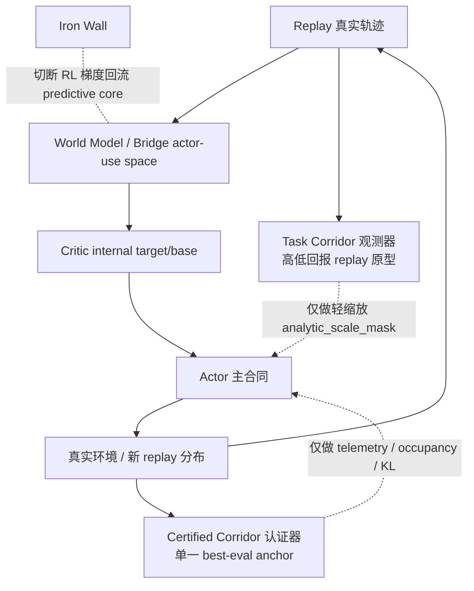
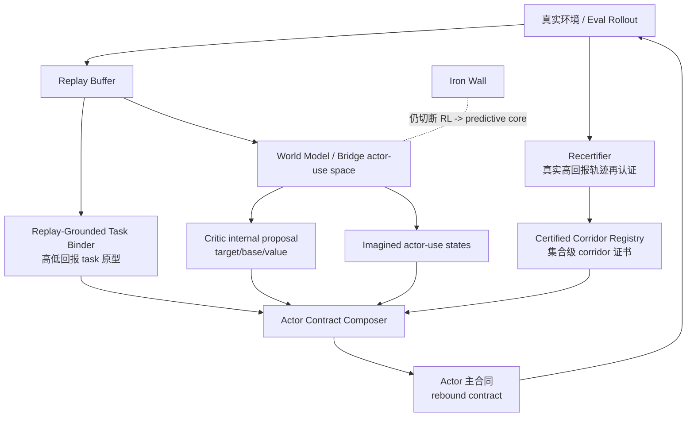

# actor主合同重绑定与certified corridor再认证系统设计图 - 2026-03-16 14:20

## 一、最根本原因

当前系统最深的病根，不是单个模块坏掉，而是三套语义参考系没有统一成一个共享不变量：

1. `actor 主合同参考系`
2. `replay-grounded 任务语义参考系`
3. `certified corridor 稳定认证参考系`

它们现在分别在工作，但没有收敛成“同一件事”。

于是就会出现这种看似矛盾、其实完全一致的现象：

- actor 觉得自己还在优化一个合理目标；
- task corridor 觉得当前高价值几何里已经混入低任务语义状态；
- certified corridor 却可能把新的高分轨迹判成“偏离旧锚”。

一句话总结：

> **当前系统的真正问题，不是没有观测、没有刹车，而是优化对象、任务语义、稳定认证没有使用同一个语义主键。**

## 二、诊断卡

### 1. 病情表现

- `v177` 已能达到：
  - `2000 = 500`
  - `2250 = 500`
- 但 `2500 current` 仍回落到：
  - `272.4 +- 186.0`

这说明系统已经具备高回报能力，但尾段保持仍不稳定。

### 2. 病理表现

- critic 语义压力仍高：
  - `value_target_gap_abs_mean` 在中后段约 `19~21+`
- task corridor 已能看见错位：
  - `high_value_but_low_task_fraction ≈ 0.22~0.25`
  - `task_geom_corridor_disagreement ≈ 0.51~0.58`
- 但 actor 主目标只受到很轻的缩放：
  - `task_corridor_analytic_scale_mean ≈ 0.984~0.995`

### 3. 病因

- `task corridor` 已经接进 actor 主链，但它现在只是一条“轻阻尼观测”。
- `certified corridor` 仍接近“单一 best-eval anchor + 窄 corridor”的认证方式。
- actor 真实优化的主合同，仍然主要由 internal critic target/base 支配。

### 4. 根因

> **在 Iron Wall 保护下，predictive truth 和 policy optimization 被故意分离了；但下游没有建立一条足够强的统一语义重绑定链，于是 actor 合同、task 语义、stability certification 各自形成了自己的参考系。**

Iron Wall 是对的。  
真正缺的是：

> **墙后语义统一机制。**

## 三、为什么 Iron Wall 不是病根，但会把这个问题放大

Iron Wall 切断的是：

- actor/critic 的 reward-seeking 梯度直接回流到 world model predictive core

它保护了：

- L0 predictive truth

但也带来一个结构后果：

- L1/L2/L3 不会自然和 L0 收敛成同一语义参考系

所以墙后如果没有显式的“语义再绑定”，系统就很容易形成：

- 内部一致
- 局部稳定
- 但全局语义错位

的 attractor。

## 四、当前错误系统图



### 这张图的问题

当前系统里：

- critic 给 actor 的是主合同
- task corridor 只是旁路减速器
- certified corridor 只是旁路认证器

也就是说：

- 真正决定 actor 学什么的，不是 replay-grounded 任务语义
- 也不是经过认证的真实高回报 corridor
- 而仍然是 internal critic semantic contract

所以只要 critic 合同和真实任务语义不完全一致，系统就会反复回到“内部合理、外部走偏”的状态。

## 五、`v177` 暴露出的关键结构矛盾

最关键的一组证据是：

### `step 2000`

- `eval = 500`
- `real_corridor_occupancy_fraction = 0.002`
- `real_policy_kl_to_certified_anchor_mean = 0.322`

### `step 2250`

- `eval = 500`
- `real_corridor_occupancy_fraction = 1.0`
- `real_policy_kl_to_certified_anchor_mean = 0.00093`

这说明至少有一件事成立：

1. 要么 current certified corridor 定义太窄，新的高回报轨迹暂时无法被认证；
2. 要么策略确实在 solved-band 内发生了高分轨迹切换，而当前认证器缺少“集合级”再认证能力。

无论是哪一种，都指向同一个结论：

> **certified corridor 不能继续只靠单点 actor anchor 定义。**

## 六、目标系统设计原则

目标系统必须满足五个原则。

### 原则 1：优化对象、任务语义、稳定认证必须共用一条语义主键

不能再让：

- actor 学一个东西
- task corridor 看另一个东西
- certified corridor 认证第三个东西

### 原则 2：certified corridor 必须是集合，不是单点

它不该只是：

- 某一步 best-eval actor 的快照

而应该是：

- 一簇被真实高回报验证过的轨迹 / 行为 envelope / feature envelope

### 原则 3：task corridor 必须从“轻缩放”升级到“合同输入”

它不该只缩放 `analytic_scale_mask`，而应该更深地参与：

- actor target
- actor base
- analytic term
- 或 contract blending

### 原则 4：critic 继续当 proposal，不再当唯一裁判

critic 依然重要，但它应该是：

- `internal proposal / semantic ruler`

而不是：

- `actor 最终主合同的唯一真理`

### 原则 5：Iron Wall 仍然不动

所有新认证与重绑定都应该发生在：

- replay-grounded observer
- actor-side contract composer
- 认证器 / registry

不能把 RL 梯度重新回灌 L0 predictive core。

## 七、目标系统图



## 八、目标系统里的新职责边界

### 1. Critic

职责：

- 提供 internal proposal
- 提供 value/base/advantage 的内部几何信息

不再承担：

- actor 最终目标的唯一裁判

### 2. Replay-Grounded Task Binder

职责：

- 在 actor-use feature space 里，用真实回报构造 task semantics
- 告诉系统“这段 imagined 高价值状态，到底像不像真实高回报状态”

### 3. Certified Corridor Registry

职责：

- 保存一组经过真实高回报认证的 corridor 证书
- 证书不是一个点，而是一组集合信息

应至少包含：

- 高回报 actor snapshot bank
- actor-use feature envelope
- 真实行为 envelope
- return / persistence floor
- 证书更新时间与有效性

### 4. Actor Contract Composer

职责：

- 接收：
  - critic internal proposal
  - replay-grounded task semantics
  - certified corridor support / mismatch
- 输出：
  - 真正供 actor 优化的主合同

这才是下一阶段最核心的新模块概念。

## 九、actor 主合同重绑定应该长什么样

当前更合理的方向不是再加一个 gate，而是把主合同写成：

```text
actor_contract
  = (1 - alpha_rebind) * internal_contract
  + alpha_rebind * certified_task_contract
```

其中：

- `internal_contract`
  - 来自 critic / internal target-base 几何
- `certified_task_contract`
  - 来自 replay-grounded task semantics
  - 并受 certified corridor support 约束

关键不是公式本身，而是：

> **当 task mismatch 和 certified mismatch 升高时，actor 不再只是“轻微减速”，而是要逐步改用经过认证的 task contract。**

这才叫主合同重绑定。

## 十、certified corridor 再认证该怎么定义

### 当前错误定义

近似是：

- “最近一次高分 actor 快照” + “与它的 KL / occupancy”

这会导致：

- 新的高回报策略稍一偏离旧锚，就可能被判为 corridor 外

### 目标定义

应改成：

- **集合级 corridor 证书**

它至少由四层组成：

1. `policy anchor bank`
   - 一组高回报 actor 快照，而不是单一快照
2. `actor-use feature envelope`
   - 高回报轨迹在 policy feature 空间里的包络
3. `real behavior envelope`
   - entropy / switch / oscillation / raw state 统计区间
4. `return-persistence certificate`
   - 必须同时满足回报和保持性

这样“occupancy / persistence / drift”才是在对一个 corridor 集合做认证，而不是对某个历史点做膜拜。

## 十一、最小落地顺序

### 第一步：先做 certified corridor 再认证设计落地

目的：

- 先把“2000=500 但 occupancy≈0”这类认证矛盾解释清楚

优先动作：

- 单点 anchor -> corridor registry
- occupancy / persistence -> 对 registry 做集合判定

### 第二步：再做 actor 主合同重绑定

目的：

- 把 task corridor 从轻缩放推进到主合同输入

优先动作：

- 先不碰 world model
- 先不加 controller stage
- 直接在 actor contract composer 层做 rebind

### 第三步：最后才考虑更强的接管强度

只有在前两步证据明确之后，才讨论：

- 接管强度怎么调
- 何时从 blend 走向 dominant contract

## 十二、一句话总诊断

> **现在最根本的问题，不是 actor 不会学，也不是 critic 单独坏了，而是系统没有一条跨 actor 优化合同、真实任务语义和稳定认证的统一语义主键。下一阶段的正确方向，就是 actor 主合同重绑定 + certified corridor 再认证。**
