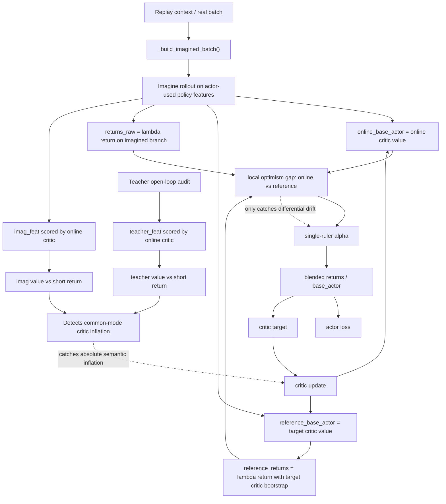

# CartPole Pure-Imag Late-Stage Common-Mode Critic Inflation Diagnosis

Date: 2026-03-15
Scope: `v165` vs `v166` late-stage differential diagnosis

## Executive Conclusion

当前最高置信度诊断已经可以继续收紧：

1. 现在的主病灶，已经不是早期 imagined rollout 几何漂移。
2. 现在的第一失真点，也不是 online critic 和 target critic 先明显打架。
3. 真正先发生的是：`online critic` 与 `target critic` 在高价值 corridor 上一起抬高，形成 **common-mode inflation**。
4. `single-ruler` 目前只能修“online 相对 reference 更乐观”的局部错位，不能修“online 和 reference 一起变乐观”的共同漂移。
5. 等 critic 家族已经共同抬高之后，actor 才会继续沿着这条被抬高的 corridor 往前走，随后 imagined branch 再次放大和 teacher branch 的差异，最终进入 late-stage collapse。

一句话概括：

`v166` 不是“world model 还不准”，而是“critic family 在高分后进入共同乐观，single-ruler 只能抓双尺错位，抓不住双尺同漂”。

## 它不是什么问题

这轮证据足够支持以下排除：

- 不是公式符号算错。
- 不是 `iron wall` 设计错误。
- 不是 teacher-forced world model 全局 loss 崩坏。
- 不是短程 reward / continue 动力学先坏掉。
- 也不是 late-stage 最先表现为 `online critic` vs `target critic` 的大尺度分叉。

## 训练链路里的真实传播路径

真实主链路仍然是：

`CLI -> run_train() -> TrainingLoop.run() -> _build_imagined_batch() -> TrainingStep.run_step()`

核心代码位置：

- imagined batch 构造：`aletheia/aletheia_train.py:_build_imagined_batch()`
- single-ruler / reference return 逻辑：`aletheia/aletheia_train.py` 约 `10645+`
- actor online advantage 形成：`aletheia/aletheia_train.py` 约 `10938+`
- RL step 读取 `target_actor/base_actor`：`aletheia/aletheia_train.py` 约 `4249+`
- critic contract loss：`aletheia/aletheia_train.py` 约 `4436+`
- target-ruler distill：`aletheia/aletheia_train.py` 约 `4489+`

## 关键传播图

图里的关键点只有一个：

- 现在的 `single-ruler alpha` 主要盯的是 `online vs reference` 的相对错位。
- 但真正把系统拖死的，是 `online` 和 `reference` 一起偏离 return corridor 的绝对错位。

## 证据 1：v166 在 1500 左右先坏的不是 world model 动力学，而是 value semantics

`v166` 的 open-loop audit 显示：

| probe | feature_l1 | reward_gap | continue_gap | teacher_value_err | imag_value_err | value_gap |
|---|---:|---:|---:|---:|---:|---:|
| 1000 | 0.149 | 0.0118 | 0.0000 | 8.73 | 7.39 | 1.35 |
| 1500 | 0.184 | 0.0056 | 0.0000 | 33.75 | 29.93 | 4.81 |
| 1600 | 0.213 | 0.0146 | 0.0000 | 68.67 | 50.88 | 17.79 |
| 1700 | 0.200 | 0.0111 | 0.0000 | 101.81 | 108.72 | 21.05 |
| 2000 | 0.164 | 0.0075 | 0.0000 | 237.83 | 240.63 | 24.27 |
| 2500 | 0.205 | 0.0070 | 0.0000 | 287.28 | 332.74 | 70.94 |

结论非常直接：

- reward/continue 审计一直很小，说明短程动力学并没有先崩。
- `teacher value vs short return` 和 `imag value vs short return` 却在 `1500` 后急剧放大。
- 这说明首先坏掉的是 **critic 对高价值 corridor 的语义标定**，不是 transition model 本身。

## 证据 2：1500 时刻，critic family 已经先共同抬高，teacher/imag 差异还不是主导项

`v166 @1500`

- `actor/online_adv_mean = -7.11`
- `critic/value_target_gap_abs_mean = 7.34`
- `imag/reference_online_value_gap_abs_mean = 2.50`
- `imag/target_value_target_gap_abs_mean = 7.76`
- `imag/open_loop_audit_value_gap_mean = 4.81`
- `imag/open_loop_audit_teacher_value_abs_to_short_return_mean = 33.75`
- `imag/open_loop_audit_imag_value_abs_to_short_return_mean = 29.93`

这里最重要的是相对量级：

- `online vs target` 的 value gap 只有 `2.50`
- 但 `target critic vs actor target corridor` 的 gap 已经 `7.76`
- 同时 teacher 和 imag 两边在 online critic 眼里的 value error 已经来到 `30+`

这说明到了 `1500`，先坏的不是：

- imagined branch 离 teacher 特别远
- 或者 online critic 和 target critic 先打崩

而是：

- critic 家族已经开始把整段 corridor 一起往上抬

## 证据 3：到 1900-2500，single-ruler 失效不是因为没开，而是因为它面对的是“双尺同漂”

`v166` 晚期关键对账如下：

| probe | online_adv | value_target_gap_abs | online_target_gap_abs | target_value_target_gap_abs | alpha_mean | optimism_gap_mean |
|---|---:|---:|---:|---:|---:|---:|
| 1600 | -26.69 | 26.73 | 4.80 | 22.00 | 0.740 | 5.09 |
| 1700 | -39.65 | 39.73 | 4.02 | 36.09 | 0.713 | 4.83 |
| 1900 | -54.21 | 54.51 | 9.53 | 45.26 | 0.883 | 9.63 |
| 2000 | -48.92 | 48.92 | 4.25 | 53.04 | 0.028 | 0.18 |
| 2200 | -49.10 | 49.10 | 10.15 | 58.85 | 0.054 | 0.26 |
| 2500 | -56.51 | 56.83 | 9.70 | 47.96 | 0.774 | 9.42 |

这里的逻辑非常关键：

- `value_target_gap_abs` 很大，表示 actor 真正拿来训练的 target corridor 已经和 online critic 严重错位。
- 但 `online_target_gap_abs` 很小，表示 online critic 和 target critic 之间并没有大规模分家。
- `target_value_target_gap_abs` 同样很大，表示 target critic 自己也已经高于 actor target corridor。

也就是说：

- 问题不是 `online critic` 单独疯掉；
- 而是 `online critic + target critic` 一起乐观。

这就是 **common-mode inflation**。

于是 `single-ruler` 会遇到一个结构性盲区：

- 它监控的是 `online` 相对 `reference` 是否更乐观；
- 但当两者一起偏高时，这个相对差可以很小；
- 相对差小，`alpha` 就会掉下去；
- `alpha` 掉下去后，系统失去回拉；
- actor 继续沿着被共同抬高的 corridor 推进。

`@2000` 是最干净的证据：

- `critic/value_target_gap_abs_mean = 48.92`
- `imag/target_value_target_gap_abs_mean = 53.04`
- 但 `imag/reference_value_ruler_alpha_mean = 0.028`
- `imag/reference_value_ruler_optimism_gap_mean = 0.18`

这不是模块没工作，而是模块的检测对象不对：

- 它抓的是“局部相对乐观”
- 当前病灶却是“整体共同乐观”

## 证据 4：v165 和 v166 一起说明，早期 imagined drift 已经不是主病因

`v165` 的关键特征是：

- 没有 reference ruler；
- 但 late-stage 也出现：
  - `teacher value error` 很大
  - `imag value error` 很大
  - 两者 gap 并不总是先最大

`v166` 则把这件事看得更清楚：

- `single-ruler` 确实把 `1000-1500` 段修稳了
- 但晚期依然掉
- 而且晚期掉的时候，`online-target gap` 仍显著小于 `critic-vs-return corridor gap`

因此当前结论应更新为：

- Phase 2 修掉的是：早期 actor-use imagined manifold 脱锚
- Phase 3 修到的是：双标尺错位
- 当前剩余病灶是：**critic family 的共同乐观漂移**

## 病理 / 病因 / 根因

### 病理

- eval 在中后段掉回低分
- `actor/online_adv_mean` 深度转负
- `critic/value_target_gap_abs_mean` 冲到 `40-50+`
- teacher 和 imagined 的 value semantics 同时恶化

### 直接病因

- actor 依赖的 actor-use corridor 上，critic 给出的 value 标尺整体抬高
- actor target 被这个抬高后的标尺持续塑形
- critic 更新又继续吃到这套 corridor，形成自洽闭环

### 结构根因

- 现有保护主要测“相对错位”，不测“绝对漂移”
- slow target critic 是慢尺，不是真尺
- 因而它能抑制快抖动，不能阻止共同方向的自举偏移

### 更深一层的机制根因

纯 imag 主链路在 high-value corridor 上存在一个结构事实：

- actor 选择状态
- critic 给状态打分
- target critic 跟随 critic 平滑
- 如果 replay 真实锚没有直接进入 actor-use corridor 的同一语义切面
- 那么整个 critic family 会在这个 corridor 上一起形成自证闭环

因此，晚期问题本质上是：

**actor-use corridor 缺少“绝对语义标定”，只有“相对标尺对齐”。**

## 对下一刀的约束

这一轮诊断也足以明确哪些方向不该回头：

- 不该回 controller rescue 主线
- 不该恢复 legacy critic path
- 不该把“更硬的 feature regularization”当成主修复
- 不该继续只做 online-vs-target 的局部拉回

下一刀如果继续推进，必须针对：

**high-value actor-use corridor 的 absolute semantic calibration**

而不是继续只做：

**ruler mismatch correction**

## 当前最准确的判断

如果用最短的话来总结当前模型现状：

- 早期 imagined drift 已经不是主矛盾。
- `single-ruler` 已经证明能修局部双尺错位。
- 剩下的真正根因，是 critic family 在 late-stage high-value corridor 上的共同乐观漂移。
- 所以下一步不该再补“救火器”，而该补“绝对语义标定”。
