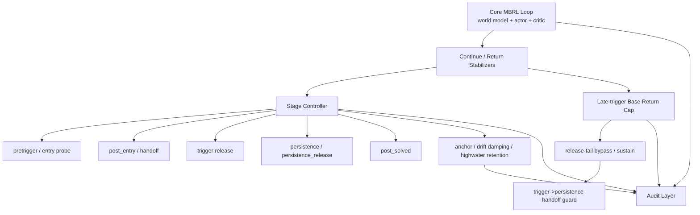

# CartPole Pure-Imag 脚手架清单

日期：2026-03-14  
状态：整理版，先归档，不拆除  
目的：把当前为修复 `CartPole pure-imag` 训练稳定性而搭建的“控制层脚手架”讲清楚，为后续收敛为更优雅、更模块化的实现做准备。

## 1. 这份文档在说什么

这里说的“脚手架”，不是世界模型、actor、critic 本身，而是包在它们外面的稳定化控制层。  
这些逻辑主要存在于：

- `TrainingConfig` 参数层：[aletheia_config.py](../aletheia/aletheia_config.py)
- 训练时状态与持久化层：[aletheia_train.py](../aletheia/aletheia_train.py)
- 对外暴露 override 的 API 层：[aletheia_api.py](../aletheia/aletheia_api.py)
- 审计与回放工具层：
  - [scripts/formula_chain_audit.py](../scripts/formula_chain_audit.py)
  - [scripts/post_entry_audit.py](../scripts/post_entry_audit.py)
  - [scripts/phase_transition_audit.py](../scripts/phase_transition_audit.py)
  - [tools/controller_relation_audit.py](../tools/controller_relation_audit.py)

这套脚手架当前是必要的，因为模型还没有稳定到可以“裸跑 pure-imag”的程度。  
但它不是最终形态。未来如果模型修好，脚手架应该被收敛成更少、更清楚的模块，而不是继续无限叠加。

## 2. 当前脚手架总览

## 3. 脚手架分层

### 3.1 参数层

当前大多数脚手架开关都集中在 [aletheia_config.py](../aletheia/aletheia_config.py#L1698) 到 [aletheia_config.py](../aletheia/aletheia_config.py#L1938)。

主要分组如下：

| 分组 | 作用 | 代表参数 |
| --- | --- | --- |
| `continue_cap` | 限制 imagined continue 过快漂移 | `adaptive_imag_continue_cap_*` |
| `post_trigger` | 控制 trigger 后的 pressure、delta clip、quality gate | `adaptive_imag_post_trigger_*` |
| `late_trigger` | trigger release 尾段的修复和限幅 | `adaptive_imag_late_trigger_*` |
| `entry_probe` | 在真正 post-entry 前做早期探测 | `adaptive_imag_entry_probe_*` |
| `post_entry` | 外部评估进入后的一整套阶段逻辑 | `adaptive_imag_post_entry_*` |
| `persistence` | trigger 失稳后的保底接管 | `adaptive_imag_persistence_*` |
| `trigger_persistence_handoff` | trigger 到 persistence 的放行条件 | `adaptive_imag_trigger_persistence_handoff_*` |
| `post_solved` | 高分后锚定 actor/critic，抑制后漂 | `adaptive_imag_post_solved_*` |

观察：

- 这些参数已经形成了一个“隐式子系统”。
- 现在它们还混在同一个 `TrainingConfig` 里，阅读成本高。
- 这说明下一阶段适合把它们重组为更清楚的配置对象，而不是继续横向扩字段。

### 3.2 运行时状态层

当前 controller 脚手架的运行时状态集中初始化在 [aletheia_train.py](../aletheia/aletheia_train.py#L6238) 到 [aletheia_train.py](../aletheia/aletheia_train.py#L6271)。

主要状态块：

| 状态块 | 作用 |
| --- | --- |
| `post_entry_*` | 记录 post-entry 是否 armed、hold、pending、commit |
| `persistence_*` | 记录 persistence 是否 armed、hold、entry protect、生效历史 |
| `persistence_release_*` | 记录 release 窗口和 release-tail bypass 的尾窗 |
| `trigger_persistence_handoff_*` | 记录 handoff block、handoff confirm 的临时状态 |
| `post_solved_*` | 记录 post-solved hold、negative-adv latch、actor/critic anchor |
| `external_eval_*` | 记录 external eval 的最近值、最好值和确认 streak |
| `entry_probe_*` | 记录 early probe 的历史轨迹 |

这些状态随后在 [aletheia_train.py](../aletheia/aletheia_train.py#L6630) 到 [aletheia_train.py](../aletheia/aletheia_train.py#L6728) 导出 / 恢复，以便 checkpoint 可继续追踪 controller。

结论：

- 这一步是必要的。否则 resume 会把 controller 变成“失忆状态机”。
- 但状态字段已经说明 controller 不再是一个“小 if-else”，而是一个值得独立建模的运行子系统。

### 3.3 阶段机层

真正决定 controller 当前处于什么阶段、是否切换的核心逻辑，主要在 [aletheia_train.py](../aletheia/aletheia_train.py#L7630) 到 [aletheia_train.py](../aletheia/aletheia_train.py#L7835)。

关键部分：

- `standard_soft_fallback_trigger_release`
  - 定义 trigger 在 post-entry 之后的 release 语境。
- `trigger_persistence_handoff_*`
  - 计算 handoff 的 release progress、gap、continue、eval 门槛。
- `trigger_persistence_handoff_recent_late_trigger_base_cap_block_active`
  - 当 trigger 尾段刚刚还在靠 late-trigger base cap 修复时，短时禁止 handoff。
- `trigger_persistence_handoff_confirmation_*`
  - block 之后的确认计数器，目前已验证“不是根因本体”，但作为实验脚手架保留。
- 最终 `stage`
  - 在 `post_entry_soft / trigger / persistence / persistence_release / post_solved` 等阶段间选择。

这层是目前最核心的“脚手架中心”。  
训练不稳定时，很多补丁最终都会落到这里。

### 3.4 想象批次整形层

当前 imagined batch 在进入 actor/critic 损失前，会被一层稳定器整形。关键逻辑在 [aletheia_train.py](../aletheia/aletheia_train.py#L9050) 到 [aletheia_train.py](../aletheia/aletheia_train.py#L9225)。

这里主要做几件事：

- trigger 阶段决定是否混入 target critic 作为 base
- post-trigger delta clip，限制 imagined return 相对 bootstrap 的大幅漂移
- 根据 controller stage 决定 `base_return_cap_margin`
- `late_trigger_base_return_cap_prebuild_real_adv_threshold`
  - 只在 real support 变弱时才允许 late-trigger base return cap 介入
- `persistence_release_tail_late_trigger_prebuild_gate_bypass_*`
  - release 尾窗期间，为 late-trigger prebuild gate 开旁路
- sustain / latch / bypass
  - 这是典型的“救火脚手架”，价值是定位问题，最终不一定保留

这层本质上是在做一句话：

> 当纯 imagined target 开始不可信时，不要让 actor 直接按原始 imagined base 学到底。

### 3.5 高分后保护层

post-solved 相关逻辑主要在 [aletheia_train.py](../aletheia/aletheia_train.py#L6297) 到 [aletheia_train.py](../aletheia/aletheia_train.py#L6612)。

包括：

- actor anchor snapshot
- critic anchor snapshot
- highwater retention
- negative advantage latch
- drift damping

这层的设计目的不是让模型继续探索，而是：

> 当系统已经学到一个高质量策略后，阻止 imagination drift 把它再毁掉。

## 4. 现有脚手架的“保留价值”

当前脚手架不是一锅粥。它里面有三类东西。

### 4.1 大概率长期保留的

这些更像“必要稳定器”：

- continue cap
- imagined return delta clip
- actor / critic anchor
- checkpointable controller state
- audit tools

原因：

- 它们对应的是世界模型 RL 的常见系统问题，不是某个局部 bug。
- 就算未来大重构，通常也仍会保留某种等价能力。

### 4.2 暂时必要，但未来应该收敛的

这些更像“结构还没归一时的过渡控制”：

- post-entry soft / pending / commit 的多分支阶段机
- late-trigger base return cap 的多重门控
- release-tail bypass / sustain
- trigger -> persistence handoff block
- handoff confirmation after late-trigger block

原因：

- 它们抓住了真实问题片段
- 但表达方式仍是“多阈值、多窗口、多阶段”堆起来的
- 更像脚手架，不像最终建筑

### 4.3 目前还不能轻易删的实验性补丁

这些东西不够优雅，但现在删掉风险高：

- persistence highwater tail 相关保护
- post-solved negative-adv latch
- release 独立 return cap
- real-adv / real-value anchor 的局部补偿

原因：

- 它们可能不是最终答案
- 但它们已经帮助我们把问题缩窄到更具体的后段 failure mode

## 5. 当前最需要避免的事情

现在最不该做的，不是“脚手架太多”，而是：

- 一边继续加 patch，一边没有把 patch 的因果含义整理出来
- 把每一个 patch 都永久化
- 在没有统一命名的前提下继续扩字段
- 用更多临时阈值去替代更本质的状态变量

如果继续这样下去，最后不是模型越来越稳，而是 controller 越来越像“补丁编排器”。

## 6. 未来更优雅的模块边界

这部分先做结构设想，不落代码。

### 6.1 推荐拆分方向

| 未来模块 | 当前职责来源 |
| --- | --- |
| `controller/signals.py` | continue、gap、adv、online_adv、real_adv、eval 等信号提取 |
| `controller/stages.py` | stage resolve，本体状态机 |
| `controller/guards.py` | base cap、late-trigger bypass、handoff gate |
| `controller/anchors.py` | post-solved actor/critic anchors、drift damping |
| `controller/state.py` | controller runtime state 的初始化、导出、恢复 |
| `controller/metrics.py` | controller metrics 发射 |
| `controller/audit_hooks.py` | 审计脚本需要的观测接口 |

### 6.2 推荐的收敛原则

- 不再按“补丁来源”分组，而按“功能语义”分组
- 不再让 config 直接暴露太多一次性实验参数
- 保留 audit 能力，但减少 controller 的表面阶段数
- 最终尽量把 controller 围绕更少的核心状态量工作

## 7. 当前脚手架反映出的根问题

现有脚手架之所以长这么多，不是因为世界模型 RL 理论上必须这么复杂，而是因为当前系统还缺一个统一的核心语义。

从这轮实验看，最像缺失的核心语义不是：

- “现在分数高不高”
- “现在 gap 大不大”
- “现在有没有一次坏信号”

而是：

> trigger 当前到底还有没有修复能力。

如果未来把这个核心语义显式建出来，很多现在的局部 handoff / sustain / bypass 补丁就有机会收敛掉。

## 8. 本文档的用法

后续如果继续修 `CartPole pure-imag`，建议把这份清单当成边界文档：

- 改逻辑前，先判断属于哪一层脚手架
- 做 patch 时，说明它属于“必要稳定器”还是“临时补丁”
- patch 生效后，评估它是否能被更高层的统一语义替代

这能保证我们不是“继续堆东西”，而是“有意识地借脚手架修楼”。
