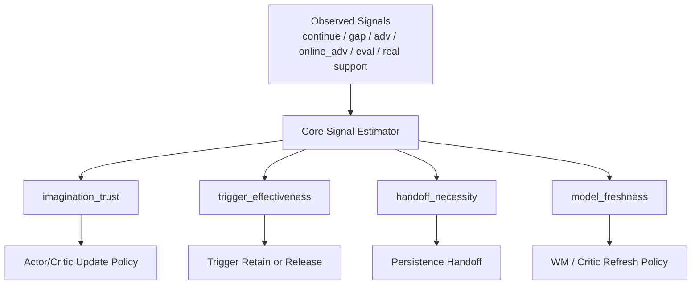

# CartPole Pure-Imag 信号收敛备忘

日期：2026-03-14  
目标：在不继续叠加零散 patch 的前提下，把当前 controller 复杂度压缩成更少、更本质的核心语义与实验主线。

## 1. 为什么还需要这份文档

前两份文档已经解决了两个问题：

- 脚手架现在长什么样
- 社区更主流的答案大致长什么样

但还有一个关键问题没被显式回答：

> 当前这些 patch，背后到底都在补什么“缺失变量”？

如果不把这件事讲清楚，后面我们还是会不断遇到这种情况：

- 一个 patch 修好 `2000`
- 另一个 patch 伤到 `2500`
- 再加一个确认逻辑，结果几乎不变

这不是因为 patch 毫无价值，而是因为 patch 处理的是“代理症状”，不是“统一语义”。

## 2. 当前补丁都在补什么

### 2.1 从现象看

当前最典型的现象：

- `v123` 能把后段拖住，但 retention 不稳
- `v125` 的 handoff block 把 `2000/2250` 拉高
- `v126` 的 confirm=2 基本不改变轨迹

这说明：

- 问题不是纯随机噪声
- 也不像某个公式算错
- 更像是 controller 在没有统一状态量的情况下，用很多局部阈值去猜系统健康度

### 2.2 从代码看

当前 patch 大致围绕这些观测量在转：

- `continue`
- `gap`
- `adv_mean`
- `online_adv_mean`
- `real_adv`
- `external_eval_best_mean`
- `base_return_cap_active`
- `late_trigger sustain / bypass`

也就是说，现有 patch 并不是互不相关。  
它们其实在围绕几个“没被直接建模”的核心问题打转。

## 3. 我们真正缺的四个核心状态量

我现在认为，当前 controller 应该最终收敛到下面四个核心语义。

### 3.1 `imagination_trust`

含义：

> 当前 imagined return / value / continue，到底还值不值得继续主导 actor 和 critic 的更新。

它不是单一指标，而是一个综合判断。  
更接近这些问题的答案：

- imagined target 和 online / real support 是否还一致
- imagined tail 是否开始出现放大性漂移
- actor 是否已经开始明显利用模型偏差

当前在代码里替代它的 proxy：

- `adaptive_imag_continue_cap_*`
- `adaptive_imag_post_trigger_return_delta_clip`
- `adaptive_imag_late_trigger_base_return_cap_*`
- `adaptive_imag_late_trigger_target_base_blend`
- `adaptive_imag_persistence_release_tail_late_trigger_prebuild_gate_bypass_*`

### 3.2 `trigger_effectiveness`

含义：

> trigger 当前到底是在真的修复局面，还是只是在表面上维持不继续恶化。

这是目前最缺的一项。

当前 patch 里最接近这个语义的 proxy：

- `actor/base_return_cap_active`
- `actor/base_return_cap_prebuild_real_adv_gate_bypass_sustain_active`
- `actor/adv_mean`
- `actor/online_adv_mean`
- `adaptive_imag_late_trigger_negative_online_adv_*`
- `adaptive_imag_post_entry_negative_online_adv_*`

为什么它重要：

- 如果 `trigger_effectiveness` 还在，过早 handoff 会打断修复
- 如果它已经耗尽，不 handoff 就只是继续拖时间

### 3.3 `handoff_necessity`

含义：

> 当前是不是已经到了必须让 persistence 接管的程度。

这和 `trigger_effectiveness` 有关，但不是同一个东西。  
前者问“trigger 还能不能救”，后者问“现在是不是必须接管”。

当前代码里替代它的 proxy：

- `adaptive_imag_trigger_persistence_handoff_*`
- `adaptive_imag_persistence_eval_threshold`
- `adaptive_imag_persistence_gap_scale`
- `adaptive_imag_persistence_continue_delta`
- `adaptive_imag_persistence_adv_delta`
- `adaptive_imag_persistence_entry_protect_*`
- `adaptive_imag_trigger_persistence_handoff_block_after_late_trigger_base_cap_steps`
- `adaptive_imag_trigger_persistence_handoff_confirmation_steps_after_late_trigger_base_cap`

### 3.4 `model_freshness`

含义：

> 当前 world model 是否仍有足够塑性，能跟上策略分布的变化，而不是已经阶段性固化偏差。

这是现有 controller 最少直接表达、但很可能最根的问题。

当前局部替代它的 patch：

- post-solved actor anchor / critic anchor
- drift damping
- real-value anchor
- real-advantage 相关保护

这些补丁很多时候并不是在“优化 actor”，更像是在对抗 world model / critic 漂移后传导出来的问题。

## 4. 现有补丁到核心语义的映射

| 当前补丁/机制 | 直接现象 | 实际在补哪类缺失语义 |
| --- | --- | --- |
| `continue_cap` | imagined continue 漂移太快 | `imagination_trust` |
| post-trigger delta clip | imagined return 尾段漂大 | `imagination_trust` |
| late-trigger target blend | online value 不够稳 | `imagination_trust` |
| late-trigger base return cap | actor base 过高，adv 失真 | `imagination_trust` + `trigger_effectiveness` |
| release-tail bypass / sustain | release 后 trigger 修复链断掉 | `trigger_effectiveness` |
| persistence release 独立 return cap | persistence_release 需要单独保护 | `handoff_necessity` |
| handoff block | trigger 刚修回来就被过早接管 | `handoff_necessity` |
| handoff confirmation | 想防单次坏信号误触发 | `handoff_necessity`，但实验显示太浅 |
| post-solved actor/critic anchor | 高分后被漂移拉崩 | `model_freshness` |
| drift damping | 高分后 world model / critic 继续漂 | `model_freshness` |

这个表最重要的价值是：

> 它说明我们现在不是有十几个互不相关的问题，而是有四个核心变量没有被直接表达。

## 5. 什么叫“更优雅的解法”

更优雅，不是没有复杂度。  
更优雅，是把复杂度放到正确位置。

对于这个项目，我认为更优雅的解法至少满足三点：

### 5.1 用更少的核心状态量解释更多 patch

如果一个机制只能解释一个局部 failure mode，它大概率只是补丁。  
如果一个机制能同时解释：

- release-tail sustain
- handoff block
- late-trigger base cap
- 部分 post-solved anchor 需求

那它更像根因级变量。

### 5.2 不把 horizon 问题伪装成 controller 问题

社区更主流的答案反复提醒：

- world model 有偏差时，长自由 imagination 风险更高
- 短 rollout + terminal value 更稳定

所以如果问题本质是 horizon / trust 问题，就不该只在 controller 上不断补。

### 5.3 不把 world model freshness 问题伪装成 actor patch 问题

如果 world model 已经阶段性固化偏差，再怎么给 actor 加 guard，也很可能只是在延后崩溃。  
这种情况下，更优雅的方向应该是：

- 识别 freshness 下降
- 降低 imagined training 主导权
- 或者对 world model 做 refresh / reweight / retrain 策略

## 6. 推荐的收敛式 controller 草图

未来更值得尝试的 controller，不应该继续按“新增阶段 / 新增阈值 / 新增锁存”扩展。  
更像应该是下面这种结构：

这里的核心思路是：

- controller 不再直接读几十个阈值做判断
- 先把低层信号压缩成少量高层语义
- 再用这些高层语义决定训练动作

## 7. 下一轮不建议直接改哪里

当前不建议继续优先加这些：

- 更长的 `handoff block`
- 更多 `confirm steps`
- 更多 sustain latch
- 更多局部 negative-adv 旁路

原因：

- `v126` 已经证明“小确认”不改变真实轨迹
- 这类 patch 继续加下去，风险大于信息增量

## 8. 下一轮更值得先验证的三条主线

### 8.1 `trigger_effectiveness` 观测化

目标：

- 不再只看“当前坏不坏”
- 而是看“trigger 打开后，局面是否仍在改善”

优先考虑的观测量：

- `adv_mean` 的短窗斜率
- `online_adv_mean` 的短窗斜率
- `base_return_cap_active` 的持续性
- `sustain_active` 的连续性

### 8.2 `imagination_trust` 降权化

目标：

- 当 trust 下降时，不是立刻切阶段
- 而是优先降低 imagined target 对 actor / critic 的主导权

优先方向：

- 更短主优化 horizon
- 更强 target base / online base 混合
- 更保守的 actor weight

### 8.3 `model_freshness` 验证化

目标：

- 明确当前后段回落，有多少是 controller 问题，有多少是 world model 固化问题

优先实验：

- 针对固定 checkpoint，比较不同阶段 world model rollout 的长期误差特征
- 验证 refresh / retrain world model 是否能比继续调 controller 更有效

## 9. 推荐的实验顺序

为了避免继续随机改系统，后续建议按下面顺序走：

1. 先加观测，不先加新 patch  
   目标：把 `trigger_effectiveness` 和 `imagination_trust` 直接打成 metrics

2. 先做 horizon / trust 实验，再做 handoff 实验  
   目标：先分清“是不是 imagination 本身扛太多”，再决定 controller 该不该继续长

3. 再做 world model freshness 实验  
   目标：确认是不是 controller 只是在替 world model 漂移擦屁股

4. 最后才做 controller 收敛重构  
   目标：把大量局部 patch 替换成少量统一语义

## 10. 本文档的结论

当前系统的复杂，不是简单的“功能多”，而是：

> 很多局部 patch 其实都在试图补四个没有被直接建模的核心变量。

这四个变量是：

- `imagination_trust`
- `trigger_effectiveness`
- `handoff_necessity`
- `model_freshness`

只要这四个变量还没显式建出来，系统就很容易继续长出更多 controller patch。  
而一旦它们被建出来，现有很多脚手架就有机会收敛回更少、更优雅的机制。
