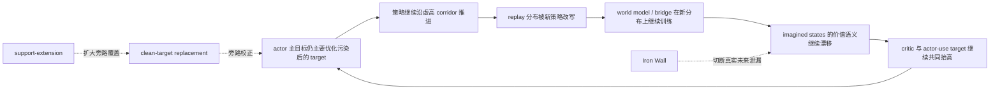

# 真实训练运行诊断报告-2026-03-16-0931

## 一、实验对象

- 运行产物：`outputs/exp_seed42_v171_h15_clean_target_support_extension_2500_20260316_01`
- 对照基线：`outputs/exp_seed42_v170_h15_actor_clean_target_replacement_2500_20260316_01`
- 当前修复主题：在 actor-side clean target replacement 上，补“部分 replay 支持可向同一 rollout 尾部延展”的 support-extension 机制。

## 二、核心结果

### 1. eval 曲线

| step | v170 | v171 |
|---:|---:|---:|
| 250 | 28.4 | 28.4 |
| 500 | 45.6 | 46.2 |
| 750 | 24.4 | 43.6 |
| 1000 | 25.0 | 16.6 |
| 1250 | 177.4 | 58.0 |
| 1500 | 185.4 | 89.6 |
| 1750 | 283.0 | 113.4 |
| 2000 | 148.0 | 115.2 |
| 2250 | 158.8 | 120.0 |
| 2500 | 249.4 | 79.8 |

### 2. 结论先说

- 这刀 **不是无效**。
- 它确实修到了 `v170` 中“clean target 可用样本和真正可替换样本交集过小”的一部分问题。
- 最直接证据是：`750` 从 `24.4` 抬到了 `43.6`，说明早期那种“prefix replay support 不足导致 clean target 根本接不进去”的问题被缓解了。
- 但它 **也没有完成终局修复**。
- `1000` 仍然掉到 `16.6`，最终 `2500` 只有 `79.8`，远低于 `v170` 的 `249.4`。

## 三、内部指标对账

### 1. support-extension 的确生效了

`v171` 新增的两个关键指标证明代码行为符合预期：

- `actor/corridor_semantic_clean_target_support_fraction`
- `actor/corridor_semantic_clean_target_confidence_mean`

中后段典型值：

| step | available | support | confidence |
|---:|---:|---:|---:|
| 1000 | 0.2250 | 0.8750 | 0.3750 |
| 1500 | 0.5250 | 1.0000 | 0.6728 |
| 2000 | 0.4417 | 0.8750 | 0.6061 |
| 2500 | 0.2083 | 1.0000 | 0.3228 |

这说明：

- `support-extension` 确实把“只有 prefix 有精确 replay 对齐”的样本，延展成了“同一行尾部也有非零替换置信度”。
- 所以这次结果不好，**不是因为实现没生效**。

### 2. 真正的问题是：替换权重仍然太弱

尽管 support 与 confidence 提升了，但真正进入 actor 主目标的替换量仍偏小：

| step | blend_mean | inflation_gate_mean | weighted_actor_target_mean |
|---:|---:|---:|---:|
| 1000 | 0.0067 | 0.2809 | 0.2730 |
| 1500 | 0.0002 | 0.5095 | 0.6177 |
| 2000 | 0.0125 | 0.7578 | 0.5842 |
| 2250 | 0.0246 | 0.9264 | 0.6203 |
| 2500 | 0.0626 | 0.9756 | 0.5664 |

这组量的物理含义很直接：

- 风险检测器是亮的，而且后段几乎拉满。
- 但 clean-target 替换只拿到了很小一部分有效权重。
- actor 的主推进器 `weighted_actor_target_mean` 仍长期维持正值，而且量级不低。

因此当前系统已经从“看不见风险”进入了“看见风险，但替换力度不够”的阶段。

### 3. 晚期病理仍然存在，而且最终还是爆了

训练末端：

| step | value_gap_abs | teacher_value_err | imag_value_err |
|---:|---:|---:|---:|
| 2000 | 2.03 | 17.46 | 17.27 |
| 2250 | 10.14 | 40.15 | 40.97 |
| 2500 | 34.21 | 97.26 | 119.24 |

这说明：

- 后段价值语义仍然发生了大幅通胀和语义脱轨。
- `support-extension` 并没有阻止 late-stage value semantics 继续膨胀。
- 它只是把 clean target replacement 的覆盖面从“太窄”推到了“略宽”，还没有宽到足以压住主链。

## 四、病理、病因、根因

### 1. 当前病理表现

- 早期第一处 support 断层被缓解，`750` 明显改善。
- 中段仍会出现一次深跌，`1000=16.6`。
- 后段不再完全自由落体，但始终无法建立高分 corridor 保持。
- 训练末端 value semantics 再次严重爆炸。

### 2. 病因

当前 actor-side clean target replacement 仍然是一个“条件非常苛刻的修正项”：

- 需要进入 corridor
- 需要 inflation gate 打开
- 需要 clean target 有 replay 支持
- 还需要其他门控共同允许，最终才能把替换权重送进 actor 主目标

这会导致一个典型时序错位：

- **越到后面越危险的时候，系统越想替换**
- 但 **越到后面可用的高质量 replay suffix 支持反而越稀**

结果就是：

- 风险越大，替换意愿越高
- 但真正可替换的干净目标越少
- 替换 alpha 最终仍被压得偏小

### 3. 当前最收敛的根因

当前剩余主根因已经可以压缩成一句话：

> clean-target replacement 的“可用性”问题已经部分修复，但“接管强度”仍然不足；报警信号能到达旁路，却还进不了 actor 主推进链的主通道。

换句话说，问题已经不再是：

- 要不要继续走 actor-side 主线
- 要不要继续做 replay-grounded clean target

而是：

- **如何让 clean target 在 high-inflation corridor 中更早、更强、更持续地接管 actor target。**

## 五、跨桥因果判断

这次 `v171` 的结论是：

- `support-extension` 把 `H` 这条旁路变宽了一些。
- 但 `H` 仍然不够粗，无法压过 `A -> B -> C -> D -> E -> F -> A` 这条主正反馈环。

## 六、对模型现状的判断

### 1. 对的部分

- actor-side clean target 主方向是对的。
- replay-grounded 语义锚也是对的。
- support-extension 这个补丁本身也是对的。

### 2. 还不够的部分

- 它没有把 clean target 从“修正项”提升成“主合同”。
- 替换强度仍被多层条件稀释。
- actor 主目标仍然过多地由污染 target 决定。

### 3. 当前整体状态

- 比 `v169` 更接近正确主线。
- 比 `v170` 在早期覆盖问题上更干净。
- 但整体效果还不如 `v170`，因为它把系统推成了“更知道该刹车，但仍然刹不住主油门”的形态。

## 七、下一刀建议

下一刀不应再去补：

- controller rescue
- 新的 detector
- critic-only 锚

下一刀应该直接打在：

> **clean-target replacement 的主通道接管强度**

建议方向：

1. 在 `high inflation + replay support available` 的 corridor 内，让 clean target 的替换从“轻混合”升级为“更强 takeover”。
2. 降低对瞬时 advantage 符号翻转的过度依赖，避免一旦 `adv` 暂时回正，替换权重立刻掉光。
3. 把 row-level replay support 的持续性变成更稳定的 actor target 合同，而不是只在局部样本时刻生效。

## 八、最终一句话

`v171` 证明了 support-extension 的补丁方向是正确的，但也把剩余病灶钉得更死了：

> 现在的问题已经不是“clean target 能不能进来”，而是“进来了以后，为什么还接管不了 actor 的主推进器”。
