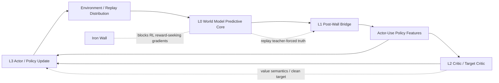

# 系统级控制蓝图与下一层切入面 - 2026-03-16 11:25

## 一、为什么现在要升维，而不是继续 patch-first

前面几轮并不是“盲修”，而是在做系统辨识。

我们已经用连续 run 把问题从一团混合病灶，逐步分解成：

1. `world model predictive core` 是否先坏
2. `post-wall bridge` 是否失训
3. `critic ruler semantics` 是否共漂
4. `actor target law` 是否把污染目标继续当成主合同
5. 是否还存在一个更早、且不以 inflation 为前导的 behavior instability

到 `v173` 为止，系统状态已经足够清楚，可以从“阶段性补刀”上升为“系统级控制蓝图”。

当前最重要的升级不是再加一个 patch，而是明确：

- 系统到底在控制什么
- 哪些量是可靠观测
- 哪些模块负责哪一层稳定性
- Iron Wall 到底切断了什么
- 下一刀应该落在哪一层才最干净

## 二、系统分层

当前系统不是单环，而是一个多环耦合系统。

建议把它正式拆成四层。

| 层级 | 模块 | 职责 | 允许的训练来源 | 不允许承担的职责 |
|---|---|---|---|---|
| L0 真实预测层 | RSSM / reward / continue / decoder | 保持世界预测真值 | replay teacher-forced predictive losses | 直接追随 actor/critic 的 reward-seeking 梯度 |
| L1 墙后桥接层 | `control_head` / `projection` / `abstractor` / `consistency_head` / `aux_tasks` / `router` | 把预测真值翻译成 actor-use policy space | replay-side bridge maintenance + policy-space open-loop consistency | 被动等 RL 梯度“顺带训练” |
| L2 语义标尺层 | critic / target critic / MC anchor / single-ruler / clean target | 维护 value/return 语义尺度 | imagined RL + replay-grounded calibration | 作为 world truth 的替代品 |
| L3 行为控制层 | actor objective / policy update / replay distribution | 决定策略推进、收油、分布迁移 | imagined actor loss + clean target replacement | 反向污染 L0 predictive truth |

一句话概括：

- L0 管“真”
- L1 管“把真传到 actor 能用的空间”
- L2 管“尺度”
- L3 管“行为”

## 三、系统级因果图

这张图里有两个主反馈环：

1. `actor -> replay -> wm -> bridge -> actor`
2. `actor-use features -> critic -> actor`

纯 imag 训练的不稳定，本质上就是这两个环在不同阶段轮流主导。

## 四、Iron Wall 的真实职责与切断点

Iron Wall 不是 bug，它是设计原则。

它的目标是：

> 保护预测真值，不让 actor/critic 的 reward-seeking 梯度直接回流污染 world model predictive core。

### 代码层的关键切断点

#### 1. `WMState.isolate_gradients(context=\"policy\")`

在 [aletheia_world_model.py](/Users/zhangsan/Desktop/缸中之脑v5.6/aletheia/aletheia_world_model.py#L4744)：

- `policy` 语境下，`x_t` 会按 `wall_strength` 部分或完全 detach
- `rl` 语境保留的是 `s_ctrl`

这意味着：

- policy 使用的是“被隔离后的世界模型状态”
- 不是一个对 predictive core 全开梯度的状态

#### 2. `x_proj` / `z_task` 在进入 policy routing 前就被 detach

在 [aletheia_world_model.py](/Users/zhangsan/Desktop/缸中之脑v5.6/aletheia/aletheia_world_model.py#L7960) 和 [aletheia_world_model.py](/Users/zhangsan/Desktop/缸中之脑v5.6/aletheia/aletheia_world_model.py#L8013)：

- `x_proj_raw -> x_proj.detach()`
- `z_task_raw -> z_task.detach()`

这说明：

- bridge 给 actor 的不是“可随 actor loss 回传塑形的 predictive latent”
- 而是刻意隔离后的 policy-side bridge representation

#### 3. imagined rollout 的 seed state 明确 `detach_all()`

在 [aletheia_train.py](/Users/zhangsan/Desktop/缸中之脑v5.6/aletheia/aletheia_train.py#L9800)：

- replay seed 构成的 `wm_state` 在进入 imagination 前就被整体 detach

这意味着：

- imagined actor/critic update 不会顺着 imagined branch 把梯度压回 WM 内部

#### 4. router loss 也刻意不回流共享 backbone

在 [aletheia_actor_critic.py](/Users/zhangsan/Desktop/缸中之脑v5.6/aletheia/aletheia_actor_critic.py#L1935)：

- `compute_router_loss()` 显式 `feat.detach()`

这说明：

- router 的训练被设计成“后桥局部训练”
- 不是把 router 当成可任意反向改写 critic backbone 的入口

#### 5. router 位于额外 RL 参数桶，而非 WM optimizer

在 [aletheia_train.py](/Users/zhangsan/Desktop/缸中之脑v5.6/aletheia/aletheia_train.py#L7523)：

- `extra_rl_params` 收集 non-WM / non-actor / non-critic 参数
- router 结构上就是墙后 RL 侧 bridge

这意味着：

- router 不是 predictive core 的一部分
- 它如果没有稳定的桥接监督，就会沦为“随下游语义飘移的后桥”

### Iron Wall 真正切断了什么

它切断的是：

- `actor reward gradient -> WM predictive core`
- `imagined critic drift -> WM latent shaping`
- `policy-space shortcut -> predictive truth corruption`

它没有切断的是：

- `actor 行为 -> replay 分布 -> WM teacher-forced 数据`
- `桥接层失训 -> actor-use feature manifold 漂移`
- `critic 标尺漂移 -> actor 目标污染`

这正是为什么：

- Iron Wall 是对的
- 但系统仍然会生病

## 五、受控量、观测量、控制面

### 1. L0 真实预测层

#### 受控量

- predictive truth fidelity
- replay teacher-forced 下的 reward / continue / reconstruction / KL 一致性

#### 主要观测量

- `loss_wm`
- recon / reward / continue / KL
- `bridge/maintenance_scale`

#### 控制面

- WM optimizer
- predictive losses
- bridge maintenance schedule 的上游地板

#### 当前判断

`v173 @1000` 时 value audit 仍健康，因此当前最主导的残余问题不像是 L0 先坏。

### 2. L1 墙后桥接层

#### 受控量

- actor-use policy features 是否仍对齐 replay teacher semantics
- `x_proj / s_ctrl / z_task / f_policy` 的局部几何与控制语义

#### 主要观测量

- `wm/policy_open_loop_consistency_*`
- `imag/open_loop_audit_*`
- `bridge/projection`
- `bridge/control_align`
- `bridge/control_reg`
- `bridge/consistency_head`
- `bridge/aux_inverse`
- `bridge/aux_value`

#### 控制面

- replay-side bridge maintenance losses
- replay open-loop policy-space consistency
- router 局部训练合同

#### 当前判断

L1 不是已经完全修好，但也不是当前唯一主病灶。

前面几轮已经证明：

- 早期 imagined geometry 曾经是主病灶
- 但通过 bridge contract + policy open-loop consistency，早期 imagined manifold 脱锚问题已被大幅收窄

### 3. L2 语义标尺层

#### 受控量

- online critic / target critic / replay anchor / clean target 的语义尺度一致性

#### 主要观测量

- `critic/value_target_gap_abs_mean`
- `critic/real_mc_value_gap_abs_mean`
- `imag/reference_value_ruler_alpha_mean`
- `imag/open_loop_audit_teacher_value_abs_to_short_return_mean`
- `imag/open_loop_audit_imag_value_abs_to_short_return_mean`
- `actor/corridor_semantic_inflation_gate_mean`

#### 控制面

- single-ruler
- MC anchor
- clean target replacement
- dominant takeover

#### 当前判断

L2 的 severe inflation 问题没有被彻底治愈，但 `v173` 已经证明：

- 这层的晚期接管显著增强了
- polluted target heat 被真实压低了

所以当前系统不再适合继续简单表述为：

> 还是 value inflation 没修够

### 4. L3 行为控制层

#### 受控量

- policy 推进是否过冲
- corridor 内是否能连续收油
- replay 分布是否被策略带入坏相位
- 当前 checkpoint 的长期保持力

#### 主要观测量

- external eval curve
- `actor/target_raw_mean`
- `actor/target_mean`
- `actor/base_mean`
- `actor/adv_mean`
- `actor/online_adv_mean`
- `actor/weighted_actor_target_mean`
- `actor/corridor_semantic_clean_target_blend_mean`

#### 当前最缺的观测量

这一层正是当前的盲区。

我们还缺：

- action-level phase stability
- policy KL / policy mode switch rate
- corridor occupancy persistence
- pre-inflation 段的 policy-space jitter / collapse precursor

#### 控制面

- actor objective law
- clean target takeover law
- 若必要，再做 policy-space consistency / open-loop behavior regularization

#### 当前判断

`v173 @1000` 崩落发生时：

- `inflation_gate = 0`
- value audit 仍健康

这说明当前最值得怀疑的残余主病灶已经进入 L3：

> pre-inflation 的 policy / behavior instability

## 六、职责边界

这是当前最需要钉死的部分。

### 1. world model 的职责

- 建模世界真值
- 提供 teacher-forced predictive state
- 提供桥接训练所需的 replay-side teacher semantics

它不应负责：

- 直接吃 actor reward-seeking 梯度
- 为 actor 末端不稳定兜底

### 2. bridge 的职责

- 把 predictive truth 翻译成 actor-use feature space
- 保持局部控制语义与短程价值语义
- 在 wall 存在时继续被维护

它不应负责：

- 替 actor 自己做探索决策
- 替 critic 修语义膨胀

### 3. critic 的职责

- 给 actor 提供价值尺度
- 对 imagined branch 做 value semantics 对账

它不应负责：

- 充当外生真理
- 训练 bridge 几何

### 4. actor 的职责

- 在现有 feature / value 合同上做行为推进
- 当 corridor 语义恶化时连续收油

它不应负责：

- 反向决定 predictive truth
- 通过 controller 事后修补自己本应内生完成的行为稳定

### 5. replay 的职责

- 把 actor 行为变成训练分布
- 作为系统慢反馈通道

它不应被误解为：

- 一个被动数据仓库

实际上 replay 是系统里最重要的分布状态变量之一。

## 七、当前系统为什么会反复生病

根本原因不是“某个公式写错了”，而是三个环互相咬住：

### 环一：行为分布环

`actor -> replay -> world model -> bridge -> actor`

如果 actor 先把行为推离健康 corridor：

- replay 分布被改写
- WM 学到的新数据分布也变了
- bridge 在新的分布上重新塑形
- actor 最终收到的 feature space 也就变了

### 环二：语义标尺环

`actor-use features -> critic family -> actor target law -> actor`

如果 critic 家族在高价值 corridor 上共同乐观：

- actor 目标被污染
- replay 进一步被带偏

### 环三：外层 controller 环

`audit -> stage controller -> return/base scaling`

这个环本质上是救火环，不是主控制环。

它适合：

- 发现病情
- 短时保护

它不适合：

- 替代 actor / bridge / critic 的主合同

## 八、为什么之前会进入阶段性修补

因为在 `v165` 之前，我们连主导失稳发生在哪一层都没分清。

必须先通过局部修复做系统辨识，才能得到现在这张图：

- geometry drift 不是当前首发病灶
- late-stage common-mode inflation 确实存在，但已被部分修到
- dominant takeover 确实有效，但不能解释 `@1000` 的 pre-inflation collapse

所以现在真正该做的，不是继续 patch-first，而是用这张蓝图来重建下一步。

## 九、下一刀该落在哪一层最干净

当前最干净的下一层，不是 L0，也不是继续加厚 L2。

### 不该落在 L0 的原因

`@1000` 崩落时 predictive / value audit 仍健康，说明不是 predictive truth 先坏。

### 不该继续落在 L2 的原因

`v173` 已经显著增强了 severe inflation takeover。
如果再继续盲目加强 clean target replacement，很可能会把晚期病灶继续往前掩，而不是解释 `@750 -> @1000`。

### 最该落在 L3 的原因

当前剩余主病灶最像：

> policy / behavior 自身在 pre-inflation 阶段发生相位失稳，而当前观测体系还没把它正式建模出来。

因此，下一刀最干净的切入面不是“再加控制”，而是：

> 先把 L3 行为层的状态变量和观测量补齐。

## 十、下一阶段的正式任务

下一阶段不应直接改损失，而应先做一轮系统级行为诊断设计。

### 任务 A：补齐 L3 观测

优先新增或审计：

1. action entropy / action mode collapse
2. policy KL to recent anchor
3. action switch rate / oscillation rate
4. corridor occupancy persistence
5. pre-inflation 段 `f_policy` 局部速度和曲率

### 任务 B：建立先后因果

在 `@750 -> @1000` 窗口内，逐步判断谁先动：

1. actor logits 先乱
2. `f_policy` 几何先变
3. replay support 先弱化
4. critic semantics 其实更早已开始变，只是当前指标没看见

### 任务 C：再决定下一刀

只有把上面三者分清后，才决定：

- 是 actor objective 的 behavior-phase damping
- 还是 bridge 侧的 policy-space stability contract
- 还是 replay-distribution aware 的慢反馈控制

## 十一、最终结论

当前最准确的系统级判断是：

> Iron Wall 设计本身是对的；L1 bridge 之前确实长期失训；L2 late-stage severe inflation 已经被明显修动；但系统仍存在一个位于 L3 的、早于 inflation 出现的行为相位失稳点。

所以当前最优雅、最准确的下一步不是再下代码刀，而是：

> 用系统级控制视角，把 L3 行为层正式建模成新的主观察对象，再决定下一刀。
