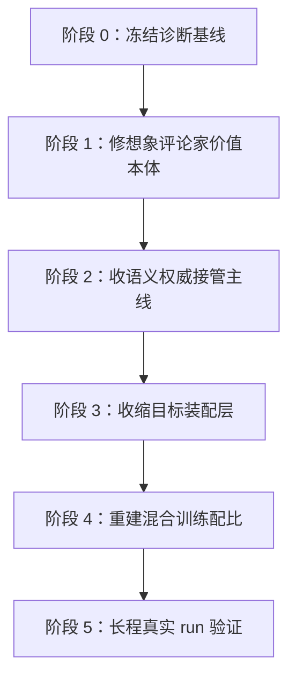
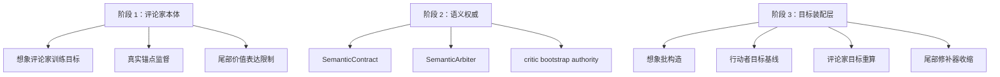

# 模型本体训练失衡修复方案 v1

> 2026-03-24 状态更新：
> - 阶段 1、阶段 2 已完成并形成当前主线基线。
> - 阶段 3 的结构诊断已经完成，但实现收官尚未通过验收。
> - 5000 步长程验证已经提前做过一次，结果显示 `3000 -> 3250` 仍存在后段断崖失稳。
> - 因此，阶段 4 暂不正式启动；当前主任务仍然是回到阶段 3，收束后段目标装配主执行线。

## 1. 文档目标

这份文档回答的是：

1. 现在能不能直接开始修复
2. 应该先修哪里，后修哪里
3. 修复工作如何分阶段实施
4. 每个阶段改哪些模块、看哪些指标、如何判定成功

这份方案建立在《模型本体训练失衡根因报告 v1》的结论之上，当前正式判断是：

> 主根因是想象评论家在想象状态上的价值语义失稳；
> 目标装配层会进一步放大并传播这类误差；
> `continue` 的尾部乐观是次级放大器；
> 动力学误差与奖励误差当前不是主导根因。

因此，项目现在**可以直接开始修复**，但不能再按“哪里看起来危险就补一个门控”的方式推进，而必须按主次顺序收敛。

## 2. 修复总原则

### 原则 1：先修病源，再修传播层

先解决想象评论家价值语义失稳，再收缩目标装配层。

如果顺序反过来，只会出现两种情况：

- 用更复杂的装配逻辑去包住本体误差
- 暂时压住曲线，但把目标语义变得更不可解释

### 原则 2：每一步都必须可单独验收

每一阶段都必须回答：

- 改动前想压的是什么误差
- 改动后哪个指标应该先变好
- 哪些指标不允许顺手变差

### 原则 3：不允许继续长出新的散装控制层

后续实现只能落到下面三类之一：

- 本体修复
- 语义权威修复
- 装配层收敛

不允许再增加新的临时阶段控制、旁路保护、双重门控、额外接线补丁，除非它们属于明确的迁移期脚手架，而且有退场时间。

### 原则 4：所有修复都要服务于“单一主线”

终局目标不是“很多保护一起工作”，而是：

- 想象价值本体更稳定
- 外生真值在有覆盖位置拥有清晰底线权威
- 目标装配层只保留少数必要改写器

## 3. 修复总图

这五个阶段里，真正的主修复只有两条：

- 主线一：想象评论家价值本体修复
- 主线二：目标装配层收敛与语义权威统一

其中：

- 阶段 1 是病源修复
- 阶段 2 和阶段 3 是传播层与权威层修复
- 阶段 4 才能重新谈训练配比
- 阶段 5 才能宣布问题是否真正收住

## 4. 实施路径图

## 5. 阶段设计

### 阶段 0：冻结诊断基线

#### 目标

在开始任何修复前，先固定一组对照基线，防止后续又回到“改了很多，但不知道哪一步真正有效”。

#### 需要冻结的基线

- 主线 run
- `contract off`
- `mixed 0.85`
- `target audit`

#### 冻结内容

- 配置快照
- 关键指标快照
- 评估曲线快照
- 五类误差表

#### 验收标准

- 所有后续实验都能对照这四组基线
- 所有新增修复都能回答“相比哪条基线改善了什么”

---

### 阶段 1：修想象评论家价值本体

#### 目标

把“想象状态上的价值语义自然膨胀”压下去。

这是第一优先级，也是病源级修复。

#### 修复范围

只碰想象评论家本体相关路径，不碰装配层收缩，不碰大规模控制器逻辑。

重点模块：

- [aletheia_train.py](/Users/zhangsan/Desktop/缸中之脑v5.6/aletheia/aletheia_train.py)
  这里面包含想象 rollout、想象价值计算、评论家目标消费与相关损失

#### 本阶段要做的事

1. 把想象评论家误差从“观测量”升级为“主约束对象”
2. 明确区分真实锚点监督和想象自举监督
3. 收紧想象评论家对想象尾部的乐观估值
4. 让评论家在想象状态上的值分布重新贴近短回报和真实锚点

#### 具体实现方向

1. 重构评论家训练目标的优先级

- 真实锚点监督优先于纯内生想象自举
- 想象值不能长期脱离短回报误差审计

2. 把“想象价值对短回报误差”纳入硬性回归纪律

- 不是只记录 `imag/open_loop_audit_imag_value_abs_to_short_return_mean`
- 而是把这一误差对应到评论家训练的显式约束

3. 重新限制想象尾部价值的乐观外推

- 重点不是先砍 `horizon`
- 而是先收紧尾部价值在高不确定区域的表达空间

4. 区分“可认证想象状态”和“纯内生想象状态”

- 在真实锚点覆盖弱的位置，评论家不能以同样强度宣称高值

#### 本阶段核心指标

- `imag/open_loop_audit_imag_value_abs_to_short_return_mean`
- `critic/real_mc_value_gap_abs_mean`
- `critic/slow_value_gap_abs_mean`
- `critic/value_target_gap_abs_mean`

#### 成功标准

- 相比主线 run，本体价值误差明显下降
- 相比 `contract off`，不再出现大幅自然膨胀
- 真实退化的出现时间明显后移，或不再出现快速回撤

#### 风险

- 如果本阶段无效，说明本体价值失稳不是单纯监督问题，而是更深层的语义结构问题
- 但在现有证据下，这个阶段必须先做

---

### 阶段 2：收语义权威接管主线

#### 目标

让外生真值在有覆盖的位置真正拥有底线权威，而不是只作为支持信号存在。

#### 修复范围

聚焦 `SemanticContract / SemanticArbiter / critic bootstrap authority` 这条主线。

重点文档与模块：

- [RFC-SAI-001-语义权威接口.md](/Users/zhangsan/Desktop/缸中之脑v5.6/docs/RFC-SAI-001-%E8%AF%AD%E4%B9%89%E6%9D%83%E5%A8%81%E6%8E%A5%E5%8F%A3.md)
- [aletheia_train.py](/Users/zhangsan/Desktop/缸中之脑v5.6/aletheia/aletheia_train.py)

#### 本阶段要做的事

1. 明确 clean target、真实锚点、外部自举值、内部自举值的权威层级
2. 让“有覆盖的外部来源”在评论家目标里具有真正的接管下限
3. 让行动者、评论家、走廊三者消费同一套权威语言

#### 具体实现方向

1. 固化合同对象

- 每个主要来源必须带：
  - 数值
  - 覆盖率
  - 可信度
  - 权威
  - 任务一致性

2. 固化仲裁器

- 外部来源在 `coverage > 0` 位置不能被压到接近零权威
- 内部评论家权威必须受到任务一致性和覆盖率约束

3. 固化消费者

- `target_critic`
- 行动者主目标
- 走廊消费者

这三处不能再各自私有一套“谁更可信”的解释。

#### 本阶段核心指标

- `contract/bootstrap_internal_authority_mean`
- `contract/bootstrap_external_authority_mean`
- `contract/bootstrap_external_authority_on_valid_mean`
- `critic/bootstrap_clean_mix_mean`
- `critic/bootstrap_requested_floor_mean`
- `critic/bootstrap_contact_floor_mean`

#### 成功标准

- 外部覆盖有效位上的外部权威稳定非零，且不再只是名义存在
- 内部自举权威在风险阶段不再长期垄断
- 真实退化时，接管幅度能与退化强度匹配

---

### 阶段 3：收缩目标装配层

#### 目标

把现在多层串联、重复重写的目标装配，收回成一条更短、更可解释的主线。

#### 修复范围

想象批构造路径。

重点位置：

- [aletheia_train.py:11282](/Users/zhangsan/Desktop/缸中之脑v5.6/aletheia/aletheia_train.py#L11282)
- [aletheia_train.py:11334](/Users/zhangsan/Desktop/缸中之脑v5.6/aletheia/aletheia_train.py#L11334)
- [aletheia_train.py:16492](/Users/zhangsan/Desktop/缸中之脑v5.6/aletheia/aletheia_train.py#L16492)

#### 本阶段要做的事

1. 正式区分：

- 观测器
- 门控器
- 真正改写目标的执行器

2. 删掉或降级那些只是在叠加语义不稳定性的执行器
3. 限制单批内同一目标被多次重写

#### 实施原则

目标装配最终应压缩成下面的顺序：

1. 原始想象回报
2. 一次权威仲裁
3. 一次必要的目标修正
4. 输出给行动者和评论家

不允许再出现：

- 先改 `returns`
- 再改 `base_actor`
- 再改 `returns`
- 再改 `target_critic`
- 最后再修尾部权重

这种多轮重写链。

#### 本阶段重点改写器

- `continue cap`
- `target base blend`
- `reference value ruler`
- `corridor clean target blend`
- `critic bootstrap target rewrite`
- `persistence tail repair`

#### 本阶段核心指标

- `corridor_semantic_clean_target_blend_mean`
- `critic/bootstrap_clean_mix_mean`
- `critic/bootstrap_raw_vs_clean_gap_mean`
- `critic/bootstrap_target_delta_mean`
- `reference_value_ruler_alpha_mean`
- `base_return_cap_fraction`
- `persistence_tail_mismatch_active`

#### 成功标准

- 目标装配改写次数减少
- 改写器数量减少
- 装配改写幅度下降
- 在同等或更低原始误差下，评估不再中后期回撤

#### 当前状态

- 已完成：
  - 目标装配层结构清单
  - 观测器 / 门控器 / 执行器划分
  - 最佳基线时间线与 5000 步失败传播链分析
- 未完成：
  - 后段主执行线压缩为单一权威主线
  - 外部自举值链的明确退场条件
  - 删除/降级项清单的正式落地
  - “同等或更低原始误差下不再中后期回撤”的验收

#### 当前阶段 3 的唯一主刀位

当前不再横向扩散到新功能，而是只收束这条后段主执行线：

1. 过渡桥接
2. 终局真值源
3. 数值源替换
4. 持有持久化
5. 最终质量钳制

目标是把“谁是权威、谁只是 support”压成单一主线，而不是继续允许多个高值来源在后段并行改写最终目标。

---

### 阶段 4：重建混合训练配比

#### 目标

在本体与传播层都收住之后，再重新决定想象训练比例，而不是拿配比去硬压系统性问题。

#### 需要明确的判断

`mixed 0.85` 不是最终解。它证明的是：

- 把想象价值误差压下来，不等于全局就稳定
- 配比会改变问题显性程度，但不会自动修复语义权威与目标传播

#### 本阶段要做的事

1. 重建 `imag_ratio` 的试验矩阵
2. 分别评估：

- 本体价值是否稳
- 目标装配是否稳
- 真实评估是否稳

3. 再决定默认训练配比

#### 成功标准

- 不是只追求峰值评估
- 而是追求：
  - 峰值高
  - 尾部不回撤
  - 权威与误差指标同步健康

#### 启动门禁

阶段 4 只有在下面条件同时满足后才能正式启动：

1. 阶段 3 的后段主执行线已完成收束
2. 长程 run 不再出现 `3000 -> 3250` 级别的断崖失稳
3. 目标装配改写次数、改写幅度、后段高值滞留都已经下降

在当前状态下，阶段 4 仍然是后续阶段，不是当前施工阶段。

---

### 阶段 5：长程真实 run 验证

#### 目标

确认修复不是“短程看起来有效”，而是真的能穿过中后期。

#### 需要跑的验证

1. 短程回归 run

- 用于快速看本体误差是否收住

2. 中程稳定性 run

- 用于看是否还在 1000-2500 窗口出现回撤

3. 长程真实 run

- 用于看是否重新出现假稳定后崩塌

#### 验收标准

- 不再出现“峰值很高，末段塌掉”的主线形态
- 五类误差里，价值语义误差不再先爆
- 权威接管与真实退化之间的关系更一致

#### 当前状态

阶段 5 已经做过一次前置性长程验证，但该验证的用途是判断阶段 3 是否真的收住，而不是宣布阶段 5 已完成。

当前结果是：

- `v249 phase426 ratio 0.5` 在 `2500` 前后能稳定达到 `500`
- 但 `5000` 步验证中，`3000 -> 3250` 仍发生断崖式失稳

因此这次长程验证的正式含义是：

- 阶段 5 尚未完成
- 阶段 4 不应启动
- 阶段 3 仍需继续收官

## 6. 模块实施图

## 7. 实施顺序的强约束

这部分是硬约束，不能跳。

### 必须先做

1. 阶段 0
2. 阶段 1

### 做完阶段 1 后才能做

1. 阶段 2
2. 阶段 3

### 只有阶段 1-3 收住后，才允许做

1. 阶段 4
2. 阶段 5

### 当前真实状态

- 阶段 1：已完成
- 阶段 2：已完成
- 阶段 3：分析完成，实施未收官
- 阶段 4：未到启动条件
- 阶段 5：已做一次前置长程验证，结果反证阶段 3 仍未完成

## 8. 每阶段的交付物

### 阶段 1

- 评论家本体修复提交
- 对应单测与短程 run 结果
- 价值误差改善报告

### 阶段 2

- 语义权威对象与仲裁器实现
- 权威对账面板
- 接管行为验证报告

### 阶段 3

- 目标装配层结构清单
- 删除/降级项清单
- 装配层改写幅度对比报告
- 后段主执行线收束结果
- 长程 run 不再发生后段断崖的验证结论

### 阶段 4

- 新训练配比矩阵
- 配比敏感性分析

### 阶段 5

- 长程 run 结果
- 最终收敛性判定报告

## 9. 当前建议的施工起点

如果现在就开始动手，**第一批实现应只做阶段 1 的最小闭环**：

1. 固定一条想象评论家价值误差主线
2. 把真实锚点监督提升为评论家主约束之一
3. 跑短程与中程回归
4. 验证价值语义误差是否显著下降

只有这一步成功，后面的权威接管与装配层收缩才有意义。

## 10. 一句话施工决策

> 当前不进入阶段 4；继续完成阶段 3，把后段目标装配主执行线收束成单一权威主线，再谈配比重建与最终长程验收。
