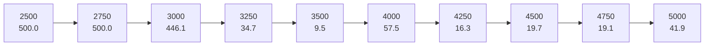
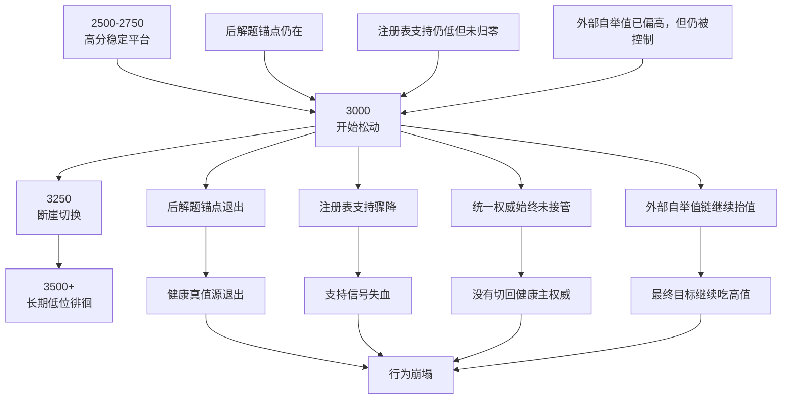
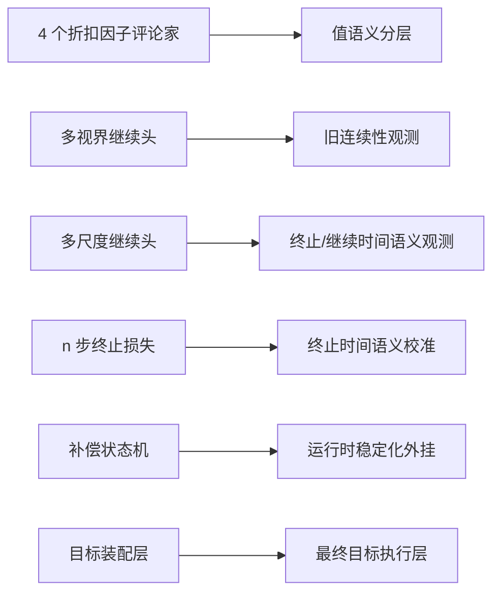
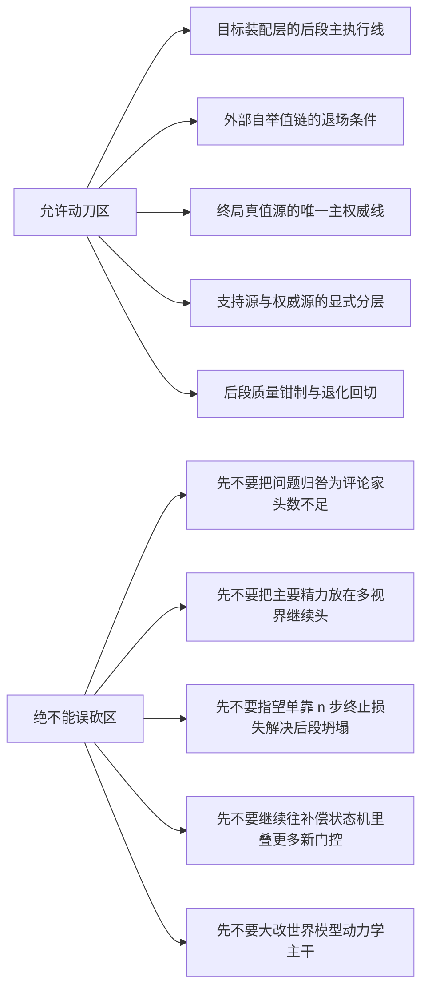

# 模型本体训练失衡根因报告 v2

## 副标题

最佳基线时间线、5000 步失败传播链、模块职责边界与下一刀手术边界总图

## 1. 文档目标

这份文档只回答四件事：

1. 当前“第三阶段”之后，哪条 run 才是正式意义上的最佳性能基线
2. 5000 步超长 run 为什么会在 `3000 -> 3250` 发生断崖式失稳
3. `4 个折扣因子评论家 / 多视界继续头 / 多尺度继续头 / n 步终止损失 / 补偿状态机 / 目标装配层` 各自负责什么，不负责什么
4. 下一刀应该落在哪一层，绝不能误砍哪一层

这份报告不是修复方案文档，而是后续所有修复与争论的裁决基准。

---

## 2. 最终裁决

当前最重要的总判断是：

> 当前最佳基线是 `v249 phase426 ratio 0.5` 这条主线。
>
> 它已经证明系统可以在 `2250 -> 2500` 稳定到 `500`，但 5000 步超长 run 又证明它没有真正修掉后段根因，只是把失稳点推迟到了 `3000 -> 3250`。
>
> 因此，当前问题的主病灶不是“评论家头数不够”，不是“n 步终止损失没接上”，也不是“多视界继续头没开”，而是“目标装配层在后段没有完成健康的权威切换”。

换句话说：

- 观测层不是完全没有工作
- 门控层不是完全没有保护
- 运行时补偿层也不是完全不存在

真正失效的是：

**后段最终目标仍在持续消费一个越来越不健康的高值来源，而没有切回更健康的真值源。**

---

## 3. 最佳基线时间线

### 3.1 当前最佳基线是谁

当前“第三阶段”之后，真正被性能结果证明的最佳主线基线是：

`outputs/exp_seed42_v249_phase426_recert_headroom_peak_recovery_compentry_on_ratio_0p5_2500_20260324_143718`

它不是名义上更像“阶段三实验”的 `v250`，而是实际把后段重新拉回高分稳定区的平台。

### 3.2 时间线总图

### 3.3 为什么它是正式基线

因为它同时满足三点：

1. 中段曾明显掉落，但后段被重新拉回高分
2. `2250` 与 `2500` 两个连续评估点都达到 `500`
3. 它后来被拿去做 5000 步超长验证，因此具备“主线基线”资格

对应评估记录：

- `250 = 102.87`
- `500 = 113.20`
- `750 = 54.47`
- `1000 = 20.13`
- `1250 = 467.47`
- `1500 = 389.20`
- `1750 = 291.87`
- `2000 = 477.80`
- `2250 = 500.0`
- `2500 = 500.0`

### 3.4 为什么 `v250 phase3` 不是最佳基线

`outputs/exp_seed42_v250_phase3_bonus_consumer_observer_1500_20260324_105924`

这条 run 的关键评估是：

- `250 = 110.7`
- `500 = 112.7`
- `750 = 60.6`
- `1000 = 53.8`
- `1250 = 41.4`
- `1500 = 156.1`

它可以说明某条“第三阶段观察刀”没有完全坏掉，但它并没有形成高分后段稳定平台，因此不能拿来替代 `v249 ratio 0.5` 的基线地位。

---

## 4. 5000 步失败传播链

### 4.1 超长 run 总图

对应 run：

`outputs/exp_seed42_v249_phase426_recert_headroom_peak_recovery_compentry_on_ratio_0p5_5000_20260324_160546`

关键评估窗口如下：

这条线说明：

- 系统并不是从头就坏
- 也不是在 `1500` 左右就已经决定失败
- 它是真正跨过了高分平台后，才在 `3000 -> 3250` 发生相位切换

### 4.2 失败传播链总图

### 4.3 最关键的证据点

#### 在 `2500`

- `actor/post_solved_anchor_active = 1.0`
- `actor/contract_certified_registry_support_mean ≈ 0.154`
- `critic/bootstrap_external_value_final_mean ≈ 33.62`
- `critic/bootstrap_raw_vs_clean_gap_mean ≈ 20.18`

解释：

- 后解题锚点还在
- 注册表支持还很低，但还没有跌穿
- 外部自举值已经偏高，但还没有完全脱离控制

#### 在 `3000`

- `actor/post_solved_anchor_active = 1.0`
- `actor/contract_certified_registry_support_mean ≈ 0.162`
- `critic/bootstrap_external_value_final_mean ≈ 33.98`
- `critic/bootstrap_raw_vs_clean_gap_mean ≈ 29.39`

解释：

- 表面上系统还没彻底退出健康轨道
- 但“原始值与 clean target 的差距”已经继续扩大
- 这说明问题不是在 `3250` 瞬间突然出现，而是提前累积到阈值

#### 在 `3500`

- `actor/post_solved_anchor_active = 0.0`
- `actor/contract_certified_registry_support_mean ≈ 0.032`
- `actor/drift_guard_triggered = 1.0`
- `critic/bootstrap_eval_drawdown ≈ 0.931`
- `critic/bootstrap_real_task_degradation ≈ 0.931`
- `critic/bootstrap_semantic_debt_mean = 1.0`

解释：

- 后解题锚点已经退出
- 注册表支持接近失血
- 漂移保护器开始被动触发
- 真实任务退化已经非常严重
- 语义债务已经打满

#### 在 `5000`

- `critic/bootstrap_external_value_final_mean ≈ 80.02`
- `critic/bootstrap_raw_vs_clean_gap_mean ≈ 90.55`
- `critic/bootstrap_target_delta_mean ≈ 21.72`
- `actor/contract_certified_registry_support_mean ≈ 0.031`
- `actor/actor_contract_unified_authority_mean = 0.0`

解释：

- 后段最终值源继续被外部自举高值主导
- 真实支持仍未恢复
- 统一权威根本没有接管

### 4.4 失败根因的最短表述

这条失败链最应该被表述为：

> 后段不是“保护不够多”，而是“健康权威退出以后，目标装配层仍持续消费不健康高值源”。

因此，这是一条：

**后段权威切换失败 -> 外部高值滞留 -> 最终目标继续被污染 -> 行为断崖**

而不是一条：

**动力学突然坏掉 -> 训练直接崩**

---

## 5. 模块职责总图

### 5.1 总图

### 5.2 职责边界表

| 模块 | 负责什么 | 不负责什么 | 当前判断 |
|---|---|---|---|
| 4 个折扣因子评论家 | 提供短中长回报的值语义分层，降低单一折扣语义误导 | 不决定谁拥有最终目标权威 | 值得保留，但不是本次 5000 步失稳主解 |
| 多视界继续头 | 提供旧式多视界继续预测 | 不负责后段目标写入，也不负责主线后段稳定 | 当前主线里不是主执行链核心 |
| 多尺度继续头 | 预测多尺度终止概率，提供更强的继续/终止时间语义 | 不负责最终权威切换 | 有价值，但属于观测层，不是后段主解 |
| n 步终止损失 | 约束终止时间语义，减少想象尾部时间边界漂移 | 不负责外部高值源退场 | 接线已修好，属于增强件，不是主解 |
| 补偿状态机 | 在训练失稳时运行时接管、缓释、过渡 | 不是模型本体，不应替代健康目标语义 | 应修好，但不是当前本体失衡根因 |
| 目标装配层 | 决定最终评论家目标与行动者目标由谁来写、何时改写、何时切换权威 | 不负责观测本身 | 当前主病灶就在这里 |

---

## 6. 四折扣因子评论家、MHC、MSC、NST、补偿状态机、目标装配层逐项分析

### 6.1 4 个折扣因子评论家

#### 它负责什么

- 把评论家从单一折扣语义扩展为多时间尺度语义
- 帮助区分短视乐观与长视乐观
- 为后续诊断提供“哪一个时间尺度先坏”的信息

#### 它不负责什么

- 它不决定最终目标由谁主导
- 它不处理“外部自举值链该不该继续拥有权威”
- 它不负责把后段权威切回健康真值源

#### 当前裁决

它是有价值的结构增强，但不能把它误当作这轮超长失败的主解。

最直接的反证是：

- `compentry off`
- `compentry off + 4 gamma`
- `compentry off + 4 gamma + NST`

这三条 `3500` 步 run 的评估轨迹几乎完全重合，说明仅靠 `4 gamma` 并没有把主病灶打穿。

---

### 6.2 多视界继续头

#### 它负责什么

- 提供旧式多视界 continue 观测
- 让系统知道“未来若干步内是否仍会继续”

#### 它不负责什么

- 不负责后段最终目标权威切换
- 不负责让外部高值源退场
- 不负责主线行为高分保持

#### 当前裁决

在当前主线里，它不是关键执行链。

代码上，`MSC` 一旦开启，`MHC` 分支会直接返回 `0`，参考：

- `aletheia/aletheia_world_model.py`
- `_compute_mhc()`

因此，当前 5000 步后段失稳不应优先归因到它。

---

### 6.3 多尺度继续头

#### 它负责什么

- 预测多尺度终止概率
- 提供更细粒度的“继续/终止时间语义”
- 为 `NST` 提供输入来源

#### 它不负责什么

- 不决定最终目标写给谁
- 不决定谁是主权威
- 不负责后段外部高值退场

#### 当前裁决

它是健康的时间语义观测器，不是后段最终权威执行器。

---

### 6.4 n 步终止损失

#### 它负责什么

- 约束终止时间语义
- 让想象轨迹在“尾巴什么时候结束”这件事上更守纪律
- 减少一部分继续概率或终止概率的时间漂移

#### 它不负责什么

- 不负责把后段最终目标从不健康高值源上移开
- 不负责决定锚点退出后由谁接管

#### 当前裁决

它现在已经不是静默死代码，而是真正参与训练。

真实对照证明：

- 控制组里 `loss/consistency_nst = 0.0`
- 打开 `NST` 后，`loss/consistency_nst` 稳定非零，均值约 `0.0181`

这说明它是有效增强件，但仍不是当前超长失败的主解。

---

### 6.5 补偿状态机

#### 它负责什么

- 在训练已经开始偏离时，作为运行时外挂接管、缓释和过渡
- 在根系统还不够稳时，延缓或抑制明显失稳

#### 它不负责什么

- 它不是模型本体
- 它不应该承担“本体长期目标语义纠偏”的最终职责
- 它不能替代一个健康、可解释的主训练目标

#### 当前裁决

补偿状态机应该修好，但它不应被误当作根治器。

如果本体的后段目标装配权威仍然错误，那么补偿状态机最多是拖延失稳、改变失稳形态，不能根治失稳。

---

### 6.6 目标装配层

#### 它负责什么

- 决定最终评论家目标与行动者目标由谁主导
- 决定哪些来源只是 support，哪些来源是真正 authority
- 决定桥接、替换、持有、钳制的主执行线

#### 它不负责什么

- 不负责产生原始观测
- 不负责预测动力学
- 不负责替代所有下游控制器

#### 当前裁决

它就是这轮超长后段失败的主病灶层。

因为从现有证据看：

1. 健康来源在后段退出或失血
2. 统一权威没有接管
3. 外部高值源仍持续进入最终目标
4. 目标装配层没有完成健康的主权威切换

因此，后段崩坏不是“没有来源”，而是“写入最终目标的来源排序错了”。

---

## 7. 反证链

### 7.1 为什么不是“4 个折扣因子评论家就够了”

因为以下三条 `3500` 步 run 轨迹几乎重合：

- `compentry off`
- `compentry off + 4 gamma`
- `compentry off + 4 gamma + NST`

这意味着：

- 评论家头数增加没有改变主失稳相位
- `NST` 加入也没有改变主失稳相位

所以它们都不是当前主病灶的主解。

### 7.2 为什么不是“多视界继续头没开”

因为当前主线里它并不在关键执行链上。

只要 `MSC` 启用，`MHC` 分支就不再起主作用。

因此当前长跑后段失败，不应优先归因于它。

### 7.3 为什么不是“动力学突然坏掉”

因为 5000 步 run 在 `2500 -> 2750` 仍然保持稳定高分。

如果动力学本体是主导根因，通常会更早、更连续地破坏行为，而不是先跨过高分平台，再在后段发生权威链断裂式坍塌。

### 7.4 为什么不是“补偿状态机不够强”

因为这次分析聚焦的是模型本体链。

补偿状态机最多改变失稳表象，但如果后段最终目标的主权威仍然错误，它无法把系统从根上拉回长期健康轨道。

---

## 8. 下一刀手术边界

### 8.1 手术边界总图

### 8.2 下一刀应该落在哪

下一刀应该明确落在：

**目标装配层的后段主执行线**

也就是把这条长链压缩为更明确、更单义的主线：

`过渡桥接 -> 终局真值源 -> 数值源替换 -> 持有持久化 -> 最终质量钳制`

目标不是“再加一个门”，而是：

- 明确谁是主权威
- 明确谁只是 support
- 明确什么时候从 bridge 过渡到 terminal truth
- 明确什么时候必须停掉外部高值源继续写目标

### 8.3 绝不能误砍哪

当前绝不能优先误砍：

1. 评论家头数
2. 多视界继续头
3. `NST`
4. 补偿状态机
5. 世界模型动力学主干

这些都可能有价值，但它们不是当前主刀位。

---

## 9. 最终一句话

当前问题不是“观测器不够多”，也不是“门控器不够强”，而是：

> 执行器层，也就是目标装配层，在后段仍把不该继续主导的高值来源当成权威。

因此，当前主线的下一刀必须落在：

**后段目标装配权威切换主执行线**

而不是把主要精力继续投入到：

- 4 个折扣因子评论家
- 多视界继续头
- `n` 步终止损失
- 补偿状态机外挂增强

这些模块都值得保留，但它们不是这次 5000 步超长失稳的主解。
